# 기술 설계 문서 (PRD + Technical Design Document)
# AI Native Creative Workspace (`ai-creative-workspace`)

> **문서 목적**: 본 문서는 Cursor / Codex / Claude Code 등 AI 코딩 에이전트가 **추가 질의 없이 곧바로 구현을 시작할 수 있는 수준**의 상세 기술 설계서입니다. 추상적 서술을 지양하고, 다이어그램·인터페이스·시그니처·스키마 중심으로 작성합니다.
>
> **중요**: 본 문서는 *설계 문서*입니다. 실제 프로덕션 코드는 작성하지 않으며, 저수준 설계를 위한 의사코드/시그니처/인터페이스/타입 정의만 포함합니다.

---

## 0. 문서 구성 및 읽는 법

| Phase | 제목 | 성격 |
|-------|------|------|
| 1 | 요구사항 분석 | PRD |
| 2 | 전체 아키텍처 | High-Level |
| 3 | 도메인 모델 | High-Level |
| 4 | DB 설계 (ERD) | High-Level |
| 5 | 폴더 구조 | High/Low |
| 6 | REST API 설계 | High/Low |
| 7 | 프론트엔드 아키텍처 | High/Low |
| 8 | 백엔드 아키텍처 | High/Low |
| 9 | Prompt Engine | Low-Level |
| 10 | Memory Engine | Low-Level |
| 11 | Novel Engine | Low-Level |
| 12 | Chat Engine | Low-Level |
| 13 | Provider Adapter | Low-Level |
| 14 | 인증(Authentication) | Low-Level |
| 15 | 배포(Deployment) | High/Low |
| 16 | 로드맵(Roadmap) | 계획 |

### 핵심 설계 원칙 (전 Phase 공통 적용)

1. **Personal-First / Local-First**: 단일 사용자가 로컬에서 완전히 동작. 클라우드 의존성 0.
2. **Scale-Ready**: 멀티유저 · 클라우드 동기화 · 팀 프로젝트로 확장 가능한 구조를 처음부터 내재화 (단, 초기엔 비활성).
3. **Zero-Cost**: API 사용료 외 인프라 비용 0원. 셀프 호스팅 + SQLite + 로컬 스토리지.
4. **No Vendor Lock-in**: Provider Adapter 패턴(OpenAI-compatible)으로 LLM 공급자 언제든 교체.
5. **Prompt / Memory 분리**: 프롬프트 조립 책임과 기억 관리 책임을 독립 모듈로 분리.
6. **DB Swap-Ready**: SQLite → PostgreSQL 무중단 마이그레이션. ORM 추상화로 SQL 방언 격리.
7. **Mobile-First PWA**: 모바일 UX 우선, 설치형 PWA.
8. **Modular Auth**: 인증은 독립 모듈. Google OAuth부터 시작, GitHub/Discord/Apple 확장.

---

# Phase 1. 요구사항 분석 (Requirements Analysis / PRD)

## 1.1 제품 비전

> "나만의 로판AI + 하트픽션" — 하나의 세계관, 하나의 캐릭터 DB를 중심으로 **AI 캐릭터 채팅**과 **AI 장편 소설 창작**을 단일 플랫폼으로 통합한 개인용 AI 네이티브 창작 워크스페이스.

기존 도구들은 분절되어 있다. SillyTavern(채팅), NovelForge(소설), 별도 세계관 위키 — 데이터가 흩어진다. 본 제품은 **캐릭터·세계관·로어·기억을 단일 진실 공급원(Single Source of Truth)** 으로 두고, 채팅에서 만든 설정이 소설로, 소설의 전개가 다시 캐릭터 기억으로 환류되는 **창작 플라이휠**을 만든다.

## 1.2 핵심 가치 제안

- **통합**: 채팅 캐릭터 = 소설 등장인물 = 동일 엔티티.
- **자유**: LLM 공급자(Claude/GPT/Gemini/DeepSeek/Qwen/Ollama/OpenRouter) 자유 교체.
- **지속성**: 장편 서사를 유지하는 Memory Engine + Lorebook.
- **소유**: 모든 데이터는 로컬. 사용자가 완전히 소유.

## 1.3 사용자 정의

| 페르소나 | 설명 | 초기 지원 |
|----------|------|-----------|
| 1차 사용자 (Owner) | 본인. 단일 사용자, 로컬 호스팅 | ✅ MVP |
| 협업자 (Collaborator) | 향후 팀 프로젝트 멤버 | 🔜 확장 |
| 열람자 (Viewer / Reader) | 공유된 작품 독자 | 🔜 확장 |

## 1.4 기능 요구사항 (Functional Requirements)

EARS(Easy Approach to Requirements Syntax) 표기로 기술. 본 요구사항은 Phase 진행 후 별도 `requirements.md`로 정식 도출된다.

### FR-CHAR: 캐릭터 관리
- FR-CHAR-1: WHEN 사용자가 캐릭터 생성을 요청하면 THE 시스템 SHALL 이름·프로필이미지·첫인사·말투·태그·세계관 연결을 가진 캐릭터를 생성한다.
- FR-CHAR-2: THE 시스템 SHALL 캐릭터에 대한 CRUD(생성/조회/수정/삭제)를 제공한다.
- FR-CHAR-3: WHERE 캐릭터가 세계관에 연결되면 THE 시스템 SHALL 채팅·소설에서 해당 세계관 컨텍스트를 자동 주입한다.

### FR-WORLD: 세계관 / Lore 관리
- FR-WORLD-1: THE 시스템 SHALL 세계관(이름·설명·시대·종족·국가·금기·용어집)에 대한 CRUD를 제공한다.
- FR-WORLD-2: THE 시스템 SHALL Lorebook 항목(키워드 트리거 기반)을 관리한다.
- FR-WORLD-3: WHEN 대화/집필 컨텍스트에 Lorebook 키워드가 등장하면 THE 시스템 SHALL 해당 로어 항목을 프롬프트에 주입한다.

### FR-NOVEL: 소설 창작
- FR-NOVEL-1: THE 시스템 SHALL 작품(Work) 생성·챕터 생성·이어쓰기·AI 보조를 제공한다.
- FR-NOVEL-2: THE 시스템 SHALL 작품에 등장인물(캐릭터)·세계관을 연결한다.
- FR-NOVEL-3: WHEN 사용자가 "이어쓰기"를 요청하면 THE 시스템 SHALL 이전 챕터 요약 + 관련 로어 + 캐릭터 설정을 컨텍스트로 다음 분량을 생성한다.

### FR-CHAT: AI 채팅
- FR-CHAT-1: WHEN 사용자가 메시지를 전송하면 THE 시스템 SHALL 선택된 캐릭터·페르소나·세계관·기억을 조합해 스트리밍 응답을 생성한다.
- FR-CHAT-2: THE 시스템 SHALL 대화 기억(단기 윈도우 + 장기 요약 메모리)을 유지한다.
- FR-CHAT-3: THE 시스템 SHALL 시스템 프롬프트·페르소나를 사용자별로 설정 가능하게 한다.

### FR-MEM: Memory Engine
- FR-MEM-1: WHEN 대화 토큰이 임계치를 초과하면 THE 시스템 SHALL 오래된 메시지를 요약하여 장기 메모리로 압축한다.
- FR-MEM-2: THE 시스템 SHALL 컨텍스트 조립 시 관련 메모리를 검색(우선 키워드, 확장 시 임베딩/RAG)하여 주입한다.

### FR-PROMPT: Prompt Engine
- FR-PROMPT-1: THE 시스템 SHALL 프롬프트 템플릿을 변수 치환·블록 조립 방식으로 관리한다.
- FR-PROMPT-2: THE 시스템 SHALL 컨텍스트 토큰 예산을 초과하지 않도록 블록 우선순위에 따라 truncation을 수행한다.

### FR-AI: Provider Adapter
- FR-AI-1: THE 시스템 SHALL OpenAI-compatible 인터페이스로 다중 공급자를 추상화한다.
- FR-AI-2: WHEN 사용자가 모델 설정을 변경하면 THE 시스템 SHALL 코드 변경 없이 런타임에 공급자를 교체한다.

### FR-AUTH: 인증
- FR-AUTH-1: THE 시스템 SHALL Google OAuth 로그인을 제공한다.
- FR-AUTH-2: THE 시스템 SHALL 인증 모듈을 독립적으로 활성/비활성(로컬 단일 사용자 모드) 가능하게 한다.

### FR-IMG: AI 이미지 (확장)
- FR-IMG-1: THE 시스템 SHALL 캐릭터/장면 이미지 생성을 위한 어댑터를 제공한다(확장 단계).

## 1.5 비기능 요구사항 (Non-Functional Requirements)

| ID | 분류 | 요구사항 |
|----|------|----------|
| NFR-1 | 성능 | 채팅 첫 토큰 지연(TTFB) < 2s (공급자 응답 시간 제외 시스템 오버헤드 < 200ms) |
| NFR-2 | 비용 | API 사용료 외 인프라 비용 0원 |
| NFR-3 | 이식성 | 단일 `docker compose up`으로 전체 기동 |
| NFR-4 | 확장성 | DB·인증·공급자 모듈 교체가 코어 변경 없이 가능 |
| NFR-5 | 모바일 | Lighthouse PWA 점수 ≥ 90, 모바일 우선 반응형 |
| NFR-6 | 데이터 소유 | 전체 데이터 로컬 저장 + Export(JSON/EPUB/PDF) |
| NFR-7 | 보안 | API Key는 백엔드에서만 보관, FE 노출 금지 |
| NFR-8 | 오프라인 | Ollama 사용 시 완전 오프라인 동작 |

## 1.6 범위 (Scope)

**MVP 포함**: 캐릭터/세계관/소설 CRUD, 채팅+스트리밍, Prompt Engine, Memory Engine(요약), Provider Adapter, Google OAuth, Docker 배포, PWA.

**MVP 제외(향후)**: 이미지 생성, TTS/STT, RAG 임베딩 검색, 관계도/타임라인, 멀티유저 협업, 클라우드 동기화, EPUB/PDF Export, 멀티모델 비교.

## 1.7 제약 및 가정

- 단일 사용자 환경을 1차 가정하되, 모든 테이블에 `user_id` FK를 처음부터 포함하여 멀티유저 확장 대비.
- ORM은 SQLAlchemy 2.0 + Alembic. SQLite ↔ PostgreSQL 방언 차이를 ORM 레벨에서 흡수.
- LLM 토큰 한도는 공급자/모델별 상이 → Prompt Engine이 모델 메타데이터 기반 예산 산정.

---

# Phase 2. 전체 아키텍처 (Overall Architecture)

## 2.1 시스템 컨텍스트 (C4 - Level 1)

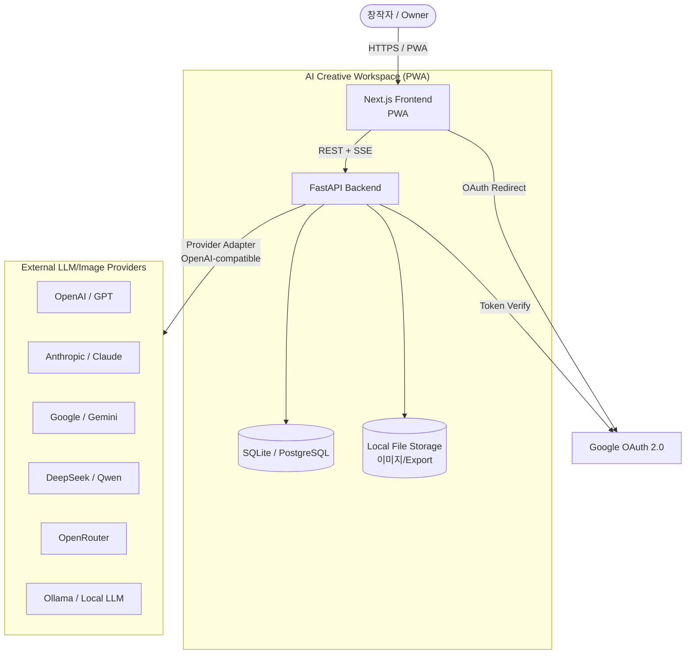

## 2.2 컨테이너 다이어그램 (C4 - Level 2)

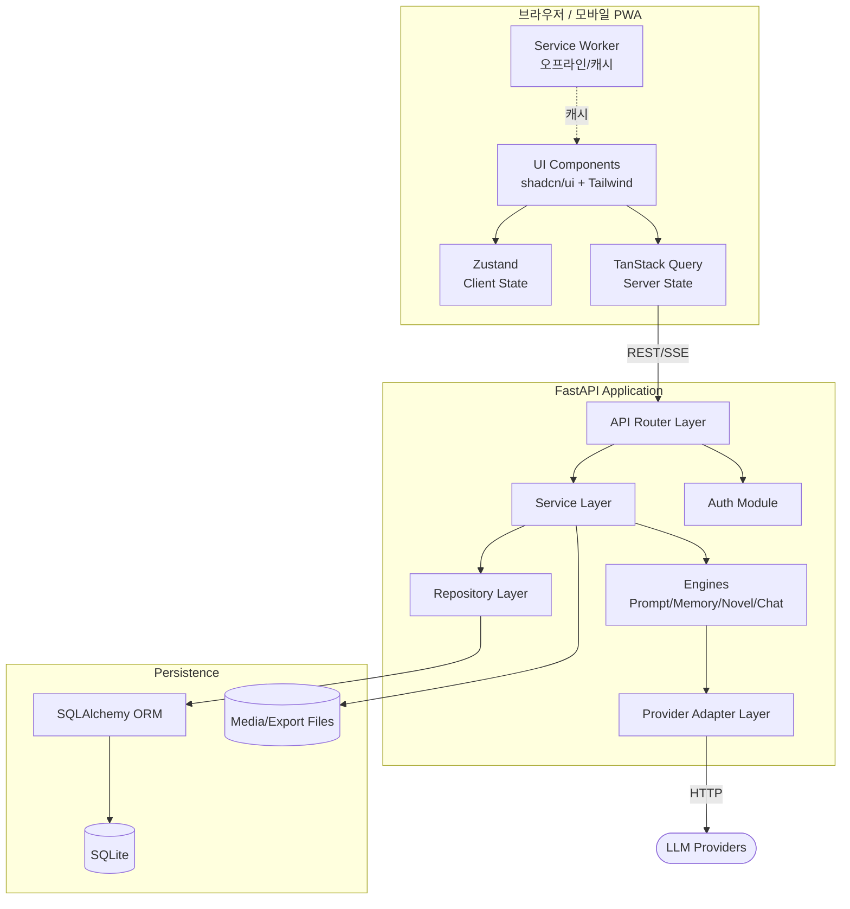

## 2.3 레이어드 아키텍처 (의존성 규칙)

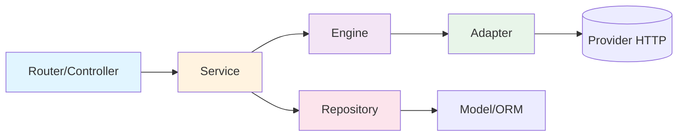

**의존성 규칙 (Dependency Rule)**: 상위 레이어만 하위 레이어를 호출한다. 역방향 의존 금지. Engine과 Adapter는 인터페이스(Protocol)에만 의존하여 교체 가능성을 보장한다.

| 레이어 | 책임 | 의존 대상 |
|--------|------|-----------|
| Router | HTTP 요청/응답, 검증(Pydantic), 인증 가드 | Service |
| Service | 유스케이스 오케스트레이션, 트랜잭션 경계 | Engine, Repository |
| Engine | 도메인 핵심 로직(프롬프트/기억/소설/채팅) | Adapter, Repository(읽기) |
| Adapter | 외부 LLM/이미지 공급자 추상화 | Provider HTTP |
| Repository | 영속성 CRUD, 쿼리 | ORM Model |
| Model | 테이블 매핑 | - |

## 2.4 핵심 데이터 흐름: 채팅 메시지 처리

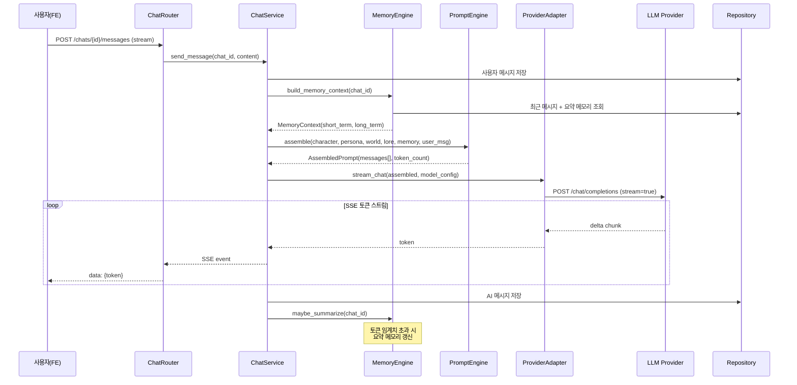

## 2.5 기술 스택 요약

| 영역 | 기술 | 선정 이유 |
|------|------|-----------|
| FE Framework | Next.js (App Router) | PWA, SSR/CSR 유연, 생태계 |
| 언어 | TypeScript | 타입 안정성 |
| 스타일 | TailwindCSS + shadcn/ui | 모바일 우선, 빠른 UI |
| 클라이언트 상태 | Zustand | 경량, 보일러플레이트 최소 |
| 서버 상태 | TanStack Query | 캐시·재검증·낙관적 업데이트 |
| 에디터 | TipTap | 소설 집필 리치 텍스트 |
| BE Framework | FastAPI | async, Pydantic, SSE 용이 |
| ORM | SQLAlchemy 2.0 | 방언 추상화, 성숙도 |
| 마이그레이션 | Alembic | DB 스키마 버전 관리 |
| DB | SQLite → PostgreSQL | Local-first → Scale |
| 인증 | Authlib (OAuth) + JWT | 표준 OAuth, 모듈 분리 |
| 배포 | Docker Compose | 단일 명령 기동 |

---

# Phase 3. 도메인 모델 (Domain Model)

## 3.1 도메인 개요

본 도메인의 중심은 **`Character`(캐릭터)** 와 **`World`(세계관)** 이다. 이 둘이 채팅과 소설 양쪽에서 공유되는 단일 진실 공급원이다.

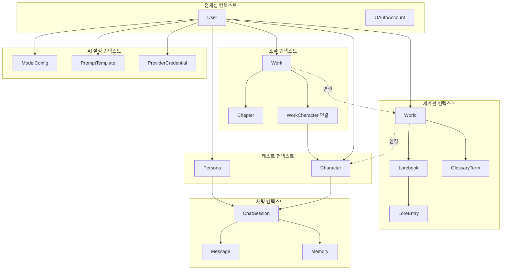

## 3.2 Bounded Context (DDD 경계)

| 컨텍스트 | 핵심 애그리거트 | 책임 |
|----------|-----------------|------|
| Identity | User | 사용자·OAuth 계정·세션 |
| Worldbuilding | World | 세계관·로어북·용어집 |
| Cast | Character, Persona | 캐릭터·사용자 페르소나 |
| Chat | ChatSession | 대화 세션·메시지·기억 |
| Novel | Work | 작품·챕터·등장인물 연결 |
| AI Config | ModelConfig | 모델 설정·프롬프트 템플릿·자격증명 |

## 3.3 핵심 엔티티 정의 (도메인 어휘)

```typescript
// 도메인 타입 — 구현 언어 무관 개념 정의 (실제 ORM은 Phase 4 참조)

/** 사용자 — 모든 데이터의 소유자. 멀티유저 확장 대비 루트 */
type User = {
  id: UUID
  email: string
  displayName: string
  createdAt: DateTime
}

/** 세계관 — 채팅/소설 공통 컨텍스트의 원천 */
type World = {
  id: UUID
  userId: UUID
  name: string
  description: string
  era: string          // 시대
  races: string[]      // 종족
  nations: string[]    // 국가
  taboos: string[]     // 금기
  // glossary, lorebook은 별도 엔티티로 연결
}

/** 캐릭터 — 채팅 상대이자 소설 등장인물 (통합 핵심) */
type Character = {
  id: UUID
  userId: UUID
  worldId: UUID | null     // 세계관 연결(선택)
  name: string
  avatarUrl: string | null
  greeting: string         // 첫인사
  speechStyle: string      // 말투
  personality: string      // 성격/설정
  tags: string[]
}

/** 페르소나 — 사용자가 채팅에서 연기하는 자아 */
type Persona = {
  id: UUID
  userId: UUID
  name: string
  description: string
}

/** 로어북 항목 — 키워드 트리거 기반 컨텍스트 주입 단위 */
type LoreEntry = {
  id: UUID
  lorebookId: UUID
  keywords: string[]       // 트리거 키워드
  content: string          // 주입될 로어 내용
  priority: number         // 주입 우선순위
  enabled: boolean
}

/** 채팅 세션 */
type ChatSession = {
  id: UUID
  userId: UUID
  characterId: UUID
  personaId: UUID | null
  modelConfigId: UUID
  title: string
  createdAt: DateTime
}

/** 메시지 */
type Message = {
  id: UUID
  chatSessionId: UUID
  role: "user" | "assistant" | "system"
  content: string
  tokenCount: number
  createdAt: DateTime
}

/** 기억 — 요약된 장기 메모리 */
type Memory = {
  id: UUID
  chatSessionId: UUID
  kind: "summary" | "fact" | "event"
  content: string
  coverUpToMessageId: UUID  // 이 메시지까지 요약됨
  createdAt: DateTime
}

/** 작품(소설) */
type Work = {
  id: UUID
  userId: UUID
  worldId: UUID | null
  title: string
  synopsis: string         // 줄거리
  genre: string
  tags: string[]
}

/** 챕터 */
type Chapter = {
  id: UUID
  workId: UUID
  index: number            // 화 순서
  title: string
  content: string          // 본문
  summary: string          // 챕터 요약(이어쓰기 컨텍스트용)
}

/** 모델 설정 — Provider 교체의 핵심 */
type ModelConfig = {
  id: UUID
  userId: UUID
  provider: ProviderType   // openai | anthropic | gemini | deepseek | qwen | ollama | openrouter
  modelName: string        // 예: "gpt-4o", "claude-3-5-sonnet"
  baseUrl: string | null   // OpenAI-compatible base URL
  temperature: number
  maxTokens: number
  contextWindow: number    // 모델 컨텍스트 한도(토큰 예산 산정)
}
```

## 3.4 불변식 (Domain Invariants)

| ID | 불변식 |
|----|--------|
| INV-1 | 모든 도메인 엔티티는 정확히 하나의 `User`에 소속된다 (`userId` 필수). |
| INV-2 | `Character.worldId`가 설정되면 그 World는 동일 `userId` 소유여야 한다. |
| INV-3 | `Chapter.index`는 동일 `workId` 내에서 유일하다(연속성은 강제 안 함 — 삭제 빈틈 허용, 4.8 재정의 참조). |
| INV-4 | `Message`는 생성 후 불변(immutable). 편집은 새 버전 생성으로 처리. |
| INV-5 | `Memory.coverUpToMessageId`는 같은 세션의 실재 메시지를 가리킨다. |
| INV-6 | `ModelConfig.contextWindow ≥ maxTokens`. |
| INV-7 | Prompt 조립 결과 토큰 수 ≤ `ModelConfig.contextWindow`. |

## 3.5 통합 플라이휠 (도메인 시나리오)

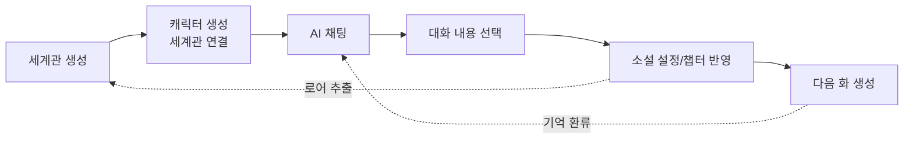

이 환류 구조가 제품의 차별점이다. 채팅에서 생성된 서사가 소설 챕터로, 소설 전개가 다시 캐릭터 기억/로어로 흘러든다.

## 3.6 정확성 속성 (Correctness Properties) — 정식 정의

> **[검토 반영]** 본 절은 문서 전반(Phase 8.13, 8.15, 9.18, 10.16, 11.14, 12.14 등)에서 "Property 1~9"로 30회 이상 참조되나 **단일 정식 정의가 부재**하여 추가되었다. Hypothesis 속성 테스트(8.15)의 대상이며 불변식(3.4)과 1:1 연동된다. 기존 참조는 모두 본 목록을 가리키므로 **하위 호환 유지**.

| # | 속성 | 정식 진술 | 연동 INV / 검증 위치 |
|---|------|-----------|----------------------|
| Property 1 | 소유자 격리 | 어떤 사용자도 다른 사용자의 엔티티를 조회/수정할 수 없다. 모든 쿼리는 `user_id`로 스코프된다. | INV-1 / Repo `_scoped`(8.3) |
| Property 2 | 세계관 소유 일치 | `Character.world_id`/`Work.world_id`가 가리키는 World는 동일 `user_id`. | INV-2 / Service(8.13) |
| Property 3 | 챕터 인덱스 무결성 | 동일 `work_id` 내 활성 챕터 `index`는 유일하다(연속성은 4.x 재정의 참조). | INV-3 / NovelService(8.13) |
| Property 4 | 메시지 불변성 | 저장된 `Message`는 변경되지 않는다. 재생성/편집은 새 행으로만 표현한다. | INV-4 / ChatService append-only(8.13, 4.6) |
| Property 5 | 메모리 참조 유효성 | `Memory.cover_up_to_message_id`는 항상 동일 세션의 실재 메시지를 가리키며 단조 증가한다. | INV-5 / MemoryEngine(10.7) |
| Property 6 | 예산 사전조건 | `ModelConfig.context_window ≥ max_tokens`. | INV-6 / PromptEngine(9.7) |
| Property 7 | 조립 예산 보존 | `assemble().token_count ≤ context_window` (입력+출력). | INV-7 / BudgetManager(9.7) |
| Property 8 | 자격증명 비노출 | 평문 API Key/토큰은 어떤 API 응답·로그에도 나타나지 않는다(마스킹). | NFR-7 / Schema·Logging(8.11, 8.14) |
| Property 9 | 부분 보존 | SSE 단절 시 누적 토큰과 사용자 입력은 유실되지 않고 best-effort로 보존된다. | — / SSE(8.7.4), 정확히 1회 저장(4.6) |

---

# Phase 4. 데이터베이스 설계 (DB Design + ERD)

## 4.1 설계 원칙

1. **소유권 스코프 (Ownership Scope)** — **[검토 수정]** 종전 "모든 테이블에 `user_id`" 원칙은 ERD와 모순되었다(자식 테이블 `messages`/`memories`/`chapters`/`lore_entries`/`work_characters` 등은 `user_id` 미보유). 정정: **애그리거트 루트 테이블**(`worlds`, `characters`, `personas`, `works`, `chat_sessions`, `model_configs`, `prompt_templates`, `provider_credentials`)은 `user_id` FK를 직접 보유한다. **자식 테이블은 부모를 통해 스코프**되며(Repository `_scoped`가 JOIN으로 강제), 다만 **고빈도 조회 자식**(`messages`, `memories`, `chapters`)은 **`user_id`를 비정규화 복제**하여 JOIN 없는 격리 쿼리·인덱스를 가능케 한다(Property 1 성능/단순성). 비정규화 컬럼은 부모와 항상 일치(쓰기 시 채움, 불변).
2. **UUID PK (`CHAR(36)`/`TEXT`)** — SQLite/PostgreSQL 양쪽 호환, 분산 환경 대비. (PG 전환 시 `UUID` 네이티브 타입으로 Alembic 마이그레이션 가능.)
3. **타임스탬프** — `created_at`, `updated_at` 전 테이블 공통(BaseMixin).
4. **소프트 삭제 옵션** — `deleted_at NULL` 컬럼으로 복구 가능 삭제(작품/캐릭터 등 중요 엔티티). 전파 규칙은 4.7 참조.
5. **JSON 컬럼** — 배열/유연 필드(tags, races 등)는 JSON 타입. SQLite `JSON`, PG `JSONB`.
6. **인덱스** — 모든 FK + 자주 조회되는 `user_id`, `chat_session_id`, `work_id`에 인덱스.
7. **부분 유니크 제약 (Partial Unique)** — **[검토 추가]** `model_configs`는 사용자당 기본값 1개(`UNIQUE(user_id) WHERE is_default`), `prompt_templates`는 사용자·scope당 기본값 1개(`UNIQUE(user_id, scope) WHERE is_default`). SQLite는 부분 인덱스 지원, PG는 partial unique index. 다중 기본값 모순 차단.

## 4.2 ERD (Entity Relationship Diagram)

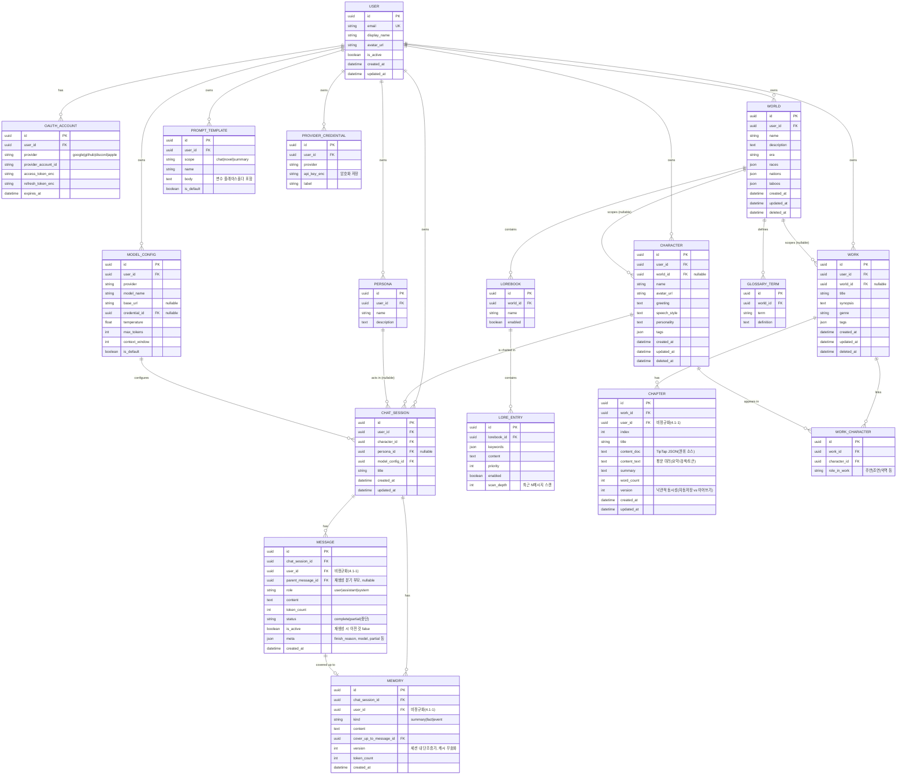

## 4.3 테이블 명세 요약

| 테이블 | 핵심 인덱스 | 비고 |
|--------|------------|------|
| `users` | UK(email) | 멀티유저 루트 |
| `oauth_accounts` | UK(provider, provider_account_id) | 토큰 암호화 저장 |
| `worlds` | IDX(user_id) | 소프트 삭제 |
| `glossary_terms` | IDX(world_id) | |
| `lorebooks` | IDX(world_id) | |
| `lore_entries` | IDX(lorebook_id), IDX(enabled) | keywords JSON |
| `characters` | IDX(user_id), IDX(world_id) | 소프트 삭제 |
| `personas` | IDX(user_id) | |
| `chat_sessions` | IDX(user_id), IDX(character_id) | |
| `messages` | IDX(chat_session_id, created_at) | 불변, append-only |
| `memories` | IDX(chat_session_id) | |
| `works` | IDX(user_id), IDX(world_id) | 소프트 삭제 |
| `chapters` | UK(work_id, index) | INV-3 강제 |
| `work_characters` | UK(work_id, character_id) | 다대다 연결 |
| `model_configs` | IDX(user_id), IDX(is_default) | |
| `prompt_templates` | IDX(user_id, scope) | |
| `provider_credentials` | IDX(user_id) | api_key 암호화 |

## 4.4 SQLite → PostgreSQL 마이그레이션 전략

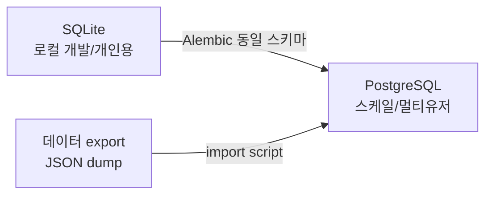

| 항목 | SQLite | PostgreSQL | 추상화 방식 |
|------|--------|------------|-------------|
| UUID | TEXT | UUID | SQLAlchemy `Uuid` 타입(2.0 내장) |
| JSON | JSON | JSONB | SQLAlchemy `JSON` 타입 |
| 불리언 | INTEGER(0/1) | BOOLEAN | ORM 자동 변환 |
| 타임스탬프 | TEXT/REAL | TIMESTAMPTZ | `DateTime(timezone=True)` |
| 동시성 | 파일 락 | MVCC | 트랜잭션 격리 레벨 설정 |

**규칙**: 원시 SQL 금지(방언 종속 회피). 모든 쿼리는 SQLAlchemy ORM/Core 표현식으로 작성. DB 연결은 `DATABASE_URL` 환경변수 하나로 전환.

## 4.5 암호화 정책

- `provider_credentials.api_key_enc`, `oauth_accounts.*_token_enc`는 애플리케이션 레벨 대칭 암호화(예: Fernet/AES-GCM). 키는 `APP_SECRET_KEY` 환경변수.
- 복호화는 백엔드 메모리 내에서만. API 응답에 평문 키 절대 미포함(마스킹: `sk-...abcd`).

## 4.6 메시지 버전·재생성 모델 (Message Versioning)

> **[검토 추가]** Phase 12.9(재생성)와 INV-4(불변)가 종전 스키마로는 표현 불가능했다(버전/분기 컬럼 부재). 정합화:

- `Message`는 **append-only·불변**(INV-4/Property 4). 편집·재생성은 **새 행** 생성으로만 처리한다.
- 재생성: 직전 `assistant` 메시지의 `is_active=false`로 표시하고, 동일 `parent_message_id`(직전 user 메시지)를 부모로 하는 새 `assistant` 행을 `is_active=true`로 추가한다. 기존 행은 보존(감사/되돌리기).
- 조회: 기본 조회는 `is_active=true`만 반환. 분기 히스토리(되돌리기/대안 보기)는 동일 `parent_message_id` 그룹으로 노출(확장 UI, L3).
- 중단(SSE 단절, Property 9): 부분 메시지는 `status="partial"`, `meta.partial=true`로 저장. 재생성/이어받기로 대체 가능.

## 4.7 삭제·전파 규칙 (Deletion & Cascade)

> **[검토 추가]** 종전 문서는 소프트/하드 삭제 전파를 미정의하여 댕글링 참조·고아 행 위험이 있었다.

| 부모 | 삭제 방식 | 자식 전파 |
|------|-----------|-----------|
| `Work`(소프트) | `deleted_at` 세팅 | `Chapter`·`WorkCharacter`는 부모 `deleted_at` 통해 숨김(연쇄 소프트). 영구 삭제 시 `ON DELETE CASCADE`. |
| `Character`(소프트) | `deleted_at` 세팅 | 참조 중인 `ChatSession`/`WorkCharacter`는 **보존**. 캐릭터는 "보관됨"으로 표시, 신규 채팅 생성만 차단. 기존 대화 무손상. |
| `World`(소프트) | `deleted_at` 세팅 | `Lorebook`/`LoreEntry`/`GlossaryTerm` 연쇄 숨김. 연결된 `Character.world_id`/`Work.world_id`는 `null` 처리(설정 해제), 채팅/집필 계속 가능. |
| `ChatSession`(하드) | 행 삭제 | `Message`·`Memory` `ON DELETE CASCADE`. |
| `Lorebook`(하드) | 행 삭제 | `LoreEntry` `ON DELETE CASCADE`. |

- **INV-5 보호**: `Message`는 세션 하드 삭제 시에만 사라지며 그 때 `Memory`도 함께 삭제 → `cover_up_to_message_id` 댕글링 불가.
- 모든 FK는 명시적 `ON DELETE`(CASCADE 또는 SET NULL) 정책을 Alembic 마이그레이션에 선언한다(SQLite는 `PRAGMA foreign_keys=ON` 필수, 8.1.4).

## 4.8 챕터 인덱스 정책 (INV-3 재정의)

> **[검토 수정]** 종전 INV-3은 "1부터 **연속**"을 요구했으나, 중간 챕터 삭제·재정렬 시 즉시 위반된다(삭제 API·재정렬 정책 부재). 정정:

- 보장: 동일 `work_id` 내 **`index` 유일성**(UK 유지) + **정렬 안정성**. 연속성(빈틈 없음)은 강제하지 않는다(삭제로 빈틈 허용).
- 신규 챕터: 트랜잭션 내 `max(index)+1` 부여(경합 시 UK로 재시도).
- 재정렬: `PATCH /works/{id}/chapters:reorder`(6.2 추가)로 `index` 일괄 재계산(트랜잭션·원자적).
- 표시 순서는 `index ASC`. 사용자 노출 "N화"는 표시용 순번(정렬 기반)으로 계산 가능(저장 index와 분리).

---

# Phase 5. 폴더 구조 (Folder Structure)

## 5.1 모노레포 최상위

```text
ai-creative-workspace/
├── docker-compose.yml          # 단일 명령 기동
├── .env.example                # 환경변수 템플릿
├── README.md
├── frontend/                   # Next.js PWA
├── backend/                    # FastAPI
└── docs/
    └── design.md               # 본 문서
```

## 5.2 백엔드 (FastAPI) — 기능/레이어 혼합 구조

```text
backend/
├── pyproject.toml              # 의존성 (uv/poetry)
├── alembic.ini
├── Dockerfile
├── app/
│   ├── main.py                 # FastAPI 앱 팩토리, 라우터 등록, 미들웨어
│   ├── config.py               # Pydantic Settings (env 로딩)
│   ├── db/
│   │   ├── base.py             # Declarative Base + BaseMixin(id, timestamps)
│   │   ├── session.py          # 엔진/세션 팩토리 (DATABASE_URL)
│   │   └── migrations/         # Alembic
│   │       ├── env.py
│   │       └── versions/
│   ├── core/
│   │   ├── security.py         # 암복호화, JWT 발급/검증
│   │   ├── deps.py             # 공통 의존성 (get_db, get_current_user)
│   │   ├── errors.py           # 예외 정의 + 핸들러
│   │   └── pagination.py       # 페이지네이션 유틸
│   ├── models/                 # SQLAlchemy ORM 모델 (Phase 4 매핑)
│   │   ├── user.py
│   │   ├── world.py            # World, Lorebook, LoreEntry, GlossaryTerm
│   │   ├── character.py        # Character, Persona
│   │   ├── chat.py             # ChatSession, Message, Memory
│   │   ├── novel.py            # Work, Chapter, WorkCharacter
│   │   └── ai_config.py        # ModelConfig, PromptTemplate, ProviderCredential
│   ├── schemas/                # Pydantic DTO (요청/응답)
│   │   ├── world.py
│   │   ├── character.py
│   │   ├── chat.py
│   │   ├── novel.py
│   │   └── ai_config.py
│   ├── repositories/           # 영속성 계층
│   │   ├── base.py             # BaseRepository[T] (CRUD 제네릭)
│   │   ├── world_repo.py
│   │   ├── character_repo.py
│   │   ├── chat_repo.py
│   │   └── novel_repo.py
│   ├── services/               # 유스케이스 오케스트레이션
│   │   ├── character_service.py
│   │   ├── world_service.py
│   │   ├── chat_service.py
│   │   ├── novel_service.py
│   │   └── auth_service.py
│   ├── engines/                # 도메인 핵심 엔진 (Phase 9~12)
│   │   ├── prompt/
│   │   │   ├── engine.py       # PromptEngine
│   │   │   ├── blocks.py       # PromptBlock 정의
│   │   │   ├── budget.py       # 토큰 예산/truncation
│   │   │   └── tokenizer.py    # 토큰 카운터 추상화
│   │   ├── memory/
│   │   │   ├── engine.py       # MemoryEngine
│   │   │   ├── summarizer.py   # 요약 전략
│   │   │   └── retriever.py    # 키워드/RAG 검색 (확장)
│   │   ├── novel/
│   │   │   └── engine.py       # NovelEngine (이어쓰기)
│   │   └── chat/
│   │       └── engine.py       # ChatEngine (스트리밍 조립)
│   ├── adapters/               # Provider Adapter (Phase 13)
│   │   ├── base.py             # LLMProvider Protocol
│   │   ├── openai_compat.py    # OpenAI-compatible 공통 구현
│   │   ├── anthropic.py        # 비호환 부분 어댑트
│   │   ├── gemini.py
│   │   ├── ollama.py
│   │   ├── registry.py         # ProviderRegistry (팩토리)
│   │   └── image/              # 이미지 생성 어댑터 (확장)
│   ├── auth/                   # 독립 인증 모듈 (Phase 14)
│   │   ├── oauth.py            # OAuth 플로우 (Authlib)
│   │   ├── providers/
│   │   │   ├── google.py
│   │   │   ├── github.py       # 확장
│   │   │   └── base.py         # OAuthProvider Protocol
│   │   ├── jwt.py              # 세션 토큰
│   │   └── router.py
│   └── api/                    # 라우터 (Phase 6)
│       ├── router.py           # 메인 APIRouter 집합
│       └── v1/
│           ├── worlds.py
│           ├── characters.py
│           ├── personas.py
│           ├── chats.py
│           ├── novels.py
│           ├── ai_config.py
│           └── auth.py
└── tests/
    ├── unit/                   # 엔진/서비스 단위 테스트
    ├── property/               # 속성 기반 테스트 (Hypothesis)
    └── integration/            # API 통합 테스트
```

## 5.3 프론트엔드 (Next.js App Router)

```text
frontend/
├── package.json
├── next.config.mjs             # PWA 설정 (next-pwa)
├── tailwind.config.ts
├── components.json             # shadcn/ui 설정
├── Dockerfile
├── public/
│   ├── manifest.json           # PWA manifest
│   └── icons/                  # PWA 아이콘 세트
├── src/
│   ├── app/                    # App Router
│   │   ├── layout.tsx          # 루트 레이아웃 (모바일 우선)
│   │   ├── (auth)/
│   │   │   └── login/page.tsx
│   │   ├── (main)/
│   │   │   ├── page.tsx        # 홈 (최근 작품/채팅)
│   │   │   ├── characters/
│   │   │   ├── worlds/
│   │   │   ├── novels/
│   │   │   │   └── [workId]/
│   │   │   │       └── chapters/[chapterId]/
│   │   │   ├── chats/
│   │   │   │   └── [chatId]/page.tsx
│   │   │   └── settings/       # API Key, 모델, 프롬프트
│   │   └── api/                # Route Handlers (BFF 프록시, 선택)
│   ├── components/
│   │   ├── ui/                 # shadcn/ui 프리미티브
│   │   ├── chat/               # 채팅 UI (스트리밍 버블)
│   │   ├── novel/              # TipTap 에디터, 챕터 목록
│   │   ├── character/          # 캐릭터 카드
│   │   └── world/              # 세계관 카드
│   ├── lib/
│   │   ├── api/                # API 클라이언트 (fetch + SSE)
│   │   │   ├── client.ts
│   │   │   ├── chats.ts
│   │   │   └── sse.ts          # SSE 파서
│   │   ├── auth.ts             # 토큰 관리
│   │   └── utils.ts
│   ├── stores/                 # Zustand
│   │   ├── ui-store.ts         # 사이드바, 테마
│   │   └── chat-draft-store.ts # 입력 중 메시지 등 클라이언트 상태
│   ├── hooks/                  # TanStack Query 훅
│   │   ├── use-characters.ts
│   │   ├── use-chats.ts
│   │   └── use-novels.ts
│   └── types/                  # 공유 타입 (백엔드 스키마 미러)
└── tests/
```

## 5.4 상태 관리 책임 분리

| 상태 종류 | 도구 | 예시 |
|-----------|------|------|
| 서버 데이터(원격) | TanStack Query | 캐릭터 목록, 채팅 기록, 작품 |
| 클라이언트 UI 상태 | Zustand | 사이드바 열림, 테마, 입력 중 초안 |
| 폼 로컬 상태 | React Hook Form | 캐릭터 생성 폼 |
| 스트리밍 상태 | 커스텀 훅 + Zustand | 토큰 누적 버퍼 |

---

# Phase 6. REST API 설계 (REST API Design)

## 6.1 규약

- Base path: `/api/v1`
- 인증: `Authorization: Bearer <jwt>` (인증 활성 모드). 로컬 모드는 미들웨어가 기본 사용자 주입.
- 응답: JSON. 에러는 RFC 7807 유사 구조.
- 스트리밍: SSE (`text/event-stream`).
- 페이지네이션: `?limit=&cursor=` (커서 기반).

### 표준 에러 응답

```json
{
  "error": {
    "code": "RESOURCE_NOT_FOUND",
    "message": "Character not found",
    "details": { "id": "..." }
  }
}
```

| HTTP | code 예 |
|------|---------|
| 400 | VALIDATION_ERROR |
| 401 | UNAUTHENTICATED |
| 403 | FORBIDDEN |
| 404 | RESOURCE_NOT_FOUND |
| 409 | CONFLICT (예: chapter index 중복) |
| 422 | UNPROCESSABLE (Pydantic) |
| 429 | PROVIDER_RATE_LIMIT |
| 502 | PROVIDER_ERROR (LLM 공급자 오류) |

## 6.2 엔드포인트 목록

| 리소스 | 메서드 & 경로 | 설명 |
|--------|---------------|------|
| Auth | `GET /auth/{provider}/login` | OAuth 시작(리다이렉트 URL) |
| Auth | `GET /auth/{provider}/callback` | OAuth 콜백 → JWT 발급 |
| Auth | `POST /auth/logout` | 세션 종료 |
| Auth | `GET /auth/me` | 현재 사용자 |
| World | `GET/POST /worlds` | 목록/생성 |
| World | `GET/PATCH/DELETE /worlds/{id}` | 조회/수정/삭제 |
| Lore | `GET/POST /worlds/{id}/lorebooks` | 로어북 |
| Lore | `GET/POST /lorebooks/{id}/entries` | 로어 항목 |
| Glossary | `GET/POST /worlds/{id}/glossary` | 용어집 |
| Character | `GET/POST /characters` | 목록(태그/세계관 필터)/생성 |
| Character | `GET/PATCH/DELETE /characters/{id}` | |
| Persona | `GET/POST /personas` | |
| Chat | `GET/POST /chats` | 세션 목록/생성 |
| Chat | `GET/DELETE /chats/{id}` | 세션 조회/삭제 |
| Chat | `GET /chats/{id}/messages` | 메시지 페이지네이션(`?before=&limit=`, 역방향 기본) |
| Chat | `POST /chats/{id}/messages` | 메시지 전송(SSE 스트리밍). `Idempotency-Key` 헤더로 재전송 중복 방지 |
| Chat | `POST /chats/{id}/regenerate` | 마지막 assistant 메시지 재생성(SSE). `client_request_id`로 멱등 |
| Chat | `POST /chats/{id}/summarize` | 강제 요약 트리거 |
| Novel | `GET/POST /works` | 작품 목록/생성 |
| Novel | `GET/PATCH/DELETE /works/{id}` | |
| Novel | `GET/POST /works/{id}/chapters` | 챕터 목록/생성 |
| Novel | `GET/PATCH/DELETE /chapters/{id}` | 조회/수정(낙관적 동시성 `version`)/삭제 |
| Novel | `PATCH /works/{id}/chapters:reorder` | 챕터 순서 재계산(원자적, 4.8) |
| Novel | `POST /chapters/{id}/continue` | AI 이어쓰기(SSE) |
| Novel | `POST /works/{id}/characters` | 등장인물 연결 |
| Config | `GET/POST /model-configs` | 모델 설정 |
| Config | `GET/POST /prompt-templates` | 프롬프트 템플릿 |
| Config | `GET/POST /credentials` | API Key 등록(마스킹 응답) |
| Config | `GET /providers` | 지원 공급자/모델 메타 |
| Export | `POST /works/{id}/export` | EPUB/PDF/JSON (확장) |

## 6.3 OpenAPI 스펙 (핵심 발췌)

```yaml
openapi: 3.1.0
info:
  title: AI Creative Workspace API
  version: 1.0.0
servers:
  - url: /api/v1
paths:
  /characters:
    get:
      summary: 캐릭터 목록 조회
      parameters:
        - { name: world_id, in: query, schema: { type: string, format: uuid } }
        - { name: tag, in: query, schema: { type: string } }
        - { name: limit, in: query, schema: { type: integer, default: 20 } }
        - { name: cursor, in: query, schema: { type: string } }
      responses:
        '200':
          description: OK
          content:
            application/json:
              schema: { $ref: '#/components/schemas/CharacterPage' }
    post:
      summary: 캐릭터 생성
      requestBody:
        required: true
        content:
          application/json:
            schema: { $ref: '#/components/schemas/CharacterCreate' }
      responses:
        '201':
          content:
            application/json:
              schema: { $ref: '#/components/schemas/Character' }
        '422': { description: Validation Error }

  /chats/{id}/messages:
    post:
      summary: 메시지 전송 (스트리밍)
      description: >
        SSE 스트림 반환. event: token (델타), event: done (완료, 최종 메시지 메타).
      parameters:
        - { name: id, in: path, required: true, schema: { type: string, format: uuid } }
      requestBody:
        content:
          application/json:
            schema: { $ref: '#/components/schemas/MessageCreate' }
      responses:
        '200':
          description: SSE 스트림
          content:
            text/event-stream:
              schema: { type: string }
        '502': { description: Provider Error }

  /chapters/{id}/continue:
    post:
      summary: AI 이어쓰기 (스트리밍)
      parameters:
        - { name: id, in: path, required: true, schema: { type: string, format: uuid } }
      requestBody:
        content:
          application/json:
            schema:
              type: object
              properties:
                instruction: { type: string, description: "집필 지시(선택)" }
                target_words: { type: integer, default: 800 }
      responses:
        '200': { description: SSE 스트림 }

components:
  schemas:
    CharacterCreate:
      type: object
      required: [name]
      properties:
        name: { type: string, minLength: 1, maxLength: 100 }
        world_id: { type: string, format: uuid, nullable: true }
        avatar_url: { type: string, nullable: true }
        greeting: { type: string }
        speech_style: { type: string }
        personality: { type: string }
        tags: { type: array, items: { type: string } }
    Character:
      allOf:
        - $ref: '#/components/schemas/CharacterCreate'
        - type: object
          properties:
            id: { type: string, format: uuid }
            created_at: { type: string, format: date-time }
            updated_at: { type: string, format: date-time }
    CharacterPage:
      type: object
      properties:
        items: { type: array, items: { $ref: '#/components/schemas/Character' } }
        next_cursor: { type: string, nullable: true }
    MessageCreate:
      type: object
      required: [content]
      properties:
        content: { type: string, minLength: 1 }
  securitySchemes:
    bearerAuth: { type: http, scheme: bearer, bearerFormat: JWT }
security:
  - bearerAuth: []
```

## 6.4 SSE 이벤트 프로토콜 (스트리밍 표준)

```text
event: token
data: {"delta": "안녕"}

event: token
data: {"delta": "하세요"}

event: done
data: {"message_id": "uuid", "token_count": 42, "finish_reason": "stop"}

event: error
data: {"code": "PROVIDER_ERROR", "message": "..."}
```

프론트엔드 SSE 파서(`lib/api/sse.ts`)는 `token` 이벤트를 누적, `done`에서 확정, `error`에서 사용자 알림 + 부분 메시지 보존.

## 6.5 멱등성·동시성·재시도 규약 (Idempotency & Concurrency)

> **[검토 추가]** 종전 문서는 멱등성·동시성을 본문(8.x, 12.x)에서만 산발 언급하고 API 규약에 미반영하여, 모바일/SSE 재시도 시 **중복 메시지·경합 쓰기** 위험이 있었다.

| 항목 | 규약 |
|------|------|
| 쓰기 멱등성 | 메시지 전송·이어쓰기·재생성은 `Idempotency-Key`(헤더) 또는 `client_request_id`(바디)를 받는다. 동일 키 24h 내 재요청은 **원 결과 재생/단일 효과**(중복 user 메시지 생성 금지). |
| 낙관적 동시성 | `PATCH /chapters/{id}`는 `If-Match`(또는 바디 `version`) 필요. 불일치 시 `409 CONFLICT` + 최신 `version` 반환(자동저장 vs 이어쓰기 경합 방지). |
| 세션 직렬화 | 동일 `chat_session`의 동시 스트리밍 요청은 직렬화(12.12). 진행 중 추가 전송은 `409 CONFLICT`(또는 큐 대기). |
| 레이트리밋 | `429`는 `Retry-After` 헤더 포함. FE 지수 백오프(7.13). |
| 페이지네이션 방향 | 채팅 메시지는 `before` 커서(역방향, 최신→과거). 기타 목록은 `cursor`(정방향). |

---

# Phase 7. 프론트엔드 아키텍처 & UX 설계 (Frontend Architecture & UX Design)

> **이 Phase의 목표**: 프론트엔드 개발자가 **추가 질의 없이** 전체 UI를 구현할 수 있는 수준의 화면·내비게이션·컴포넌트·디자인 시스템·상태/로딩/에러/접근성·확장 포인트 명세를 제공한다.
>
> **최상위 설계 원칙 — 단순함(Simplicity First)**: 내부 아키텍처는 고도로 모듈화·확장 가능하지만, **최종 사용자 경험은 하트픽션/로판AI 수준으로 단순하고 직관적**이어야 한다. 컨트롤·설정·패널로 사용자를 압도하지 않는다. 항상 **최소 클릭, 깔끔한 내비게이션, 점진적 공개(Progressive Disclosure), 초보자 친화, 모바일 우선**을 우선한다. MVP의 내비게이션/UX는 향후 고급 기능이 추가되어도 **바뀌지 않도록** 설계한다.
>
> 본 Phase는 Phase 5.3(프론트 폴더 트리), Phase 5.4(상태 관리 책임 분리), Phase 6(REST/SSE API)와 완전히 일관되게 작성되었다.

## 7.0 UX 디자인 5대 규칙 (전 화면 공통)

| # | 규칙 | 적용 방식 |
|---|------|-----------|
| R1 | **3-Tap Rule** | 어떤 핵심 작업(채팅 시작/이어쓰기/캐릭터 생성)도 홈에서 3탭 이내 도달 |
| R2 | **Progressive Disclosure** | 고급 옵션(모델·온도·프롬프트·로어 우선순위)은 기본 숨김, "고급 설정" 토글/Drawer로만 노출 |
| R3 | **One Primary Action per Screen** | 각 화면에 시각적으로 강조된 주요 CTA 하나(FAB 또는 강조 버튼) |
| R4 | **Mobile-First** | 모든 화면을 360px 폭부터 설계, 데스크톱은 확장 레이아웃 |
| R5 | **Forgiving UX** | 파괴적 작업은 확인 + Undo(토스트). 자동 저장 기본. 빈 상태는 친절한 안내 + CTA |

---

## 7.1 정보 구조 (Information Architecture / Site Map)

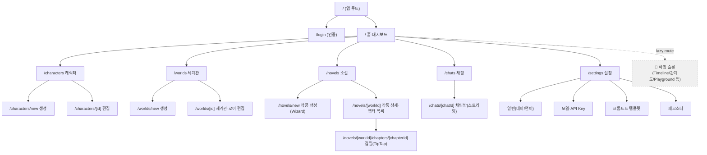

**계층 깊이 원칙**: 최대 3단계(섹션 → 목록 → 상세/편집). 4단계 이상 금지. 확장 기능은 기존 섹션 내부의 탭/Drawer 또는 lazy route로 흡수하여 최상위 내비게이션은 **5개(홈/캐릭터/세계관/소설/채팅) + 설정** 으로 고정한다.

---

## 7.2 내비게이션 구조 (Navigation Structure)

### 7.2.1 데스크톱 — 좌측 사이드바 (Collapsible)

- 폭: 펼침 `240px`, 접힘 `64px`(아이콘만). 상태는 `ui-store`(Zustand)에 persist.
- 항목(아이콘 + 라벨): 홈 / 캐릭터 / 세계관 / 소설 / 채팅 — 하단에 설정 + 사용자.
- 활성 라우트는 `bg-accent` + 좌측 4px 인디케이터.

### 7.2.2 모바일 — 하단 탭 바 (Bottom Tab Bar)

- 고정 5탭: **홈 · 캐릭터 · 소설 · 채팅 · 더보기(⋯)**.
- "세계관"과 "설정"은 사용 빈도가 낮으므로 **더보기(⋯)** 시트로 이동 → 핵심 4개를 항상 노출(단순성 우선).
- 높이 `56px` + iOS safe-area inset. 활성 탭은 아이콘 채움 + 라벨 강조.

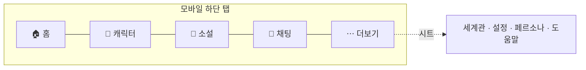

### 7.2.3 Progressive Disclosure 전략 (내비게이션 레벨)

| 레벨 | 노출 위치 | 예시 |
|------|-----------|------|
| L1 기본 | 항상 보임 | 홈/캐릭터/소설/채팅 + 1차 CTA |
| L2 보조 | 더보기 시트 / 사이드바 하단 | 세계관, 설정, 페르소나 |
| L3 고급 | 화면 내 "고급 설정" 토글 / Drawer | 모델 파라미터, 프롬프트 편집, 로어 우선순위 |
| L4 확장 | Feature Flag + lazy route | Timeline, 관계도, Playground (7.15) |

**규칙**: 새 기능은 가능한 한 낮은 빈도일수록 더 깊은 레벨에 배치한다. L1(최상위 탭)은 절대 늘리지 않는다.

---

## 7.3 사용자 플로우 (User Flows)

### 7.3.1 캐릭터 생성

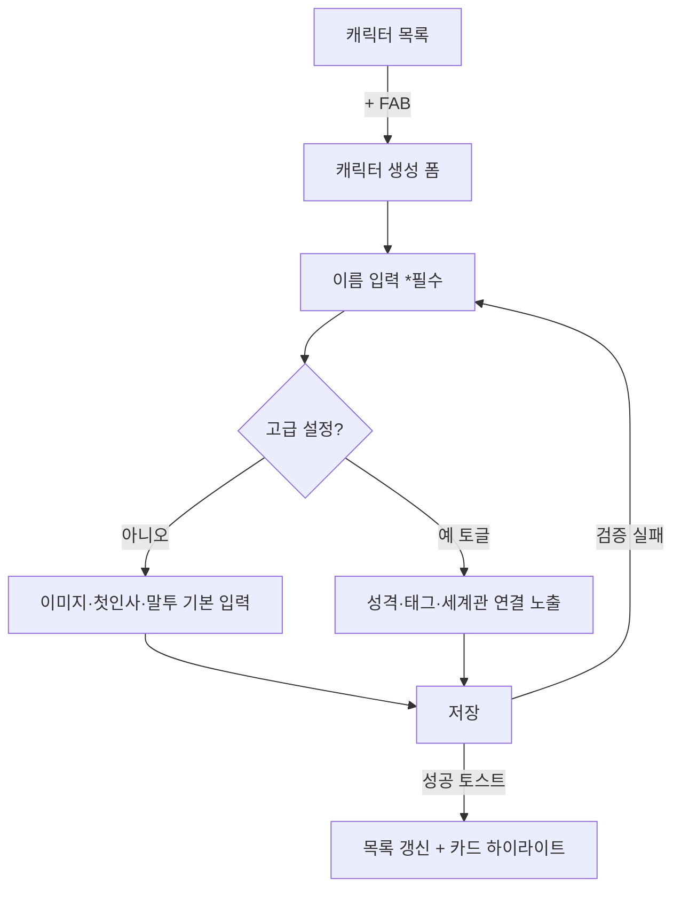

### 7.3.2 세계관 생성

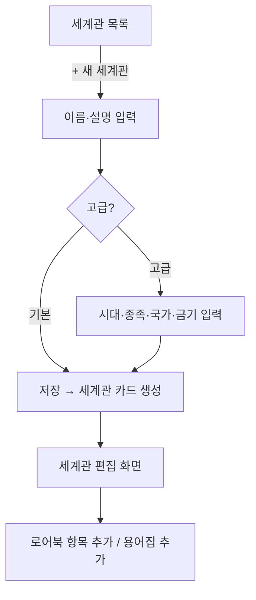

### 7.3.3 소설 생성 (Wizard, 하트픽션 스타일)

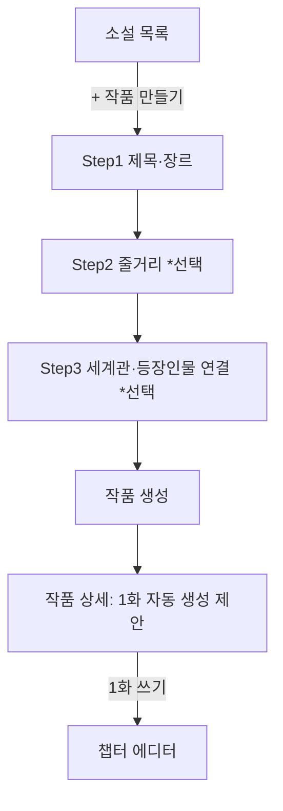

### 7.3.4 AI 채팅

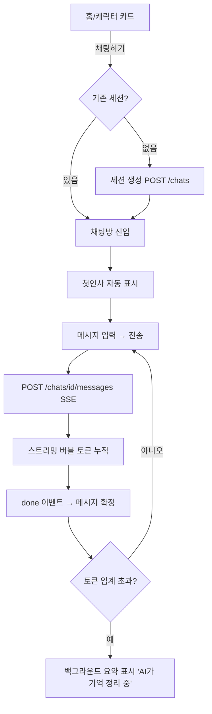

### 7.3.5 이어쓰기 (Continue Writing)

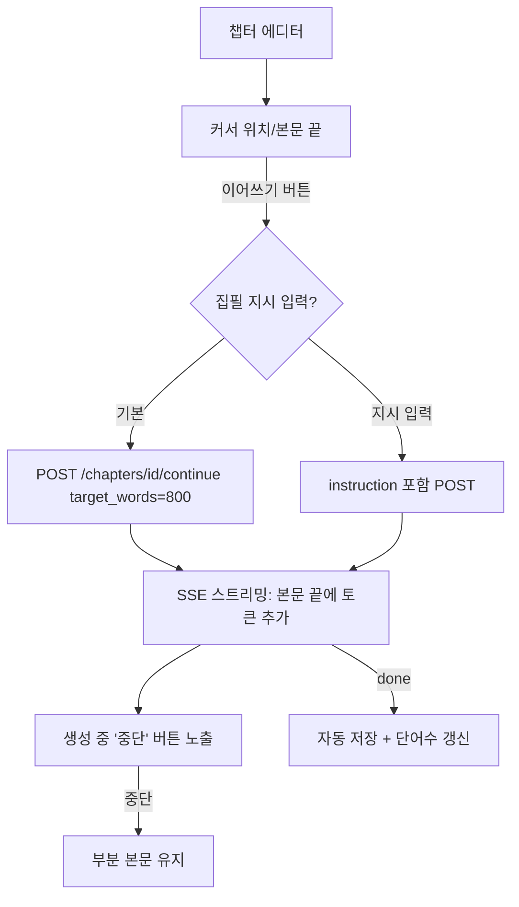

### 7.3.6 설정 (Settings)

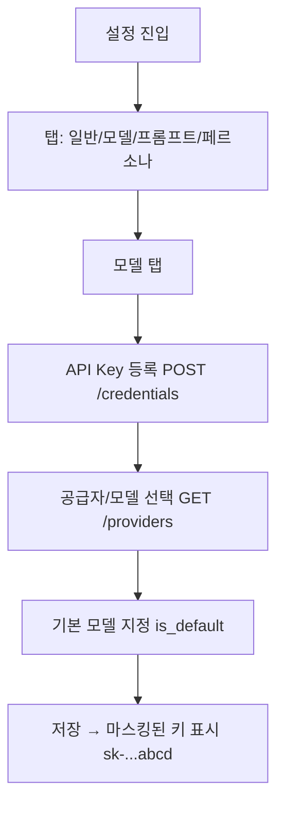

---

## 7.4 데스크톱 레이아웃 (ASCII Wireframe)

```text
┌───────────────────────────────────────────────────────────────────────┐
│  ┌──────────┐  ┌──────────────────────────────────────────────────┐    │
│  │          │  │  Top Bar: [페이지 제목]            [🔍] [🔔] [👤]  │    │
│  │ Sidebar  │  ├──────────────────────────────────────────────────┤    │
│  │ (240px)  │  │                                                  │    │
│  │          │  │                                                  │    │
│  │ 🏠 홈     │  │            Main Content Area                     │    │
│  │ 👤 캐릭터 │  │            (max-w-screen-xl, 중앙 정렬)            │    │
│  │ 🌍 세계관 │  │                                                  │    │
│  │ 📖 소설   │  │                                                  │    │
│  │ 💬 채팅   │  │                                                  │    │
│  │          │  │                                                  │    │
│  │ ──────── │  │                                                  │    │
│  │ ⚙ 설정    │  │                                       ┌────────┐ │    │
│  │ 👤 사용자 │  │                                       │  + FAB │ │    │
│  └──────────┘  └───────────────────────────────────────└────────┘─┘    │
└───────────────────────────────────────────────────────────────────────┘
```

## 7.5 모바일 레이아웃 (ASCII Wireframe)

```text
┌─────────────────────────┐
│ ☰  페이지 제목      🔔 👤 │  ← Top App Bar (sticky, 56px)
├─────────────────────────┤
│                         │
│                         │
│    Main Content         │
│    (단일 컬럼, px-4)      │
│    스크롤 영역            │
│                         │
│              ┌────────┐ │
│              │  + FAB │ │  ← 우하단 (탭 바 위)
│              └────────┘ │
├─────────────────────────┤
│ 🏠   👤   📖   💬   ⋯   │  ← Bottom Tab Bar (56px + safe-area)
│ 홈  캐릭터 소설 채팅 더보기 │
└─────────────────────────┘
```

## 7.6 반응형 동작 (Responsive Behavior)

Tailwind 기본 브레이크포인트 사용.

| 토큰 | 폭 | 레이아웃 |
|------|-----|----------|
| (base) | < 640px | 모바일: 하단 탭 바, 단일 컬럼, FAB, Drawer 풀스크린 |
| `sm` | ≥ 640px | 모바일 레이아웃 유지, 그리드 카드 2열 |
| `md` | ≥ 768px | **사이드바 등장(접힘 64px)**, 하단 탭 바 숨김, 카드 2~3열 |
| `lg` | ≥ 1024px | 사이드바 펼침(240px), 카드 3~4열, 채팅·에디터 2-pane 가능 |
| `xl` | ≥ 1280px | 콘텐츠 `max-w-screen-xl` 중앙 정렬, 에디터 우측 보조 패널 노출 |

**전환 시 이동/축소 규칙**:

| 요소 | 모바일 | 데스크톱 |
|------|--------|----------|
| 1차 내비 | 하단 탭 바(5) | 좌측 사이드바 |
| 세계관/설정 | 더보기(⋯) 시트 | 사이드바 하단 |
| 1차 액션 | FAB(우하단) | 헤더 우측 강조 버튼 또는 FAB |
| 필터/고급옵션 | 풀스크린 Drawer(Sheet) | 우측 패널/Popover |
| 채팅 세션 목록 | 별도 화면(목록→방) | 좌측 목록 + 우측 채팅 2-pane |
| 챕터 목록 | 상단 Sheet/Drawer | 좌측 챕터 사이드 패널 |

---

## 7.7 주요 화면 와이어프레임 (ASCII Wireframes — 전 화면)

### 7.7.1 로그인 (`/login`)

```text
┌─────────────────────────┐
│                         │
│        [ 로고 ]          │
│  AI Creative Workspace  │
│  "나만의 로판AI+하트픽션"  │
│                         │
│  ┌───────────────────┐  │
│  │  G  Google로 계속  │  │  ← 1차 CTA
│  └───────────────────┘  │
│                         │
│  ┌───────────────────┐  │
│  │  로컬 모드로 시작   │  │  ← 인증 비활성(개인용)
│  └───────────────────┘  │
│                         │
│   이용약관 · 개인정보처리  │
└─────────────────────────┘
```

### 7.7.2 홈 / 대시보드 (`/`)

```text
┌──────────────────────────────────────────┐
│ 홈                                  🔔 👤 │
├──────────────────────────────────────────┤
│  안녕하세요 👋 오늘은 무엇을 만들까요?       │
│                                          │
│  ┌──────────┐ ┌──────────┐ ┌──────────┐  │
│  │ + 캐릭터  │ │ + 세계관  │ │ + 소설    │  │ ← Quick Actions
│  └──────────┘ └──────────┘ └──────────┘  │
│                                          │
│  최근 채팅                       전체보기 >│
│  ┌────┐ ┌────┐ ┌────┐ ┌────┐             │
│  │👤루나│ │👤카이│ │👤···│ │ +  │           │ ← 가로 스크롤 캐릭터칩
│  └────┘ └────┘ └────┘ └────┘             │
│                                          │
│  이어서 쓰기                     전체보기 >│
│  ┌──────────────────────────────────┐    │
│  │ 📖 별빛 연대기  ·  12화  ·  3분 전  │    │ ← 최근 작품 카드
│  │ "그녀는 검을 들어올렸다..."         │    │
│  └──────────────────────────────────┘    │
└──────────────────────────────────────────┘
```

### 7.7.3 캐릭터 목록 (`/characters`)

```text
┌──────────────────────────────────────────┐
│ 캐릭터              [🔍 검색]   [+ 만들기] │
├──────────────────────────────────────────┤
│ [전체] [#로맨스] [#판타지] [#일상]  ← 태그칩│
├──────────────────────────────────────────┤
│ ┌─────────┐ ┌─────────┐ ┌─────────┐       │
│ │ [아바타] │ │ [아바타] │ │ [아바타] │      │
│ │  루나    │ │  카이    │ │  세라    │      │
│ │ #로맨스  │ │ #판타지  │ │ #일상   │       │
│ │ 💬 채팅  │ │ 💬 채팅  │ │ 💬 채팅 │       │
│ └─────────┘ └─────────┘ └─────────┘       │
│                                  ┌──────┐ │
│                                  │ +FAB │ │
│                                  └──────┘ │
└──────────────────────────────────────────┘
```

### 7.7.4 캐릭터 생성/편집 (`/characters/new`, `/characters/[id]`)

```text
┌──────────────────────────────────────────┐
│ ← 캐릭터 만들기                    [저장]  │
├──────────────────────────────────────────┤
│        ┌────────┐                         │
│        │ [이미지]│  사진 변경               │ ← 아바타 업로드
│        └────────┘                         │
│                                          │
│  이름 *                                   │
│  ┌──────────────────────────────────┐    │
│  │ 루나                              │    │
│  └──────────────────────────────────┘    │
│  첫인사                                   │
│  ┌──────────────────────────────────┐    │
│  │ "안녕, 오늘은 무슨 이야기를 할까?"  │    │
│  └──────────────────────────────────┘    │
│  말투                                     │
│  ┌──────────────────────────────────┐    │
│  │ 다정하고 장난스러운 반말           │    │
│  └──────────────────────────────────┘    │
│                                          │
│  ▸ 고급 설정 (성격·태그·세계관 연결)       │ ← 접힘(Progressive Disclosure)
│  ┄┄┄┄┄┄┄┄┄┄┄┄┄┄┄┄┄┄┄┄┄┄┄┄┄┄┄┄┄┄┄┄┄┄┄    │
│   성격 [텍스트area]                        │
│   태그 [+추가]  세계관 [선택 ▾]            │
└──────────────────────────────────────────┘
```

### 7.7.5 세계관 목록 (`/worlds`)

```text
┌──────────────────────────────────────────┐
│ 세계관                          [+ 만들기] │
├──────────────────────────────────────────┤
│ ┌──────────────────┐ ┌──────────────────┐ │
│ │ 🌍 아르카디아      │ │ 🌍 네오 서울      │ │
│ │ 중세 판타지        │ │ 사이버펑크 2099   │ │
│ │ 캐릭터 5 · 로어 12 │ │ 캐릭터 2 · 로어 4 │ │
│ └──────────────────┘ └──────────────────┘ │
└──────────────────────────────────────────┘
```

### 7.7.6 세계관 / 로어 에디터 (`/worlds/[id]`)

```text
┌──────────────────────────────────────────┐
│ ← 아르카디아                       [저장]  │
├──────────────────────────────────────────┤
│ [기본정보] [로어북] [용어집]   ← 탭         │
├──────────────────────────────────────────┤
│ (로어북 탭)                                │
│  로어 항목                       [+ 추가]  │
│  ┌──────────────────────────────────┐    │
│  │ 🔑 키워드: 왕국, 아르카디아         │    │
│  │ "천 년을 이어온 마법 왕국..."       │    │
│  │ 활성 ●     ▸ 고급(우선순위·스캔깊이)│    │ ← 우선순위는 고급에 숨김
│  └──────────────────────────────────┘    │
│  ┌──────────────────────────────────┐    │
│  │ 🔑 키워드: 금기, 흑마법             │    │
│  │ "흑마법 사용은 사형..."             │    │
│  └──────────────────────────────────┘    │
└──────────────────────────────────────────┘
```

### 7.7.7 소설 목록 (`/novels`)

```text
┌──────────────────────────────────────────┐
│ 소설                            [+ 만들기] │
├──────────────────────────────────────────┤
│ ┌──────────────────────────────────────┐  │
│ │ 📖 별빛 연대기                         │  │
│ │ 판타지 · 로맨스   ·   12화   ·   4.2만자│  │
│ │ ▓▓▓▓▓▓▓░░░  연재 중                   │  │
│ └──────────────────────────────────────┘  │
│ ┌──────────────────────────────────────┐  │
│ │ 📖 회귀한 검성                         │  │
│ │ 무협   ·   3화   ·   8천자             │  │
│ └──────────────────────────────────────┘  │
└──────────────────────────────────────────┘
```

### 7.7.8 작품 상세 + 챕터 목록 (`/novels/[workId]`)

```text
┌──────────────────────────────────────────┐
│ ← 별빛 연대기                      [⋯ 설정]│
├──────────────────────────────────────────┤
│ 시놉시스: "운명을 거스른 두 영혼의..."      │
│ 세계관: 아르카디아 ·  등장인물: 루나, 카이  │
├──────────────────────────────────────────┤
│ 챕터                            [+ 새 챕터]│
│  1화  프롤로그            ·  1,200자  >    │
│  2화  운명의 만남         ·  2,400자  >    │
│  3화  검의 맹세           ·  2,100자  >    │
│  ...                                     │
│                                  ┌──────┐ │
│                                  │+ 이어 │ │ ← 다음 화 빠른 생성
│                                  │  쓰기 │ │
│                                  └──────┘ │
└──────────────────────────────────────────┘
```

### 7.7.9 챕터 에디터 (TipTap + 이어쓰기) (`/novels/[workId]/chapters/[chapterId]`)

```text
데스크톱 (2-pane):
┌──────────────────────────────────────────────────────┐
│ ← 2화 운명의 만남         자동저장됨 ✓        [⋯]     │
├───────────┬──────────────────────────────────────────┤
│ 챕터 목록  │  ┌────────────────────────────────────┐  │
│ 1화 ✓     │  │ [B] [I] [U] [H1] [" "] ···  TipTap툴 │  │
│ ▶2화      │  ├────────────────────────────────────┤  │
│ 3화       │  │                                    │  │
│ + 새 챕터  │  │  그녀는 검을 천천히 들어 올렸다.      │  │
│           │  │  달빛이 칼날을 따라 흘렀다.          │  │
│           │  │  ▍(커서)                            │  │
│           │  │                                    │  │
│           │  │  ┌──────────────────────────────┐  │  │
│           │  │  │ ✨ AI가 이어쓰는 중...  [중단] │  │  │ ← 스트리밍 인디케이터
│           │  │  └──────────────────────────────┘  │  │
│           │  └────────────────────────────────────┘  │
│           │  [✨ 이어쓰기]  [집필 지시 ▾]   1,240자    │ ← 1차 CTA
└───────────┴──────────────────────────────────────────┘

모바일:
┌─────────────────────────┐
│ ← 2화         저장됨 ✓ ⋯ │
├─────────────────────────┤
│ [B][I][U][H1]···  (툴바) │
├─────────────────────────┤
│ 그녀는 검을 들어 올렸다.  │
│ ▍                       │
│                         │
├─────────────────────────┤
│  [ ✨ 이어쓰기 ]   1,240자│ ← 하단 고정 액션 바
└─────────────────────────┘
(챕터 목록은 상단 ← 옆 Sheet로 열림)
```

### 7.7.10 채팅 목록 (`/chats`)

```text
┌──────────────────────────────────────────┐
│ 채팅                            [+ 새 대화]│
├──────────────────────────────────────────┤
│ ┌──────────────────────────────────────┐  │
│ │ 👤 루나                       3분 전   │  │
│ │ "그럼 내일 또 보자!"          ● 2     │  │
│ └──────────────────────────────────────┘  │
│ ┌──────────────────────────────────────┐  │
│ │ 👤 카이                       어제     │  │
│ │ "검술 훈련은 어땠어?"                 │  │
│ └──────────────────────────────────────┘  │
└──────────────────────────────────────────┘
```

### 7.7.11 채팅 화면 (스트리밍 버블) (`/chats/[chatId]`)

```text
┌──────────────────────────────────────────┐
│ ← 👤 루나                          [⋯]    │ ← ⋯: 페르소나/모델(고급, 숨김)
├──────────────────────────────────────────┤
│                                          │
│  ┌────────────────────────────┐          │
│  │ 안녕! 오늘은 무슨 이야기를    │          │ ← assistant 버블(좌)
│  │ 할까? 😊                    │          │
│  └────────────────────────────┘          │
│                                          │
│          ┌────────────────────────────┐  │
│          │ 검술 훈련 얘기 해줘          │  │ ← user 버블(우)
│          └────────────────────────────┘  │
│                                          │
│  ┌────────────────────────────┐          │
│  │ 좋아! 오늘 아침에 나는 ▍      │          │ ← 스트리밍 중(커서 깜빡)
│  └────────────────────────────┘          │
│                                          │
├──────────────────────────────────────────┤
│ ┌──────────────────────────────┐  ┌────┐ │
│ │ 메시지를 입력하세요...         │  │ ▶  │ │ ← 입력+전송(스트리밍 중 ⏹)
│ └──────────────────────────────┘  └────┘ │
└──────────────────────────────────────────┘
```

### 7.7.12 설정 (`/settings` — API Key/모델/프롬프트)

```text
┌──────────────────────────────────────────┐
│ 설정                                      │
├──────────────────────────────────────────┤
│ [일반] [모델] [프롬프트] [페르소나]  ← 탭   │
├──────────────────────────────────────────┤
│ (모델 탭)                                 │
│  기본 모델                                │
│  ┌──────────────────────────────────┐    │
│  │ Anthropic · claude-3-5-sonnet  ▾ │    │ ← GET /providers
│  └──────────────────────────────────┘    │
│                                          │
│  API Key                                 │
│  ┌──────────────────────────────────┐    │
│  │ sk-...abcd               [변경]   │    │ ← 마스킹 표시
│  └──────────────────────────────────┘    │
│  [+ 공급자 추가]                          │
│                                          │
│  ▸ 고급 (온도·최대토큰·컨텍스트)           │ ← 숨김
│  ┄┄┄┄┄┄┄┄┄┄┄┄┄┄┄┄┄┄┄┄┄┄┄┄┄┄┄┄┄┄┄┄    │
│   온도   [====●====] 0.8                  │
│   최대토큰 [ 2048 ]                       │
└──────────────────────────────────────────┘
```


---

## 7.8 컴포넌트 계층 (Component Hierarchy — Tree)

Phase 5.3 폴더 트리(`src/app`, `src/components`)와 1:1 대응한다.

```text
<RootLayout>                              # app/layout.tsx (테마/쿼리 Provider)
├── <Providers>                           # QueryClientProvider, ThemeProvider
│
├── (auth)/login/<LoginPage>
│   └── <AuthCard>
│       ├── <GoogleLoginButton>
│       └── <LocalModeButton>
│
└── (main)/<AppShell>                     # 반응형 셸 (사이드바/탭바 분기)
    ├── <Sidebar>            [md+ 전용]
    │   ├── <SidebarLogo>
    │   ├── <SidebarNavItem> × 5
    │   └── <SidebarFooter> (설정/사용자)
    ├── <BottomTabBar>       [< md 전용]
    │   ├── <TabItem> × 4
    │   └── <MoreSheet>      (세계관/설정/페르소나)
    ├── <TopBar>
    │   ├── <PageTitle>
    │   └── <TopBarActions> (검색/알림/아바타)
    ├── <Fab>                              # 화면별 1차 액션
    │
    ├── <HomePage>                         # app/(main)/page.tsx
    │   ├── <Greeting>
    │   ├── <QuickActionGrid>
    │   ├── <RecentChatsRail>
    │   │   └── <CharacterChip> × n
    │   └── <ContinueWritingList>
    │       └── <WorkCard> × n
    │
    ├── characters/
    │   ├── <CharacterListPage>
    │   │   ├── <TagFilterBar>
    │   │   ├── <CharacterGrid>
    │   │   │   └── <CharacterCard> × n
    │   │   ├── <EmptyState | ListSkeleton>
    │   │   └── <Fab "+">
    │   └── <CharacterFormPage>            # new & [id] 공용
    │       ├── <AvatarUploader>
    │       ├── <FormField> (이름/첫인사/말투)
    │       └── <AdvancedDisclosure>       # 성격/태그/세계관 연결
    │           ├── <TagInput>
    │           └── <WorldSelect>
    │
    ├── worlds/
    │   ├── <WorldListPage> → <WorldCard> × n
    │   └── <WorldEditorPage>
    │       └── <Tabs: 기본정보 | 로어북 | 용어집>
    │           ├── <WorldInfoForm>
    │           ├── <LoreEntryList> → <LoreEntryCard> (+<AdvancedDisclosure>)
    │           └── <GlossaryList> → <GlossaryRow>
    │
    ├── novels/
    │   ├── <NovelListPage> → <WorkCard> × n
    │   ├── <NovelCreateWizard>            # Step1~3
    │   │   └── <WizardStepper>
    │   ├── <WorkDetailPage>
    │   │   ├── <WorkHeader>
    │   │   ├── <ChapterList> → <ChapterRow> × n
    │   │   └── <ContinueWritingFab>
    │   └── chapters/[chapterId]/<ChapterEditorPage>
    │       ├── <ChapterSidePanel | ChapterSheet>
    │       ├── <TipTapEditor>
    │       │   ├── <EditorToolbar>
    │       │   └── <StreamingInsertion>   # AI 토큰 삽입 영역
    │       └── <ContinueWriteBar>
    │           ├── <ContinueButton>
    │           └── <InstructionPopover>   # 집필 지시(고급)
    │
    ├── chats/
    │   ├── <ChatListPage> → <ChatSessionRow> × n
    │   └── [chatId]/<ChatRoomPage>
    │       ├── <ChatHeader> (+<ChatOptionsMenu> 고급)
    │       ├── <MessageList>
    │       │   └── <MessageBubble> × n (role별)
    │       ├── <StreamingBubble>          # SSE 누적
    │       └── <ChatComposer>
    │           ├── <MessageInput>
    │           └── <SendButton | StopButton>
    │
    └── settings/<SettingsPage>
        └── <Tabs: 일반 | 모델 | 프롬프트 | 페르소나>
            ├── <GeneralSettings> (테마/언어)
            ├── <ModelSettings>
            │   ├── <ModelSelect>
            │   ├── <ApiKeyField>          # 마스킹
            │   └── <AdvancedDisclosure>   # 온도/토큰
            ├── <PromptTemplateSettings>
            └── <PersonaSettings>
```

---

## 7.9 재사용 컴포넌트 라이브러리 (Reusable Component Library)

| 컴포넌트 | 목적 | 핵심 Props | shadcn/ui 기반 |
|----------|------|-----------|----------------|
| `<AppShell>` | 반응형 셸(사이드바/탭바 분기) | `children` | (레이아웃) |
| `<Sidebar>` | 데스크톱 1차 내비 | `collapsed: boolean`, `onToggle` | `Button`, `Tooltip` |
| `<BottomTabBar>` | 모바일 1차 내비 | `active: TabKey` | (커스텀) |
| `<MoreSheet>` | 모바일 보조 내비 | `open`, `onOpenChange` | `Sheet` |
| `<Fab>` | 화면별 1차 액션 | `icon`, `label`, `onClick` | `Button` |
| `<PageHeader>` | 제목 + 액션 영역 | `title`, `actions?`, `onBack?` | (조합) |
| `<EntityCard>` | 캐릭터/세계관/작품 공용 카드 | `title`, `subtitle`, `image?`, `badges?`, `onClick`, `actions?` | `Card`, `Badge`, `Avatar` |
| `<CharacterCard>` | 캐릭터 카드 + 채팅 CTA | `character`, `onChat`, `onEdit` | `Card`, `Avatar`, `Badge` |
| `<WorkCard>` | 작품 카드(진행률) | `work`, `progress?`, `onOpen` | `Card`, `Progress` |
| `<TagFilterBar>` | 태그 필터 칩 | `tags`, `active`, `onSelect` | `Badge`, `ScrollArea` |
| `<TagInput>` | 태그 추가/삭제 | `value: string[]`, `onChange` | `Input`, `Badge` |
| `<AvatarUploader>` | 이미지 업로드/미리보기 | `value?`, `onChange(file)` | `Avatar`, `Button` |
| `<FormField>` | 라벨+입력+에러 래퍼 | `label`, `error?`, `required?`, `children` | `Label`, `Input` |
| `<AdvancedDisclosure>` | 고급 옵션 접기/펼치기 | `title`, `defaultOpen?`, `children` | `Collapsible` |
| `<WizardStepper>` | 다단계 폼 진행 | `steps`, `current`, `onNext/onBack` | `Button`, `Progress` |
| `<MessageBubble>` | 채팅 버블(role별 정렬) | `role`, `content`, `state?` | `Card` |
| `<StreamingBubble>` | SSE 토큰 누적 버블 | `tokens: string`, `done: boolean` | `Card` |
| `<ChatComposer>` | 메시지 입력+전송/중단 | `value`, `onChange`, `onSend`, `streaming` | `Textarea`, `Button` |
| `<TipTapEditor>` | 소설 본문 에디터 | `content`, `onUpdate`, `editable` | (TipTap + 커스텀) |
| `<ContinueWriteBar>` | 이어쓰기 액션 바 | `onContinue`, `instruction?`, `streaming` | `Button`, `Popover` |
| `<ModelSelect>` | 공급자/모델 선택 | `providers`, `value`, `onChange` | `Select` |
| `<ApiKeyField>` | 마스킹 키 입력 | `masked`, `onSave` | `Input`, `Button` |
| `<EmptyState>` | 빈 목록 안내 | `icon`, `title`, `description`, `cta?` | (조합) |
| `<ListSkeleton>` | 로딩 스켈레톤 | `count`, `variant` | `Skeleton` |
| `<ErrorState>` | 에러 + 재시도 | `message`, `onRetry?` | `Alert`, `Button` |
| `<ConfirmDialog>` | 파괴적 작업 확인 | `title`, `onConfirm`, `destructive?` | `AlertDialog` |
| `<ToastUndo>` | 삭제 Undo 토스트 | `message`, `onUndo` | `Sonner/Toast` |

`<EntityCard>`를 공통 베이스로 두고 `<CharacterCard>`/`<WorkCard>`가 합성(composition)하여 카드 일관성을 보장한다.

---

## 7.10 디자인 시스템 (Design System)

### 7.10.1 스페이싱 스케일 (4px 베이스)

`0(0) · 1(4px) · 2(8px) · 3(12px) · 4(16px) · 6(24px) · 8(32px) · 12(48px) · 16(64px)` — Tailwind 기본. 카드 내부 패딩 `p-4`(모바일)/`p-6`(데스크톱), 섹션 간 `gap-6`.

### 7.10.2 타이포그래피 스케일

| 토큰 | 크기/행간 | 용도 |
|------|-----------|------|
| `text-2xl` (24/32) bold | 페이지 제목 |
| `text-xl` (20/28) semibold | 섹션 제목 |
| `text-base` (16/24) | 본문 기본(모바일 가독성) |
| `text-sm` (14/20) | 보조 텍스트/라벨 |
| `text-xs` (12/16) | 메타/캡션 |
| 본문 글꼴 | `Pretendard`(국문) → system-ui fallback |
| 에디터 본문 | `serif`(소설 가독성, 17/30, max-w-prose) |

### 7.10.3 색상 토큰 (Semantic, Light/Dark)

CSS 변수 + Tailwind `hsl(var(--token))`. shadcn/ui 규약 준수.

| 시맨틱 토큰 | Light | Dark | 용도 |
|-------------|-------|------|------|
| `--background` | `0 0% 100%` | `222 18% 11%` | 페이지 배경 |
| `--foreground` | `222 20% 12%` | `210 20% 96%` | 기본 텍스트 |
| `--card` | `0 0% 100%` | `222 16% 14%` | 카드 표면 |
| `--muted` | `220 14% 96%` | `222 14% 20%` | 보조 배경 |
| `--muted-foreground` | `220 9% 46%` | `215 16% 65%` | 보조 텍스트 |
| `--primary` | `262 80% 58%` | `262 78% 66%` | 1차 액션(바이올렛) |
| `--primary-foreground` | `0 0% 100%` | `0 0% 100%` | 1차 위 텍스트 |
| `--secondary` | `220 14% 96%` | `222 14% 22%` | 2차 버튼 |
| `--accent` | `262 60% 95%` | `262 30% 26%` | 활성/호버 강조 |
| `--destructive` | `0 72% 51%` | `0 62% 52%` | 삭제/위험 |
| `--success` | `142 66% 40%` | `142 60% 48%` | 성공/저장됨 |
| `--warning` | `38 92% 50%` | `38 90% 56%` | 경고 |
| `--border` | `220 13% 91%` | `222 12% 24%` | 테두리/구분선 |
| `--ring` | `262 80% 58%` | `262 78% 66%` | 포커스 링 |

채팅 버블: user=`--primary`/우측, assistant=`--muted`/좌측. 다크 모드는 `class` 전략(`.dark`), `ui-store`에 사용자 선택 persist(기본 system).

### 7.10.4 Border Radius / Shadow

| 토큰 | 값 | 용도 |
|------|-----|------|
| `--radius` | `0.75rem` (12px) | 카드/입력 기본 |
| `rounded-md` | 8px | 버튼/배지 |
| `rounded-2xl` | 16px | 채팅 버블/시트 |
| `rounded-full` | — | 아바타/FAB/칩 |
| `shadow-sm` | 미세 | 카드 기본 |
| `shadow-md` | 중간 | 호버/팝오버 |
| `shadow-lg` | 강함 | Dialog/Sheet/FAB |

### 7.10.5 아이콘 세트 (lucide-react)

| 영역 | 아이콘 |
|------|--------|
| 홈 | `Home` | 캐릭터 `User`/`Users` | 세계관 `Globe` | 소설 `BookOpen` | 채팅 `MessageCircle` |
| 더보기 `MoreHorizontal` | 설정 `Settings` | 검색 `Search` | 알림 `Bell` | 추가 `Plus` |
| 이어쓰기/AI `Sparkles` | 전송 `Send` | 중단 `Square` | 저장 `Check` | 삭제 `Trash2` |
| 편집 `Pencil` | 뒤로 `ChevronLeft` | 펼침 `ChevronDown` | 이미지 `ImagePlus` | 키 `KeyRound` |

아이콘 크기 `20px`(기본)/`24px`(탭 바). `stroke-width: 2`.

---

## 7.11 로딩 상태 (Loading States — 화면별)

| 화면 | 로딩 패턴 |
|------|-----------|
| 홈 | 섹션별 `<ListSkeleton variant="rail|card">` (칩/카드 형태) |
| 캐릭터·세계관·소설 목록 | 카드 그리드 스켈레톤(2~4개), TanStack Query `isPending` |
| 상세/편집 폼 | 필드 라인 스켈레톤, 저장 버튼 `<Button loading>`(스피너) |
| 채팅방 진입 | 메시지 버블 스켈레톤 3개 + 하단 입력 비활성 |
| 채팅 전송 | `<StreamingBubble>` 토큰 누적 + 말풍선 내 점멸 커서 `▍`. 전송 버튼 → 중단(⏹) |
| 이어쓰기 | 본문 끝 인라인 `✨ 이어쓰는 중…` 배지 + 토큰 실시간 삽입 + [중단] |
| 요약(백그라운드) | 헤더 하단 얇은 progress + "기억 정리 중" 토스트(비차단) |
| 페이지 전환 | App Router `loading.tsx`로 라우트 스켈레톤 |
| 무한 스크롤 | 목록 하단 스피너(`fetchNextPage`) |

**원칙**: 0~300ms는 즉시 표시 회피(깜빡임 방지), 300ms+ 스켈레톤. 스트리밍은 첫 토큰 도착 즉시 스켈레톤 제거.

---

## 7.12 빈 상태 (Empty States — 목록별)

| 화면 | 일러스트/아이콘 | 카피 | 1차 CTA |
|------|------------------|------|---------|
| 캐릭터 목록 | `Users` | "아직 캐릭터가 없어요. 첫 캐릭터를 만들어 대화를 시작해 보세요." | [+ 캐릭터 만들기] |
| 세계관 목록 | `Globe` | "세계관을 만들면 캐릭터와 소설이 같은 무대를 공유해요." | [+ 세계관 만들기] |
| 소설 목록 | `BookOpen` | "첫 작품을 시작해 볼까요? AI가 집필을 도와드려요." | [+ 작품 만들기] |
| 채팅 목록 | `MessageCircle` | "대화할 캐릭터를 골라 첫 채팅을 시작하세요." | [캐릭터 보러 가기] |
| 챕터 목록 | `FileText` | "아직 챕터가 없어요. 1화를 써 볼까요?" | [+ 1화 쓰기] |
| 로어북 | `BookMarked` | "로어를 추가하면 AI가 세계관을 기억해요." | [+ 로어 추가] |
| 검색 결과 없음 | `SearchX` | "‘{query}’에 대한 결과가 없어요." | [검색 초기화] |

카피는 친근한 존댓말, 1문장. 모든 빈 상태는 정확히 하나의 1차 CTA를 가진다(R3).

---

## 7.13 에러 상태 (Error States)

| 유형 | 트리거 | UI 처리 | 복구 |
|------|--------|---------|------|
| 폼 검증 | 필수 누락/형식 오류(422) | 필드 하단 `--destructive` 인라인 메시지 + 첫 오류로 스크롤·포커스 | 수정 즉시 해제 |
| 네트워크 | fetch 실패/타임아웃 | `<ErrorState>` 카드 "연결이 불안정해요" + [다시 시도] | `refetch()` |
| 인증 만료 | 401 | 토스트 "다시 로그인해 주세요" → `/login` 리다이렉트 | 재로그인 |
| 권한 | 403 | "접근 권한이 없어요" 페이지 | 홈 이동 |
| 미존재 | 404 | 라우트 `not-found.tsx` "찾을 수 없는 항목이에요" | 목록 이동 |
| 충돌 | 409(챕터 index 중복) | 토스트 "이미 존재하는 화 번호예요" | 자동 다음 index 제안 |
| 공급자 한도 | 429 PROVIDER_RATE_LIMIT | 비차단 배너 "요청이 많아요. 잠시 후 자동 재시도" + 백오프 | 지수 백오프 자동 재시도 |
| 공급자 오류 | 502 PROVIDER_ERROR | 채팅/이어쓰기 버블 하단 "AI 응답 실패" + [재생성] | 마지막 요청 재시도 |
| **SSE 끊김** | 스트림 중 연결 단절 | **부분 메시지 보존**(회색 처리) + "응답이 중단됐어요" + [이어받기]/[재생성] | 부분 토큰 유지 후 재요청 |
| 저장 실패 | 자동저장 실패 | 헤더 "저장 실패 ⚠" + 로컬 초안 보관(재시도 큐) | 온라인 복귀 시 재전송 |

**SSE 복구 상세**(Phase 6.4 프로토콜 기준): `lib/api/sse.ts` 파서는 `token` 누적 → `error`/연결 종료 시 누적 버퍼를 `<StreamingBubble done=false partial>`로 확정 보존하고, 재시도 시 동일 `chat_id`로 재요청한다. 사용자 입력/본문은 절대 유실하지 않는다.

---

## 7.14 접근성 (Accessibility)

| 항목 | 기준/구현 |
|------|-----------|
| 키보드 내비 | 모든 인터랙션 Tab 순회, 사이드바/탭바 `roving tabindex`, Dialog/Sheet 포커스 트랩 |
| 포커스 표시 | `--ring` 2px 가시 포커스 링(`focus-visible`), 마우스 클릭 시 비표시 |
| 채팅 입력 | `Enter` 전송 / `Shift+Enter` 줄바꿈, 전송 중 `Esc`로 중단 |
| ARIA | `<MessageList role="log" aria-live="polite">`(스트리밍 낭독), 아이콘 버튼 `aria-label`, 탭 `role="tablist"` |
| 라이브 영역 | 토스트 `aria-live="assertive"`, 스트리밍 텍스트 polite |
| 대비 | 본문 대비 ≥ 4.5:1, 큰 텍스트/아이콘 ≥ 3:1 (색상 토큰은 이 기준으로 선정) |
| 터치 타깃 | 최소 `44×44px`(탭 바/FAB/버튼), 항목 간 간격 ≥ 8px |
| 모션 감소 | `prefers-reduced-motion` 시 스트리밍 커서 점멸·전환 애니메이션 비활성, 즉시 표시 |
| 폼 | `<label htmlFor>` 연결, 오류 `aria-describedby` + `aria-invalid` |
| 이미지 | 아바타 `alt`(캐릭터명), 장식 이미지 `alt=""` |
| 언어 | `<html lang="ko">`, 다크/라이트 무관 동일 정보 전달 |

> 완전한 WCAG 준수는 보조기술 실사용 테스트 + 전문가 검토가 필요하다. 본 명세는 구현 기준을 제시한다.

---

## 7.15 향후 확장 — 확장 포인트 (Extension Points)

핵심 설계 목표: **MVP 내비게이션(7.2)을 바꾸지 않고** 고급 기능을 추가한다. 모든 확장은 (a) **Feature Flag**(`config.ts`의 `FEATURES`), (b) **lazy route/슬롯**, (c) **기존 화면 내부의 탭/Drawer/Popover** 중 하나로만 들어온다. 최상위 탭(홈/캐릭터/세계관/소설/채팅)은 **불변**.

### 7.15.1 확장 메커니즘

```typescript
// config.ts — 기능 플래그(기본 모두 false → MVP 영향 0)
const FEATURES = {
  storyTimeline: false,
  relationshipGraph: false,
  loreConsistencyChecker: false,
  promptPlayground: false,
  modelPlayground: false,
  costDashboard: false,
  autoBackup: false,
} as const

// 슬롯 패턴 — 기존 화면이 노출하는 확장 지점(플래그 OFF면 렌더 안 함)
type ExtensionSlot =
  | "work.detail.tabs"       // 작품 상세 탭 영역
  | "world.editor.tabs"      // 세계관 에디터 탭 영역
  | "settings.tabs"          // 설정 탭 영역
  | "chat.options.menu"      // 채팅 ⋯ 메뉴
  | "global.command"         // 커맨드 팔레트(Cmd+K)

// lazy route: 플래그가 켜질 때만 등록되는 동적 라우트
// app/(main)/_ext/[feature]/page.tsx → dynamic import
```

### 7.15.2 각 확장의 진입점 (내비 불변 보장)

| 확장 기능 | 진입 방식(슬롯/라우트) | MVP 내비가 그대로인 이유 |
|-----------|------------------------|--------------------------|
| **Story Timeline** | `work.detail.tabs`에 "타임라인" 탭 추가 (작품 상세 내부) | 새 최상위 탭 없음. 작품 상세 화면 내 탭만 1개 증가 |
| **Character Relationship Graph** | `world.editor.tabs`에 "관계도" 탭 + 작품 상세 탭 | 세계관/작품 내부 탭으로만 노출, 사이드바/탭바 동일 |
| **Lore Consistency Checker** | `world.editor.tabs` "검사" 탭 + 이어쓰기 후 비차단 배너 | 기존 로어 에디터 안에서 동작, 새 화면 없음 |
| **Prompt Playground** | `settings.tabs`에 "프롬프트 실험실" 탭 (고급, L3) | 설정 내부 탭. 일반 사용자에겐 보이지 않음 |
| **Model Playground** | `settings.tabs` "모델 비교" 탭 + `global.command` | 설정/커맨드 팔레트로만 진입, 1차 내비 불변 |
| **API Cost Dashboard** | `settings.tabs` "사용량" 탭 + 홈 위젯(플래그 시) | 설정 탭 + 선택적 홈 카드. 탭 구조 불변 |
| **Auto Backup** | `settings.tabs` "백업" 탭 + 백그라운드 작업(UI 거의 없음) | 설정 내부 + 토스트 알림만, 화면 흐름 불변 |

### 7.15.3 확장 추가 체크리스트 (개발자용)

```text
□ 1. FEATURES 플래그 추가 (기본 false)
□ 2. 해당 ExtensionSlot에 lazy 컴포넌트 등록 (플래그 가드)
□ 3. 최상위 내비(Sidebar/BottomTabBar) 코드 변경 0 확인
□ 4. 플래그 OFF 시 번들/렌더 영향 0 확인 (dynamic import)
□ 5. 신규 API는 Phase 6 규약(/api/v1, 에러/SSE) 준수
□ 6. 고급 기능은 항상 L3(고급 토글) 이하에 배치 (7.2.3)
```

이 구조로 **Story Timeline · 관계도 · Lore Consistency Checker · Prompt Playground · Model Playground · API Cost Dashboard · Auto Backup** 7개 기능 전부를 추가해도, 사용자가 매일 보는 **홈/캐릭터/세계관/소설/채팅** 내비게이션과 핵심 UX는 변하지 않는다. 단순함은 유지되고, 깊이(고급 탭)만 확장된다.


---

# Phase 8. 백엔드 아키텍처 (Backend Architecture)

> **이 Phase의 목표**: 백엔드 개발자가 **추가 질의 없이** FastAPI 애플리케이션 전체를 구현할 수 있도록, 앱 구성·레이어 책임·DI·트랜잭션·비동기·스트리밍·백그라운드 작업·스토리지·설정·로깅·에러·검증·보안·테스트·성능·확장 포인트를 구체적으로 명세한다.
>
> **일관성 기준**: Phase 2.3 레이어드 아키텍처(Router→Service→Engine→Adapter/Repository→Model, 단방향 의존), Phase 4(SQLAlchemy 2.0 + Alembic, SQLite→PostgreSQL, 암호화 4.5), Phase 5.2 백엔드 폴더 트리, Phase 6(REST + SSE, 에러 코드), 핵심 설계 원칙(Local-First, 모듈화, 공급자 독립, 확장 용이)을 그대로 따른다.
>
> **표기 원칙**: 프로덕션 코드가 아닌 **아키텍처·다이어그램·Protocol/인터페이스 시그니처·의사코드**만 기술한다. 의사코드는 ```pascal```, 타입/Protocol 시그니처는 개념적 Python 시그니처로 표기한다.

## 8.0 개요 및 레이어 매핑

Phase 2.3의 레이어드 아키텍처를 백엔드 파일 시스템(Phase 5.2)에 직접 매핑한다.

| 레이어 (Phase 2.3) | 디렉터리 (Phase 5.2) | 책임 | 호출 가능 대상 |
|--------------------|----------------------|------|----------------|
| Router | `app/api/v1/*` | HTTP I/O, Pydantic 검증, 인증 가드, SSE 응답 | Service |
| Service | `app/services/*` | 유스케이스 오케스트레이션, **트랜잭션 경계** | Engine, Repository |
| Engine | `app/engines/*` | 도메인 핵심 로직(Prompt/Memory/Novel/Chat) | Adapter, Repository(읽기) |
| Adapter | `app/adapters/*` | 외부 LLM/이미지 공급자 추상화 | Provider HTTP |
| Repository | `app/repositories/*` | 영속성 CRUD/쿼리 | ORM Model |
| Model | `app/models/*` | 테이블 매핑 | - |
| 횡단(Cross-cutting) | `app/core/*`, `app/config.py`, `app/db/*`, `app/auth/*` | DI·보안·에러·설정·세션·인증 | - |

**단방향 의존 규칙 강제**: 하위 레이어는 상위 레이어를 import 하지 않는다. Engine/Adapter는 구체 구현이 아닌 Protocol에만 의존한다(교체 가능성 보장).

## 8.1 백엔드 애플리케이션 아키텍처 (FastAPI App)

### 8.1.1 앱 팩토리 (`app/main.py`)

애플리케이션은 **앱 팩토리 패턴**으로 생성하여 테스트(테스트 DB·fake adapter 주입)와 프로덕션을 동일 경로로 구성한다.

```pascal
FUNCTION create_app(settings) RETURNS FastAPI
BEGIN
    app ← FastAPI(
        title = "AI Creative Workspace API",
        version = "1.0.0",
        lifespan = lifespan_handler        // startup/shutdown
    )

    // 1. 미들웨어 스택 등록 (역순 실행: 마지막 등록이 가장 바깥)
    register_middlewares(app, settings)

    // 2. 예외 핸들러 등록 (Phase 6.1 코드 매핑 → 8.12)
    register_exception_handlers(app)

    // 3. 라우터 등록 (/api/v1 prefix)
    app.include_router(api_router, prefix = "/api/v1")

    // 4. 헬스체크 (/healthz, /readyz)
    register_health_routes(app)

    RETURN app
END
```

### 8.1.2 라우터 등록 (`app/api/router.py`)

각 리소스 라우터(`app/api/v1/*`)를 단일 `api_router`로 집약한다. 라우터는 Service에만 의존한다.

```pascal
api_router ← APIRouter()
api_router.include_router(auth.router,       prefix="/auth",        tags=["auth"])
api_router.include_router(worlds.router,     prefix="/worlds",      tags=["worlds"])
api_router.include_router(characters.router, prefix="/characters",  tags=["characters"])
api_router.include_router(personas.router,   prefix="/personas",    tags=["personas"])
api_router.include_router(chats.router,      prefix="/chats",       tags=["chats"])
api_router.include_router(novels.router,     prefix="/works",       tags=["novels"])
api_router.include_router(ai_config.router,  prefix="",             tags=["config"])
```

### 8.1.3 미들웨어 스택

요청은 바깥→안쪽 순서로 미들웨어를 통과한다. 등록 순서와 실행 순서가 반대임에 유의.

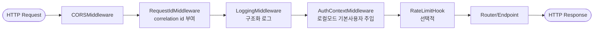

| 미들웨어 | 책임 | 비고 |
|----------|------|------|
| `CORSMiddleware` | 허용 Origin 제어 | 8.14 CORS 정책 |
| `RequestIdMiddleware` | `X-Request-Id` 생성/전파 | 8.11 상관관계 ID |
| `LoggingMiddleware` | 요청/응답 구조화 로그 | 시크릿 미기록(8.11) |
| `AuthContextMiddleware` | 로컬 단일 사용자 모드 시 기본 사용자 주입 | 8.14, FR-AUTH-2 |
| `RateLimitHook` | 공급자 호출/엔드포인트 레이트리밋 훅 | MVP 비활성, 확장 포인트 |

### 8.1.4 Lifespan (startup / shutdown)

```pascal
ASYNC CONTEXTMANAGER lifespan_handler(app)
BEGIN
    // --- startup ---
    settings ← get_settings()
    init_logging(settings)                       // 8.11
    engine ← create_async_engine(settings.DATABASE_URL)
    IF settings.is_sqlite THEN
        enable_sqlite_pragmas(engine)            // WAL, foreign_keys=ON (8.16)
    app.state.db_engine ← engine
    app.state.provider_registry ← build_provider_registry(settings)   // 8.17
    app.state.storage ← build_storage_backend(settings)               // 8.9
    app.state.job_queue ← build_job_queue(settings)                   // 8.8

    YIELD                                        // 애플리케이션 가동

    // --- shutdown ---
    AWAIT app.state.job_queue.drain()            // 진행 중 작업 정리
    AWAIT engine.dispose()                       // 커넥션 풀 정리
END
```

### 8.1.5 요청 생명주기 (Request Lifecycle)

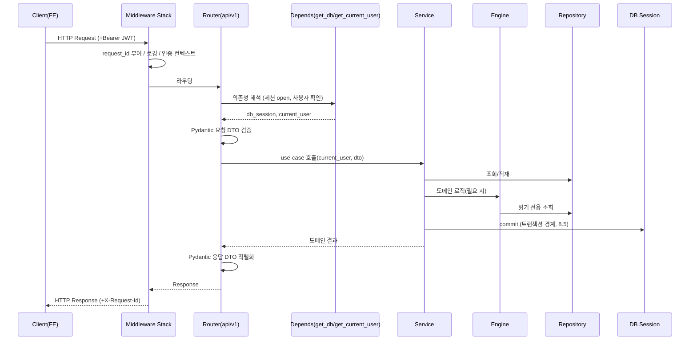

## 8.2 서비스 레이어 책임 (Service Layer)

서비스는 **유스케이스 단위 오케스트레이션**과 **트랜잭션 경계**를 담당한다. HTTP 세부사항(상태코드·헤더)이나 SQL 세부사항을 알지 않는다.

| Service에 속하는 것 | Service에 속하지 않는 것 |
|---------------------|--------------------------|
| 여러 Repository/Engine 호출 조합 | HTTP 상태코드/헤더 결정(→ Router) |
| 트랜잭션 commit/rollback 결정 | 직접 SQL 작성(→ Repository) |
| 도메인 불변식 강제(INV-1~7, 8.13) | LLM HTTP 프로토콜 처리(→ Adapter) |
| 권한·소유권 확인(`user_id` 일치) | 응답 DTO 직렬화 형태 결정(→ Router/Schema) |
| 백그라운드 작업 enqueue(8.8) | 토큰 단위 스트리밍 프로토콜(→ Adapter/Engine) |

### 8.2.1 서비스 인터페이스 시그니처 (개념적)

```python
# app/services/chat_service.py  (시그니처만 — 구현 아님)
class ChatService(Protocol):
    async def create_session(self, user: User, dto: ChatCreate) -> ChatSession: ...
    async def list_sessions(self, user: User, page: PageParams) -> Page[ChatSession]: ...
    async def get_messages(self, user: User, chat_id: UUID, page: PageParams) -> Page[Message]: ...
    # SSE: 토큰 비동기 제너레이터 반환 (8.7). 최종 메시지 DB 영속화 포함.
    def stream_message(self, user: User, chat_id: UUID, dto: MessageCreate) -> AsyncIterator[StreamEvent]: ...
    async def force_summarize(self, user: User, chat_id: UUID) -> Memory: ...

# app/services/novel_service.py
class NovelService(Protocol):
    async def create_work(self, user: User, dto: WorkCreate) -> Work: ...
    async def list_chapters(self, user: User, work_id: UUID) -> list[Chapter]: ...
    async def create_chapter(self, user: User, work_id: UUID, dto: ChapterCreate) -> Chapter: ...
    def continue_chapter(self, user: User, chapter_id: UUID, dto: ContinueRequest) -> AsyncIterator[StreamEvent]: ...
    async def link_character(self, user: User, work_id: UUID, dto: WorkCharacterLink) -> WorkCharacter: ...

# app/services/character_service.py
class CharacterService(Protocol):
    async def create(self, user: User, dto: CharacterCreate) -> Character: ...   # INV-2 검증
    async def list(self, user: User, filters: CharacterFilter, page: PageParams) -> Page[Character]: ...
    async def get(self, user: User, character_id: UUID) -> Character: ...
    async def update(self, user: User, character_id: UUID, dto: CharacterUpdate) -> Character: ...
    async def soft_delete(self, user: User, character_id: UUID) -> None: ...

# app/services/world_service.py
class WorldService(Protocol):
    async def create(self, user: User, dto: WorldCreate) -> World: ...
    async def add_lorebook(self, user: User, world_id: UUID, dto: LorebookCreate) -> Lorebook: ...
    async def add_lore_entry(self, user: User, lorebook_id: UUID, dto: LoreEntryCreate) -> LoreEntry: ...
    async def add_glossary_term(self, user: User, world_id: UUID, dto: GlossaryCreate) -> GlossaryTerm: ...

# app/services/auth_service.py
class AuthService(Protocol):
    async def begin_oauth(self, provider: str) -> RedirectInfo: ...
    async def complete_oauth(self, provider: str, code: str, state: str) -> TokenPair: ...   # JWT 발급
    async def get_me(self, user: User) -> User: ...
    async def logout(self, user: User, token: str) -> None: ...
```

## 8.3 리포지토리 레이어 책임 (Repository Layer)

리포지토리는 영속성 CRUD/쿼리만 담당한다. **원시 SQL 금지**(Phase 4.4) — 모든 쿼리는 SQLAlchemy 2.0 ORM/Core 표현식으로 작성한다. 트랜잭션 commit은 하지 않는다(서비스가 소유, 8.5).

### 8.3.1 BaseRepository[T] 제네릭 계약 (`app/repositories/base.py`)

```python
T = TypeVar("T", bound=Base)   # SQLAlchemy 선언적 모델

class BaseRepository(Generic[T], Protocol):
    model: type[T]

    # --- 기본 CRUD (commit 안 함; flush로 PK 확보) ---
    async def add(self, session: AsyncSession, entity: T) -> T: ...
    async def get(self, session: AsyncSession, id: UUID, *, user_id: UUID) -> T | None: ...
    async def list(self, session: AsyncSession, *, user_id: UUID,
                   filters: Filter, page: PageParams) -> Page[T]: ...
    async def update(self, session: AsyncSession, entity: T, patch: dict) -> T: ...
    async def soft_delete(self, session: AsyncSession, entity: T) -> None: ...   # deleted_at 세팅
    async def hard_delete(self, session: AsyncSession, entity: T) -> None: ...

    # --- 공통 쿼리 헬퍼 ---
    def _scoped(self, stmt: Select, user_id: UUID) -> Select: ...   # user_id 필터 강제(INV-1)
    def _active(self, stmt: Select) -> Select: ...                  # deleted_at IS NULL
```

### 8.3.2 쿼리 패턴 규칙

| 규칙 | 내용 |
|------|------|
| 소유권 스코프 | 모든 조회는 `user_id` 필터를 강제(`_scoped`). 교차 사용자 접근 차단(Property 1). |
| 소프트 삭제 | `worlds/characters/works`는 기본적으로 `deleted_at IS NULL`(`_active`)만 반환. 복구/관리 경로만 포함. |
| N+1 회피 | 연관 적재는 `selectinload`/`joinedload` 명시(8.16). |
| 페이지네이션 | 커서 기반(`created_at, id` 복합 정렬). Phase 6.1 `limit/cursor` 규약. |
| 정렬 안정성 | 항상 결정적 정렬키(`ORDER BY created_at, id`)로 커서 일관성 보장. |

### 8.3.3 Unit of Work 관계

리포지토리는 **세션을 인자로 전달받을 뿐 보유하지 않는다**. 세션 = Unit of Work 경계이며, 그 수명/commit은 서비스가 제어한다(8.5). 한 유스케이스에서 여러 리포지토리가 **동일 세션**을 공유하여 원자적 트랜잭션을 형성한다.

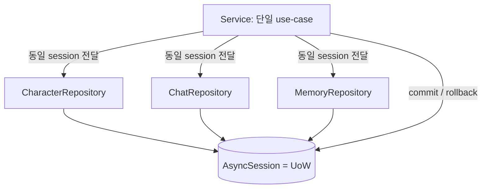

## 8.4 의존성 주입 전략 (Dependency Injection)

FastAPI `Depends`를 단일 DI 메커니즘으로 사용한다(`app/core/deps.py`). 구체 구현이 아닌 Protocol을 주입하여 교체 가능성을 확보한다.

### 8.4.1 핵심 의존성 (`app/core/deps.py`)

```python
# 시그니처(개념) — 구현 아님
def get_settings() -> Settings: ...                 # lru_cache 싱글턴 (8.10)

async def get_db() -> AsyncIterator[AsyncSession]:  # 요청당 세션 (yield 후 close)
    ...                                             # 예외 시 rollback, 항상 close

async def get_current_user(
    creds: HTTPAuthorizationCredentials = Depends(bearer_scheme),
    settings: Settings = Depends(get_settings),
    db: AsyncSession = Depends(get_db),
) -> User: ...
    # 인증 활성: JWT 검증 → User 조회
    # 로컬 단일 사용자 모드(settings.AUTH_ENABLED=False): 기본 사용자(default-user) 주입 (8.14)

def get_provider_registry(request: Request) -> ProviderRegistry:   # app.state에서 획득 (8.17)
    return request.app.state.provider_registry

def get_storage(request: Request) -> StorageBackend: ...           # 8.9
def get_job_queue(request: Request) -> JobQueue: ...               # 8.8
```

### 8.4.2 서비스/엔진 팩토리 주입

서비스는 리포지토리·엔진·어댑터 레지스트리를 의존성으로 주입받는다. 엔진은 어댑터를 **레지스트리 팩토리**를 통해 런타임에 선택한다(모델 설정 기반, FR-AI-2).

```python
def get_chat_service(
    db: AsyncSession = Depends(get_db),
    registry: ProviderRegistry = Depends(get_provider_registry),
    jobs: JobQueue = Depends(get_job_queue),
) -> ChatService:
    chat_repo = ChatRepository()
    memory_engine = MemoryEngine(MemoryRepository())
    prompt_engine = PromptEngine(tokenizer=default_tokenizer)
    return ChatServiceImpl(db, chat_repo, memory_engine, prompt_engine, registry, jobs)
```

### 8.4.3 구현 교체 방법 (Swap)

| 교체 대상 | 방법 | 스코프 |
|-----------|------|--------|
| LLM 공급자 | `ModelConfig.provider`로 `ProviderRegistry`가 어댑터 선택 | 요청 단위(런타임) |
| 테스트용 fake adapter | 테스트에서 `app.dependency_overrides[get_provider_registry]` | 테스트 |
| 테스트 DB | `app.dependency_overrides[get_db]`로 테스트 세션 주입 | 테스트 |
| StorageBackend | `build_storage_backend(settings)` 분기(local→S3) | 앱 수명(startup) |
| JobQueue | `build_job_queue(settings)` 분기(inproc→Celery/ARQ) | 앱 수명(startup) |

**스코프 정리**: `get_settings`/레지스트리/스토리지/잡큐 = 앱 수명 싱글턴(`app.state`). `get_db`/`get_current_user`/서비스 = **요청 단위**.

## 8.5 트랜잭션 경계 (Transaction Boundaries)

**원칙: 서비스 레이어가 트랜잭션을 소유한다.** 세션은 요청당 하나(session-per-request), commit은 유스케이스 종료 시 서비스가 단 한 번 수행, 예외 시 rollback.

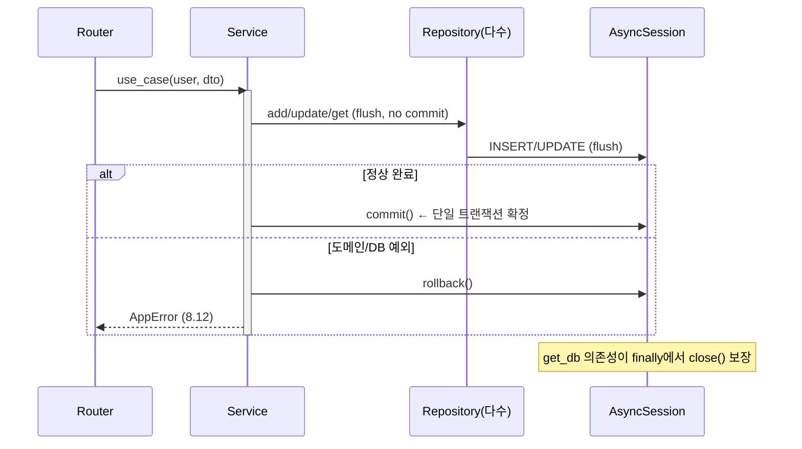

### 8.5.1 규칙

| 항목 | 규칙 |
|------|------|
| commit 위치 | **서비스 메서드 끝에서 1회**. 리포지토리/엔진은 commit 금지. |
| rollback | 예외 발생 시 서비스가 rollback. `get_db`도 안전망으로 예외 시 rollback. |
| 중첩 연산 | 한 유스케이스 내 다중 쓰기(예: 메시지 저장 + 메모리 갱신)는 동일 세션·동일 트랜잭션. |
| 부분 실패 | 중간 실패 시 전체 롤백(원자성). 예) 챕터 생성 + index 부여(INV-3)는 원자적. |

### 8.5.2 SSE 스트리밍과 DB 쓰기 순서 (중요)

스트리밍 응답은 장시간 열린 커넥션이므로 **DB 세션을 스트림 내내 점유하지 않는다**. 쓰기 시점을 분리한다.

```pascal
PROCEDURE stream_message(user, chat_id, dto)
BEGIN
    // T1: 사용자 메시지 저장 — 짧은 트랜잭션, 즉시 commit
    WITH session_scope() AS s:
        chat ← repo.get(s, chat_id, user_id=user.id)   // 소유권 확인
        save_user_message(s, chat, dto.content)
        ctx ← memory_engine.build_context(s, chat_id)  // 읽기
        prompt ← prompt_engine.assemble(...)            // INV-7 검증 (8.13)
        s.commit()

    // T2: 스트리밍 — DB 세션 미점유. 토큰 누적 버퍼만 유지
    buffer ← ""
    FOR EACH token IN adapter.stream_chat(prompt, model_config):
        buffer ← buffer + token
        YIELD StreamEvent(event="token", delta=token)   // Phase 6.4

    // T3: 최종 AI 메시지 저장 — 새 짧은 트랜잭션 (스트림 종료/정상 완료 후)
    WITH session_scope() AS s:
        msg ← save_assistant_message(s, chat_id, buffer, finish_reason)
        s.commit()
    YIELD StreamEvent(event="done", message_id=msg.id, token_count=msg.token_count)

    // T4: 비동기 요약 트리거(임계치 초과 시) — 백그라운드(8.8), 응답 차단 안 함
    IF memory_engine.needs_summary(chat_id):
        job_queue.enqueue(SummarizeJob(chat_id))
END
```

**순서 보장**: 사용자 메시지(T1)는 스트림 시작 전 확정 → 중간 단절(8.7) 시에도 사용자 입력 유실 없음(Property 9 보완). AI 메시지(T3)는 토큰 수신 완료 후 1회 저장(Property 4 불변성).

## 8.6 비동기 처리 전략 (Async Processing)

FastAPI의 비동기 모델을 일관 적용한다.

| 항목 | 선택 | 근거 |
|------|------|------|
| DB 세션 | **async SQLAlchemy**(`AsyncSession`, `create_async_engine`) | 엔드포인트 async 일관성, 동시성 |
| 드라이버 | SQLite: `aiosqlite`, PostgreSQL: `asyncpg` | `DATABASE_URL` 한 줄로 전환(8.10) |
| 엔드포인트 | `async def` 기본 | 비동기 I/O(LLM·DB) 효율 |
| 공급자 호출 | **httpx AsyncClient**(연결 재사용) | 비동기 스트리밍(8.7) |
| 블로킹 작업 | `anyio.to_thread.run_sync`로 스레드풀 오프로딩 | 토크나이저·파일 I/O 등 CPU/blocking |
| 동시성 모델 | 단일 이벤트 루프 + 스레드풀 + (확장) 외부 워커 | MVP는 단일 프로세스 |

### 8.6.1 블로킹 작업 오프로딩 원칙

```pascal
// 토큰 카운팅(tiktoken 등) 등 동기/CPU 바운드는 스레드풀로
async FUNCTION count_tokens(text):
    RETURN AWAIT run_in_threadpool(sync_tokenizer.encode_count, text)

// 파일 해시/이미지 검증 등 blocking I/O도 동일 처리 (8.9)
```

### 8.6.2 동시성 제어

- 공급자 동시 호출 상한: `asyncio.Semaphore(settings.PROVIDER_MAX_CONCURRENCY)`로 제한(8.16).
- 요청별 세션은 격리(공유 금지). `AsyncSession`은 코루틴 간 공유 불가 — 의존성으로 요청마다 새로 생성.

## 8.7 스트리밍 아키텍처 (SSE)

채팅(`POST /chats/{id}/messages`)과 이어쓰기(`POST /chapters/{id}/continue`)는 SSE(`text/event-stream`)로 응답한다. FastAPI `StreamingResponse`(또는 `sse-starlette`의 `EventSourceResponse`)를 사용한다.

### 8.7.1 비동기 제너레이터 파이프라인

토큰은 Adapter→Engine→Service→Router로 비동기 제너레이터를 통해 **역압(backpressure)** 을 유지하며 릴레이된다.

```mermaid
graph LR
    P[(LLM Provider<br/>HTTP SSE)] -->|delta chunk| AD[Adapter.stream_chat<br/>AsyncIterator-str-]
    AD -->|token| EN[ChatEngine<br/>조립/후처리]
    EN -->|StreamEvent| SV[ChatService<br/>버퍼 누적 + 영속화]
    SV -->|StreamEvent| RT[Router<br/>EventSourceResponse]
    RT -->|event: token/done/error| FE([Frontend SSE Parser])
```

### 8.7.2 Adapter 스트리밍 계약

```python
class LLMProvider(Protocol):
    def stream_chat(self, prompt: AssembledPrompt,
                    config: ModelConfig) -> AsyncIterator[str]: ...   # 토큰 델타 yield
    async def chat(self, prompt: AssembledPrompt, config: ModelConfig) -> Completion: ...  # 비스트림

# StreamEvent — Phase 6.4 프로토콜과 1:1 매핑
@dataclass
class StreamEvent:
    event: Literal["token", "done", "error"]
    delta: str | None = None            # event=token
    message_id: UUID | None = None      # event=done
    token_count: int | None = None      # event=done
    finish_reason: str | None = None    # event=done
    code: str | None = None             # event=error (Phase 6.1 코드)
    message: str | None = None          # event=error
```

### 8.7.3 Phase 6.4 이벤트 매핑

| 파이프라인 단계 | SSE 출력 (Phase 6.4) |
|-----------------|----------------------|
| Adapter delta 수신 | `event: token` / `data: {"delta": "..."}` |
| 스트림 정상 종료 + DB 저장 | `event: done` / `data: {"message_id","token_count","finish_reason"}` |
| 공급자/내부 오류 | `event: error` / `data: {"code","message"}` (8.12 코드 매핑) |

### 8.7.4 취소/연결 끊김 처리

```pascal
PROCEDURE sse_endpoint(...)
BEGIN
    gen ← service.stream_message(user, chat_id, dto)
    TRY
        FOR EACH evt IN gen:
            IF AWAIT request.is_disconnected() THEN
                // 클라이언트 단절 감지 → 공급자 스트림 취소
                AWAIT gen.aclose()              // Adapter의 httpx 스트림 close
                LOG.info("sse_client_disconnected", request_id)
                BREAK
            YIELD format_sse(evt)               // "event: ...\ndata: ...\n\n"
    FINALLY
        // 단절 시에도 누적 버퍼는 best-effort로 저장(부분 보존, Property 9)
        AWAIT service.persist_partial_if_any(chat_id, buffer)
END
```

- **부분 토큰 보존**: 단절 시 서버는 누적분을 부분 메시지로 저장 시도(`meta.partial=true`), 프론트엔드도 부분 보존(Phase 7.13). → Property 9.
- **공급자 취소**: httpx 스트림 컨텍스트를 닫아 불필요한 토큰 과금 방지.
- **[검토 추가] 단일 저장 보장**: 정상 종료(T3, `done`)와 단절 보존(`persist_partial_if_any`)은 **상호 배타**다. 스트림당 `committed` 플래그(또는 `Idempotency-Key` 기반 행 upsert)로 assistant 메시지가 **정확히 1회만** 저장되도록 한다(중복 행 금지, Property 4/9 정합).
- **[검토 추가] 동시성 직렬화 한계**: 세션 단위 직렬화(12.12)가 인메모리 lock이면 **단일 워커에서만 유효**하다. 다중 워커(스케일)에서는 DB 자문 잠금(PG `advisory lock`) 또는 분산 락이 필요하다(15장 배포에서 SQLite=단일 워커 강제로 MVP 회피).

## 8.8 백그라운드 작업 아키텍처 (Background Jobs)

MVP에서는 **FastAPI `BackgroundTasks` / `asyncio.create_task`** 로 충분하다(메모리 요약·자동 제목 생성). 단, 나중에 Celery/RQ/ARQ로 **코어 변경 없이** 교체 가능하도록 `JobQueue` Protocol로 추상화한다.

### 8.8.1 JobQueue 추상화 (`app/core/jobs.py` 개념)

```python
@dataclass
class Job:
    kind: str                  # "summarize" | "auto_title" | ...
    payload: dict
    idempotency_key: str       # 중복 실행 방지 (8.8.3)
    max_retries: int = 3

class JobQueue(Protocol):
    async def enqueue(self, job: Job) -> None: ...
    def register(self, kind: str, handler: Callable[[dict], Awaitable[None]]) -> None: ...
    async def drain(self) -> None: ...     # shutdown 시 진행 작업 정리

# MVP 구현: InProcessJobQueue (asyncio.Queue + BackgroundTasks)
# 확장 구현: CeleryJobQueue / ARQJobQueue — 동일 Protocol, 코어/서비스 변경 0
```

### 8.8.2 잡 흐름 (메모리 요약 예)

```mermaid
sequenceDiagram
    participant S as ChatService
    participant Q as JobQueue
    participant W as Worker(MVP: asyncio task)
    participant ME as MemoryEngine
    participant DB as Repository

    S->>Q: enqueue(SummarizeJob{chat_id, key})
    Note over S: 응답 스트림은 차단하지 않음
    Q->>W: dispatch(handler)
    W->>ME: summarize(chat_id)
    ME->>DB: 최근 메시지 조회 + 요약 저장(Memory)
    W->>DB: idempotency_key 기록(완료 마킹)
```

### 8.8.3 멱등성·재시도

| 항목 | 전략 |
|------|------|
| 멱등성 | `idempotency_key`(예: `summarize:{chat_id}:{last_message_id}`) 기록. 동일 키 작업 스킵. |
| 재시도 | 일시 오류(공급자 429/502)는 지수 백오프 재시도(`max_retries`). 초과 시 로그 + 실패 마킹. |
| 자동 제목 | 첫 메시지 후 `auto_title` 잡 1회(멱등키 `auto_title:{chat_id}`). 이미 제목 있으면 스킵. |
| 안전성 | 잡 실패가 사용자 요청 플로우를 깨뜨리지 않음(비동기·격리). |

## 8.9 파일 스토리지 아키텍처 (File Storage)

스토리지는 `StorageBackend` Protocol로 추상화한다. MVP는 로컬 파일시스템(Phase 2.1 `Local File Storage`), 확장 시 S3/오브젝트 스토리지로 교체.

### 8.9.1 StorageBackend Protocol (`app/core/storage.py` 개념)

```python
class StorageBackend(Protocol):
    async def save(self, path: str, data: bytes, content_type: str) -> StoredFile: ...
    async def open(self, path: str) -> AsyncIterator[bytes]: ...     # 스트리밍 서빙
    async def delete(self, path: str) -> None: ...
    def url_for(self, path: str) -> str: ...     # local: /media/..., s3: presigned URL

# 구현: LocalFileStorage(base_dir=settings.MEDIA_ROOT)
#       S3Storage(bucket=...) — 동일 Protocol, 코어 변경 0
```

### 8.9.2 경로/명명/서빙

| 용도 | 경로 규칙 | 비고 |
|------|-----------|------|
| 캐릭터 아바타 | `media/{user_id}/avatars/{character_id}/{uuid}.{ext}` | `Character.avatar_url`에 `url_for` 결과 저장 |
| Export 산출물 | `media/{user_id}/exports/{work_id}/{uuid}.{epub\|pdf\|json}` | 확장(Phase 1.6) |
| 서빙(local) | `GET /media/...`를 StaticFiles 또는 StreamingResponse | 인증 가드 하 사용자 스코프 검증 |
| 서빙(S3) | `url_for`가 presigned URL 반환 | 직접 다운로드 |

### 8.9.3 검증

```pascal
PROCEDURE validate_upload(file)
BEGIN
    ASSERT file.size ≤ settings.MAX_UPLOAD_BYTES        // 예: 5MB
    ASSERT file.content_type IN ALLOWED_IMAGE_TYPES      // image/png, image/jpeg, image/webp
    ASSERT sniff_magic_bytes(file) MATCHES content_type  // 확장자 위조 방지
    // 검증 통과 후에만 StorageBackend.save 호출
END
```

## 8.10 설정 관리 (Configuration)

`app/config.py`에서 **Pydantic Settings**로 환경변수를 로딩한다. `.env` 계층, 단일 `DATABASE_URL` 스위치, 기능 플래그, 시크릿을 일원화한다.

### 8.10.1 Settings 스키마 (개념)

```python
class Settings(BaseSettings):
    model_config = SettingsConfigDict(env_file=".env", env_nested_delimiter="__")

    # --- core ---
    APP_ENV: Literal["local", "dev", "prod"] = "local"
    APP_SECRET_KEY: SecretStr                      # 암호화/JWT 서명 (8.14)
    DATABASE_URL: str = "sqlite+aiosqlite:///./data/app.db"   # 단일 스위치(8.6)

    # --- auth (FR-AUTH-2) ---
    AUTH_ENABLED: bool = False                     # False=로컬 단일 사용자 모드
    JWT_ALG: str = "HS256"
    JWT_TTL_SECONDS: int = 60 * 60 * 24 * 7
    GOOGLE_CLIENT_ID: str | None = None
    GOOGLE_CLIENT_SECRET: SecretStr | None = None

    # --- providers / runtime ---
    PROVIDER_MAX_CONCURRENCY: int = 4
    PROVIDER_TIMEOUT_SECONDS: int = 60

    # --- storage / jobs ---
    MEDIA_ROOT: str = "./data/media"
    STORAGE_BACKEND: Literal["local", "s3"] = "local"
    JOB_BACKEND: Literal["inproc", "celery", "arq"] = "inproc"
    MAX_UPLOAD_BYTES: int = 5 * 1024 * 1024

    # --- feature flags (Phase 7.15와 정합) ---
    FEATURES: dict[str, bool] = {}                 # 예: {"image_gen": False, "rag": False}

    # --- cors ---
    CORS_ORIGINS: list[str] = ["http://localhost:3000"]

    @property
    def is_sqlite(self) -> bool: ...
```

### 8.10.2 환경별 구성

| 환경 | 특징 |
|------|------|
| local | SQLite + WAL, `AUTH_ENABLED=False`(기본 사용자), 로컬 스토리지/inproc 잡 |
| dev | PostgreSQL 가능, OAuth 활성 테스트 |
| prod | PostgreSQL(`asyncpg`), `AUTH_ENABLED=True`, S3·외부 잡큐 선택 |

- `.env` 계층: `.env`(공통) → 환경별 override → 실제 OS 환경변수(최우선). 시크릿은 절대 커밋 금지(`.env.example`만 제공, Phase 5.1).
- `get_settings()`는 `lru_cache`로 싱글턴(8.4.1).

## 8.11 로깅 전략 (Logging)

구조화 로깅(JSON line)을 채택한다. 모든 로그 라인은 `request_id`(8.1.3 RequestIdMiddleware)를 포함해 단일 요청을 추적 가능하게 한다. **시크릿·평문 API Key·OAuth 토큰·프롬프트 전문은 로그에 기록하지 않는다**(NFR-7, Property 8).

### 8.11.1 로그 구조

```python
# 구조화 로그 레코드(개념) — 구현 아님
class LogRecord:
    ts: datetime          # ISO8601 UTC
    level: str            # DEBUG|INFO|WARNING|ERROR
    request_id: str       # 상관관계 ID (X-Request-Id)
    user_id: str | None   # 인증 사용자(없으면 None)
    event: str            # "chat.stream.start", "provider.call", "job.summarize.done" ...
    duration_ms: int | None
    meta: dict            # 비민감 메타데이터만
```

### 8.11.2 마스킹 규칙

| 대상 | 처리 |
|------|------|
| API Key / 토큰 | 기록 금지. 필요 시 `sk-...abcd`로 마스킹(Phase 4.5와 동일 규칙). |
| 프롬프트 본문 | 기본 미기록. 디버그 모드(`APP_ENV=local`)에서만 토큰 수·블록 메타(9.12)만 기록. |
| 사용자 메시지 | 본문 미기록. 길이/토큰 수만 기록. |
| 예외 스택 | 기록하되 메시지 내 잠재 시크릿은 필터(`SecretStr` 노출 차단). |

### 8.11.3 로깅 포인트

```mermaid
graph LR
    A[Request 진입<br/>request_id 부여] --> B[Service use-case<br/>start/end + duration]
    B --> C[Provider 호출<br/>provider/model/latency]
    C --> D[Job 실행<br/>kind/idempotency/result]
    D --> E[Error<br/>code/level + stack]
```

## 8.12 에러 처리 전략 (Error Handling)

예외 계층을 도메인 중심으로 정의하고, FastAPI 예외 핸들러(8.1.1 `register_exception_handlers`)에서 **Phase 6.1 에러 코드/HTTP 상태**로 매핑한다.

### 8.12.1 예외 계층 (`app/core/errors.py`)

```python
class AppError(Exception):              # 모든 도메인 예외의 루트
    code: str                           # Phase 6.1 코드
    http_status: int
    message: str
    details: dict | None = None

class ValidationError(AppError):    code="VALIDATION_ERROR";   http_status=400
class Unauthenticated(AppError):    code="UNAUTHENTICATED";    http_status=401
class Forbidden(AppError):          code="FORBIDDEN";          http_status=403
class NotFound(AppError):           code="RESOURCE_NOT_FOUND"; http_status=404
class Conflict(AppError):           code="CONFLICT";           http_status=409   # 예: chapter index 충돌(INV-3)
class ProviderRateLimited(AppError):code="PROVIDER_RATE_LIMIT";http_status=429
class ProviderError(AppError):      code="PROVIDER_ERROR";     http_status=502
```

### 8.12.2 매핑 규칙

| 발생 위치 | 예외 | HTTP / code (Phase 6.1) |
|-----------|------|--------------------------|
| Pydantic 검증 실패 | (FastAPI 기본) | 422 UNPROCESSABLE |
| 서비스 도메인 검증(INV) | `ValidationError`/`Conflict` | 400 / 409 |
| 소유권 불일치(8.3 `_scoped`) | `NotFound`(존재 은닉) 또는 `Forbidden` | 404 / 403 |
| JWT 없음/만료(8.14) | `Unauthenticated` | 401 |
| 공급자 429 | `ProviderRateLimited` | 429 |
| 공급자 5xx/네트워크 | `ProviderError` | 502 |

### 8.12.3 SSE 컨텍스트에서의 에러

스트리밍 도중 오류는 HTTP 상태로 표현할 수 없으므로(이미 200 + 스트림 시작) **`event: error`**(Phase 6.4)로 전달한다(8.7.3). `code`는 동일 매핑 사용. 부분 토큰은 보존(8.7.4, Property 9).

```mermaid
flowchart TD
    E[예외 발생] --> S{스트리밍 중인가?}
    S -->|아니오| H[ExceptionHandler<br/>JSON 에러바디 + HTTP status]
    S -->|예| SS[event: error data: code,message<br/>+ 부분 메시지 best-effort 저장]
```

## 8.13 검증 전략 (Validation)

검증을 **경계(Boundary) 검증**과 **도메인 불변식 검증** 두 층으로 분리한다.

| 층 | 위치 | 책임 | 예 |
|----|------|------|-----|
| 경계 검증 | Router + Pydantic Schema(`app/schemas/*`) | 타입·필수·형식·범위(구문적) | 이메일 형식, `target_words > 0`, enum 값 |
| 도메인 불변식 | Service(`app/services/*`) | 의미적 규칙·교차 엔티티·소유권 | INV-1~7, 소유권 일치, INV-3 index 연속성 |

### 8.13.1 불변식 → 검증 위치 매핑 (Correctness Properties 연동)

| 불변식 / Property | 검증 위치 | 방식 |
|-------------------|-----------|------|
| INV-1 소유자 무결성 / Property 1 | Repository `_scoped` + Service | 모든 쓰기에 `user_id` 강제 |
| INV-2 세계관 소유 / Property 2 | CharacterService.create/update | `world.user_id == user.id` 확인 |
| INV-3 챕터 index / Property 3 | NovelService.create_chapter | 트랜잭션 내 `max(index)+1` 부여, UK 제약 |
| INV-4 메시지 불변 / Property 4 | ChatService(append-only) | UPDATE 미제공, 새 메시지로만 |
| INV-5 메모리 참조 / Property 5 | MemoryEngine.summarize | `cover_up_to_message_id` 동일 세션 검증 |
| INV-6/7 토큰 예산 / Property 6,7 | PromptEngine.assemble(9.x) | budget ≤ contextWindow 보증, 초과 시 truncation |
| NFR-7 자격증명 / Property 8 | Schema 직렬화 + Service | 응답 DTO에서 평문 키 제외(마스킹) |

도메인 불변식 위반은 `ValidationError`/`Conflict`(8.12)로 변환된다.

## 8.14 보안 아키텍처 (Security)

### 8.14.1 인증 가드

- 인증 활성 모드: `get_current_user`(8.4.1)가 `Authorization: Bearer <jwt>`를 검증. 실패 시 `Unauthenticated`(401).
- 로컬 단일 사용자 모드(`AUTH_ENABLED=False`, FR-AUTH-2): `AuthContextMiddleware`가 기본 사용자(`default-user`)를 주입. 외부 노출 배포에서는 반드시 `AUTH_ENABLED=True` 권고.

### 8.14.2 시크릿/자격증명 암호화

```mermaid
flowchart LR
    K[평문 API Key] -->|Fernet/AES-GCM<br/>key=APP_SECRET_KEY| ENC[api_key_enc 저장]
    ENC -->|복호화 backend 메모리 only| USE[Provider 호출 시점]
    ENC -.응답.-> MASK["마스킹: sk-...abcd"]
```

| 항목 | 정책 |
|------|------|
| 저장 | `provider_credentials.api_key_enc`, `oauth_accounts.*_token_enc`는 애플리케이션 레벨 대칭 암호화(Phase 4.5). |
| 키 관리 | `APP_SECRET_KEY`(`SecretStr`, 8.10). 환경변수/시크릿 매니저. 절대 커밋 금지. |
| 복호화 범위 | 백엔드 메모리 내 공급자 호출 시점에만. FE 절대 미전달(NFR-7, Property 8). |
| 응답 마스킹 | Schema 레벨에서 평문 키 필드 제외, `label`/마스킹값만 반환. |

### 8.14.3 CORS / 전송

- `CORSMiddleware` 허용 Origin은 `settings.CORS_ORIGINS`로 제한. 와일드카드 금지(프로덕션).
- 프로덕션은 리버스 프록시 TLS 종단(Phase 15). 쿠키 사용 시 `Secure`/`HttpOnly`/`SameSite`.

### 8.14.4 레이트 리밋 훅 (확장 포인트)

`RateLimitHook`(8.1.3)은 MVP 비활성. 공급자 호출/IP/사용자 단위 리밋을 끼울 수 있는 미들웨어 자리만 확보(확장 시 토큰 버킷 구현 삽입, 코어 변경 0).

## 8.15 테스트 아키텍처 (Testing)

Phase 5.2 `tests/` 레이아웃(`unit/`, `property/`, `integration/`)을 그대로 따른다.

```mermaid
graph TB
    subgraph unit["tests/unit"]
        U1[Engine 로직<br/>Prompt 조립/Budget/Memory 요약 트리거]
        U2[Service 오케스트레이션<br/>fake repo/adapter]
    end
    subgraph prop["tests/property — Hypothesis"]
        P1[Property 1~9 인코딩]
    end
    subgraph integ["tests/integration"]
        I1[FastAPI API: CRUD + SSE E2E]
        I2[인증 가드/페이지네이션]
    end
```

| 계층 | 도구/방식 | 대상 |
|------|-----------|------|
| 단위 | pytest + fake adapter/repo, `dependency_overrides` | Engine/Service 순수 로직 |
| 속성 | **Hypothesis** | Correctness Properties(특히 3, 5, 7, 8) |
| 통합 | `httpx.AsyncClient` + 테스트 DB(SQLite 메모리) | 라우터→서비스→DB, SSE 토큰/done/error |

- fake `LLMProvider`(결정적 토큰 스트림)로 공급자 비의존 테스트(8.4.3).
- SSE 통합 테스트는 `event: token*` → `event: done` 순서와 단절 시 부분 보존(Property 9)을 검증.

## 8.16 성능 및 확장성 (Performance & Scalability)

| 항목 | MVP(SQLite) | 확장(PostgreSQL) | 기법 |
|------|-------------|------------------|------|
| 동시성 | WAL 모드 + `foreign_keys=ON` | MVCC | startup pragma(8.1.4) |
| 커넥션 풀 | 단일 파일(풀 작음) | `asyncpg` 풀(`pool_size`/`max_overflow`) | `DATABASE_URL`만 교체(8.6) |
| N+1 회피 | `selectinload`/`joinedload` 명시 | 동일 | Repository 적재 정책(8.3.2) |
| 페이지네이션 | 커서 기반 결정적 정렬 | 동일 | `(created_at,id)` 인덱스(Phase 4.3) |
| 공급자 동시성 | `Semaphore(PROVIDER_MAX_CONCURRENCY)` | 동일 | 8.6.2 |
| 캐싱 seam | 없음(MVP) | Prompt cache(9.11)/조회 캐시 자리 | 인터페이스만 확보, 코어 변경 0 |

- **스트리밍 메모리**: SSE는 DB 세션 비점유(8.5.2)로 장시간 커넥션이 풀을 고갈시키지 않음.
- **요약 오프로딩**: 토큰 임계 초과 요약은 백그라운드(8.8)로 응답 지연(NFR-1) 미영향.

## 8.17 향후 모듈 확장 포인트 (Extension Points)

Phase 7.15 프론트 확장 포인트와 정합하는 백엔드 확장 seam을 정의한다. 모두 **Protocol + Registry** 패턴으로 코어 변경 없이 추가된다.

```mermaid
graph TB
    subgraph Registries["레지스트리(팩토리) 기반 확장"]
        PR[ProviderRegistry<br/>adapters/registry.py]
        OR[OAuthProviderRegistry<br/>auth/providers]
        RR[Retriever Protocol<br/>memory/retriever.py]
        SR[StorageBackend<br/>core/storage.py]
        JR[JobQueue<br/>core/jobs.py]
    end
    PR -->|신규 공급자| NEWP[새 LLMProvider 등록만]
    OR -->|GitHub/Discord/Apple| NEWO[새 OAuthProvider 등록만]
    RR -->|키워드→임베딩/RAG| NEWR[새 Retriever 교체]
    SR -->|local→S3| NEWS[새 StorageBackend]
    JR -->|inproc→Celery/ARQ| NEWJ[새 JobQueue]
```

| 확장 | seam | Phase 7.15 대응 | 코어 영향 |
|------|------|------------------|-----------|
| 신규 LLM 공급자 | `ProviderRegistry.register`(8.17/Phase 13) | modelPlayground/costDashboard | 0 |
| RAG 임베딩 검색 | `Retriever` Protocol(Phase 10) | — | 스키마 무파괴(임베딩 컬럼 옵션) |
| 멀티유저 활성화 | `AUTH_ENABLED=True` + 기존 `user_id` FK | (계정/공유) | 0(이미 전 테이블 `user_id`) |
| 클라우드 동기화 | StorageBackend/Export seam | autoBackup | 0 |
| 관계도/타임라인 | 읽기 전용 쿼리 서비스 추가 | relationshipGraph/storyTimeline | 0(기존 데이터 파생) |

---

# Phase 9. Prompt Engine (프롬프트 엔진)

> **이 Phase의 목표**: 제품의 핵심 차별점인 **프롬프트 조립 엔진**을 추가 질의 없이 구현 가능한 수준으로 상세 설계한다. 블록 시스템·조립 파이프라인·토큰 예산·우선순위·변수 치환·각종 주입(페르소나/캐릭터/세계관/로어/기억/챕터)·캐시·디버그 뷰·공급자별 적응을 다룬다.
>
> **위치(Phase 5.2)**: `app/engines/prompt/`(`engine.py`, `blocks.py`, `budget.py`, `tokenizer.py`). **레이어(Phase 2.3)**: Engine. Service가 호출하고, Engine은 Repository(읽기)와 Adapter 비의존(중립 구조 산출)에만 의존.
>
> **정합성**: Correctness Property 6(`contextWindow ≥ maxTokens`), Property 7(조립 토큰 ≤ `contextWindow`), INV-6/7, Phase 2.4 채팅 흐름, Phase 6.4 messages 구조.

## 9.1 개요 (Overview)

Prompt Engine은 흩어진 컨텍스트 조각(시스템 지침·페르소나·캐릭터·세계관·로어·기억·대화 히스토리·사용자 입력)을 **우선순위가 있는 블록(PromptBlock)** 으로 수집하고, 변수 치환→주입→예산 기반 truncation→최종 `messages[]` 변환의 결정적 파이프라인으로 조립한다. 출력은 **공급자 중립(provider-neutral)** 구조이며, 공급자별 차이(시스템 메시지 처리)는 Adapter(Phase 13)가 렌더링한다.

## 9.2 책임 (Responsibilities)

| 책임 | 설명 |
|------|------|
| 블록 수집 | 도메인 소스에서 PromptBlock 생성(collect) |
| 변수 치환 | `{{char}}`,`{{user}}`,`{{persona}}`,`{{world}}` 등 해소 |
| 주입 | 페르소나/캐릭터/세계관/로어/기억/챕터 블록 삽입 |
| 예산 관리 | 토큰 예산 계산, 초과 시 우선순위 기반 truncation/drop |
| 최종화 | `messages[]`(role/content) 중립 구조 + 메타 산출 |
| 캐시 | 블록 해시 기반 재사용·무효화 |
| 디버그 | 포함/탈락 블록·토큰 회계 추적(L3 dev 패널) |
| **비책임** | LLM HTTP 호출(→Adapter), 기억 생성/요약(→Memory Engine), DB 쓰기(→Service) |

## 9.3 아키텍처 (Architecture)

```mermaid
graph TB
    subgraph Sources["컨텍스트 소스(읽기)"]
        SYS[System/PromptTemplate]
        PERS[Persona]
        CHAR[Character]
        WORLD[World/Glossary]
        LORE[LoreEntry 매칭]
        MEM[MemoryContext<br/>Phase 10]
        HIST[최근 메시지/챕터]
        UMSG[사용자 입력]
    end
    subgraph PromptEngine["PromptEngine (app/engines/prompt)"]
        COL[collect → PromptBlock 목록]
        VAR[resolve variables]
        INJ[inject blocks]
        BUD[budget/truncate<br/>budget.py]
        FIN[finalize messages]
        TOK[tokenizer.py<br/>토큰 카운터 추상화]
        CACHE[Prompt Cache]
        DBG[Debug Trace]
    end
    Sources --> COL --> VAR --> INJ --> BUD --> FIN
    BUD <--> TOK
    COL <--> CACHE
    BUD --> DBG
    FIN -->|AssembledPrompt<br/>중립 messages| ADP[Adapter Phase 13]
```

## 9.4 컴포넌트 (Components)

| 컴포넌트 | 파일 | 책임 |
|----------|------|------|
| `PromptEngine` | `engine.py` | 파이프라인 오케스트레이션, `assemble()` |
| `PromptBlock` 정의 | `blocks.py` | 블록 타입·역할·종류·우선순위 |
| `BudgetManager` | `budget.py` | 예산 산정·truncation·drop 결정 |
| `Tokenizer` | `tokenizer.py` | 토큰 카운트 추상화(공급자/모델별) |
| `VariableResolver` | `engine.py` 내부 | 플레이스홀더 치환 |
| `LoreScanner` | `engine.py` 내부 | 최근 N메시지 키워드 스캔 → LoreEntry 매칭 |
| `PromptCache` | `engine.py` 내부 | 블록 해시 → 조립 결과 재사용 |

## 9.5 인터페이스 (Interfaces)

```python
# app/engines/prompt/blocks.py
BlockKind = Literal[
    "system", "persona", "character", "world", "lore",
    "memory", "history", "chapter", "user", "instruction"
]
BlockRole = Literal["system", "user", "assistant"]   # 최종 messages role 매핑

@dataclass
class PromptBlock:
    id: str
    role: BlockRole
    kind: BlockKind
    content: str
    priority: int          # 낮을수록 먼저 drop/trim (drop 순서 제어, 9.9)
    token_count: int       # tokenizer로 산정(지연 계산 가능)
    truncatable: bool      # True면 길이 trim 허용, False면 전체 drop만

@dataclass
class AssembledPrompt:
    messages: list[dict]   # [{"role","content"}] — 공급자 중립
    token_count: int       # 합계(≤ contextWindow 보장: Property 7)
    trace: "PromptTrace"   # 디버그(9.12)

@dataclass
class BudgetResult:
    included: list[PromptBlock]
    dropped: list[PromptBlock]
    trimmed: list[tuple[PromptBlock, int]]   # (블록, 잘려나간 토큰수)
    final_tokens: int
    budget: int            # 가용 예산(9.7)

# app/engines/prompt/engine.py
class PromptEngine(Protocol):
    def assemble(
        self,
        *,
        template: PromptTemplate,
        character: Character | None,
        persona: Persona | None,
        world: World | None,
        lore_entries: list[LoreEntry],
        memory: "MemoryContext",          # Phase 10
        history: list[Message],
        user_message: str | None,
        chapter_context: "ChapterContext | None",   # Phase 11
        config: ModelConfig,
    ) -> AssembledPrompt: ...

# app/engines/prompt/budget.py
class BudgetManager(Protocol):
    def compute_budget(self, config: ModelConfig) -> int: ...   # 9.7
    def fit(self, blocks: list[PromptBlock], budget: int) -> BudgetResult: ...  # 9.9
```

## 9.6 데이터 흐름 (Data Flow) — 조립 파이프라인

순서가 있는 5단계. 각 단계는 순수 함수에 가깝게 설계(테스트 용이, 결정적).

```pascal
FUNCTION assemble(template, character, persona, world, lore, memory, history, user_message, chapter, config)
BEGIN
    // 0. 캐시 조회 (9.11)
    key ← hash(template, character, persona, world, lore_ids, memory.version, history_tail, user_message, config.model)
    IF cache.has(key) THEN RETURN cache.get(key)

    // 1. collect — 소스 → PromptBlock[]
    blocks ← []
    blocks += make_system_block(template)                  // priority 100 (최상위, 거의 drop 안 함)
    IF persona THEN blocks += make_persona_block(persona)  // priority 80
    IF character THEN blocks += make_character_block(character) // priority 90
    IF world THEN blocks += make_world_block(world)        // priority 70
    blocks += make_lore_blocks(lore, history)              // [검토 수정] 후보 lore + history 전달 → 엔진 내 LoreScanner가 scan_depth만큼 키워드 매칭(9.11.2). priority=entry.priority
    blocks += make_memory_blocks(memory)                   // long-term: 60, short-term: 85
    IF chapter THEN blocks += make_chapter_blocks(chapter) // priority 75 (소설 이어쓰기)
    blocks += make_history_blocks(history)                 // priority = recency(최신일수록 높음)
    IF user_message THEN blocks += make_user_block(user_message) // priority 1000 (절대 보존)

    // 2. resolve variables — 플레이스홀더 치환 (9.10)
    ctx ← build_var_context(character, persona, world, user)
    FOR EACH b IN blocks: b.content ← resolve(b.content, ctx)

    // 3. inject — 정렬 및 배치 (system 먼저, user 마지막)
    blocks ← order_blocks(blocks)                          // 9.8

    // 4. budget/truncate — 예산 적합화 (9.7, 9.9)
    budget ← budget_manager.compute_budget(config)
    result ← budget_manager.fit(blocks, budget)            // BudgetResult

    // 5. finalize — 중립 messages 변환
    messages ← to_messages(result.included)                // role/content 병합
    assembled ← AssembledPrompt(messages, result.final_tokens, trace=build_trace(result))

    ASSERT assembled.token_count ≤ config.context_window   // Property 7 (방어적)
    cache.put(key, assembled)
    RETURN assembled
END
```

## 9.7 컨텍스트 예산 vs 토큰 예산 (Context Budget vs Token Budget)

두 개념을 명확히 구분한다.

| 개념 | 정의 | 산정 |
|------|------|------|
| **컨텍스트 윈도우(Context Window)** | 모델이 한 번에 처리 가능한 총 토큰(입력+출력). `ModelConfig.context_window`. | 모델 메타데이터(Phase 13 capability) |
| **출력 예산(Max Output)** | 생성에 예약하는 토큰. `ModelConfig.max_tokens`. | 설정값 |
| **입력 예산(Prompt Budget)** | 프롬프트가 쓸 수 있는 토큰. = `context_window − max_tokens − safety_margin`. | 계산 |

```pascal
FUNCTION compute_budget(config)
BEGIN
    ASSERT config.context_window ≥ config.max_tokens        // INV-6 / Property 6
    // [검토 수정] 원격 공급자(Claude/Gemini 등)는 정확 토크나이저 미공개 → 근사 카운트.
    // 공급자별 safety 비율을 capability에서 받아 차등 적용(정확: 2%, 근사: 8~10%).
    safety_ratio ← tokenizer.safety_ratio(config.provider)  // 기본 0.02, 근사 공급자 0.08+
    safety ← ceil(config.context_window * safety_ratio)     // 토크나이저 오차 마진
    budget ← config.context_window − config.max_tokens − safety
    RETURN max(budget, MIN_PROMPT_BUDGET)                    // 하한 보장
END
```

조립 결과는 항상 `budget` 이하 → 입력+출력 ≤ context_window → **Property 7** 충족.

### 9.7.1 토큰 예산 워크드 예제

`context_window=8192`, `max_tokens=1024`, `safety=ceil(8192*0.02)=164` → `budget = 8192 − 1024 − 164 = 7004`.

| 블록 | priority | tokens | 누적 | 처리 |
|------|----------|--------|------|------|
| system(template) | 100 | 350 | 350 | 포함 |
| user_message | 1000 | 120 | — | **예약 먼저**(절대 보존) |
| character | 90 | 600 | 950 | 포함 |
| memory(short-term) | 85 | 800 | 1750 | 포함 |
| persona | 80 | 200 | 1950 | 포함 |
| chapter summary | 75 | 1500 | 3450 | 포함 |
| world | 70 | 900 | 4350 | 포함 |
| lore #A | 65 | 700 | 5050 | 포함 |
| memory(long-term) | 60 | 1200 | 6250 | 포함 |
| lore #B | 55 | 900 | 7150 | **초과** → truncatable이면 trim(약 −146)·아니면 drop |
| history(오래된) | 30 | 2000 | — | drop(예산 초과, 최저 우선) |

`user_message`(120) 포함 합계 ≤ 7004 유지. 최종 `final_tokens ≈ 7004`, 출력 1024 예약 → 총 ≤ 8192.

## 9.8 우선순위 규칙 (Priority Rules) — 블록 배치

배치는 두 축으로 결정된다: (a) **역할 순서**(system→context→history→user), (b) **우선순위(priority)**(drop/trim 순서).

```pascal
FUNCTION order_blocks(blocks)
BEGIN
    // 역할 레이어 순서 고정
    layers ← group_by_layer(blocks)   // [system, persona/character/world, lore, memory, chapter, history, user]
    ordered ← []
    FOR EACH layer IN LAYER_ORDER:
        // 같은 레이어 내부는 priority 내림차순(높은 게 앞)
        ordered += sort_desc_by_priority(layers[layer])
    RETURN ordered
END
```

**LAYER_ORDER**: `system → character → persona → world → lore → memory(long) → chapter → memory(short)/history → user`. user_message는 항상 마지막(최근성 + role 일관).

## 9.9 Truncation / Priority 결정 다이어그램

예산 초과 시 **drop·trim 순서**: priority 오름차순(낮은 것부터), 단 `user_message`(priority 1000)와 system(100)은 보호. `truncatable=True`는 길이 trim, `False`는 전체 drop.

```mermaid
flowchart TD
    A[blocks + budget] --> R[필수 예약:<br/>user_message, system]
    R --> S[가용 = budget − 필수 토큰]
    S --> L[나머지 블록 priority 내림차순 순회]
    L --> C{누적 + 블록 ≤ 가용?}
    C -->|예| INC[포함] --> L
    C -->|아니오| T{truncatable?}
    T -->|예| TR[남은 예산만큼 trim<br/>경계 단어 보존] --> STOP
    T -->|아니오| D[전체 drop] --> CONT{남은 블록 있음?}
    CONT -->|예| L
    CONT -->|아니오| STOP[종료]
    STOP --> CHK[ASSERT final ≤ budget<br/>Property 7]
```

```mermaid
stateDiagram-v2
    [*] --> Collected
    Collected --> Ordered: order_blocks
    Ordered --> WithinBudget: fit (합계 ≤ budget)
    Ordered --> OverBudget: fit (합계 > budget)
    OverBudget --> Trimming: truncatable 블록 trim
    OverBudget --> Dropping: non-truncatable drop
    Trimming --> WithinBudget
    Dropping --> WithinBudget
    WithinBudget --> Finalized: to_messages
    Finalized --> [*]
```

## 9.10 변수 해소 (Variable Resolution)

플레이스홀더를 컨텍스트 값으로 치환. 미해소 변수는 빈 문자열 또는 기본값으로 안전 처리(런타임 오류 금지).

| 플레이스홀더 | 소스 | 예 |
|--------------|------|-----|
| `{{char}}` | `Character.name` | "리안" |
| `{{char.personality}}` | `Character.personality` | 성격 설정 |
| `{{user}}` | 현재 사용자 표시명 | "창작자" |
| `{{persona}}` | `Persona.name`/`description` | 사용자 연기 자아 |
| `{{world}}` | `World.name`/`description` | 세계관 요약 |
| `{{world.era}}` | `World.era` | 시대 |

```pascal
FUNCTION resolve(content, ctx)
BEGIN
    RETURN regex_replace(content, /\{\{([\w\.]+)\}\}/, λ(key):
        value ← ctx.lookup(key)
        RETURN value IF value EXISTS ELSE ""          // 미해소 → 공백(안전)
    )
END
```

## 9.11 각종 주입 + Prompt Cache

### 9.11.1 주입 소스별 규칙

| 주입 | 소스 | 규칙 |
|------|------|------|
| Persona Injection | `Persona` | 사용자 자아 → system/persona 블록 |
| Character Injection | `Character`(greeting/speech_style/personality) | 캐릭터 정체성 블록 |
| World Injection | `World`(+Glossary 핵심 용어) | 세계관 배경 블록 |
| Lore Injection | `LoreEntry` | 최근 `scan_depth` 메시지 키워드 스캔→매칭→priority순 주입(9.11.2) |
| Memory Injection | Phase 10 `MemoryContext` | short-term(최근 윈도우)+long-term(요약) 블록 |
| Chapter Injection | Phase 11 `ChapterContext` | 이어쓰기 시 이전 챕터 요약/설정 |

### 9.11.2 Lore 스캔 (키워드)

> **[검토 명확화]** 책임 위치 확정: `lore_entries`(후보)는 Service가 세계관에서 로드해 전달하고, **키워드 스캔·매칭은 PromptEngine 내부 `LoreScanner`가 `assemble()`의 `history` 인자**(소설은 `chapter_context`+`instruction`)를 대상으로 수행한다. 별도 `recent_messages` 인자는 받지 않으며 `history`를 재사용한다.

```pascal
FUNCTION make_lore_blocks(lore_entries, history)
BEGIN
    text ← concat(last_N(history, scan_depth))          // history에서 scan_depth만큼
    matched ← []
    FOR EACH entry IN lore_entries WHERE entry.enabled:
        IF ANY(kw IN entry.keywords WHERE kw ∈ text) THEN
            matched += entry
    matched ← sort_desc_by_priority(matched)
    RETURN [ to_block(e, kind="lore", priority=e.priority) FOR e IN matched ]
END
```

### 9.11.3 Prompt Cache

```pascal
key ← sha256(join(template.id, template.version, character.id?, persona.id?, world.id?,
                  sorted(lore_ids), memory.version, hash(history_tail), user_message, config.model_name))
```

| 항목 | 규칙 |
|------|------|
| 캐시 키 | 위 구성요소 해시(조립 결정 인자 전부 포함) |
| 적중 | 동일 키 → `AssembledPrompt` 재사용(토큰 재계산 생략) |
| 무효화 | template/character/world/persona 수정, memory.version 증가(Phase 10 요약 발생), lore 변경 시 키 변동 → 자연 무효화 |
| 범위 | 인메모리 LRU(요청 간), 사용자 스코프. MVP는 프로세스 로컬. |

## 9.12 Prompt Debug View (디버그 추적)

조립 결과를 **구조화 트레이스**로 노출하여 어떤 블록이 포함/탈락/trim 되었는지, 토큰 회계를 보여준다. Phase 7.15 숨김 L3 dev 패널(`modelPlayground` 인접)에서만 표시.

```python
@dataclass
class TraceEntry:
    block_id: str
    kind: BlockKind
    priority: int
    token_count: int
    status: Literal["included", "dropped", "trimmed"]
    trimmed_tokens: int = 0

@dataclass
class PromptTrace:
    entries: list[TraceEntry]
    budget: int
    final_tokens: int
    context_window: int
    max_tokens: int
    cache_hit: bool
```

```mermaid
sequenceDiagram
    participant Dev as L3 Dev Panel
    participant API as ChatRouter(debug=true)
    participant PE as PromptEngine
    Dev->>API: 메시지 전송 (?debug=1)
    API->>PE: assemble(...)
    PE-->>API: AssembledPrompt(.trace)
    API-->>Dev: trace(JSON): 블록별 included/dropped/trimmed + 토큰회계
    Note over Dev: 본문/시크릿 비포함(8.11 마스킹)<br/>토큰 수·블록 메타만
```

## 9.13 공급자별 프롬프트 적응 (Provider-specific Adaptation)

PromptEngine은 **중립 구조**(`messages[]` + system 블록 표식)를 산출하고, 공급자 차이는 Adapter(Phase 13)가 렌더링한다. 엔진은 공급자에 비의존.

| 공급자 | system 처리 | Adapter 렌더 방식 |
|--------|-------------|-------------------|
| OpenAI 호환 | `role:"system"` 메시지 | messages 배열 첫 항목으로 |
| Anthropic | 별도 `system` 파라미터 | system 블록을 top-level `system`으로 분리, 나머지 user/assistant |
| Gemini | `systemInstruction` | system 블록을 `systemInstruction`으로, contents에 turn 매핑 |

```mermaid
sequenceDiagram
    participant PE as PromptEngine(중립)
    participant AD as Adapter(공급자별)
    PE->>AD: AssembledPrompt{messages[], system 블록 표식}
    alt OpenAI 호환
        AD->>AD: system을 messages[0]에 유지
    else Anthropic
        AD->>AD: system 분리 → system param, 나머지 messages
    else Gemini
        AD->>AD: system → systemInstruction, contents 매핑
    end
    AD-->>PE: (공급자 wire 포맷)
```

**원칙**: PromptEngine은 "무엇을 담을지"(content/priority/budget)를 결정하고, Adapter는 "어떻게 보낼지"(wire 포맷)를 결정한다. 책임 분리로 No Vendor Lock-in 보장.

## 9.14 상태 전이 (State Transitions) — 조립 수명

```mermaid
stateDiagram-v2
    [*] --> CacheLookup
    CacheLookup --> Reuse: hit
    CacheLookup --> Collecting: miss
    Collecting --> Resolving
    Resolving --> Injecting
    Injecting --> Budgeting
    Budgeting --> Finalizing
    Finalizing --> Cached
    Reuse --> [*]
    Cached --> [*]
```

## 9.15 에러 처리 (Error Handling)

| 상황 | 처리 |
|------|------|
| INV-6 위반(`context_window < max_tokens`) | `compute_budget`에서 `ValidationError`(8.12) — 설정 저장 시 사전 차단 권장 |
| 미해소 변수 | 공백 치환(런타임 오류 금지, 9.10) |
| 모든 컨텍스트 drop 후에도 user_message가 예산 초과 | user_message 자체 trim(경계 보존) + 경고 trace, 최소 보존 |
| 토크나이저 실패 | 근사 카운터(문자수/4)로 폴백 + safety margin 확대 |
| 캐시 손상 | 키 무효화 후 재조립(캐시는 항상 옵셔널) |

## 9.16 엣지 케이스 (Edge Cases)

- **빈 히스토리**(첫 메시지): history 블록 없음, greeting/캐릭터 블록만. 정상.
- **로어 미매칭**: lore 블록 0개. 정상.
- **거대한 단일 블록**(예: 초장문 챕터 요약): truncatable이면 trim, 아니면 drop + trace 경고.
- **컨텍스트 윈도우가 매우 작은 모델**: budget 하한(`MIN_PROMPT_BUDGET`) 적용, system+user만 남을 수 있음.
- **메모리 version 불일치**(요약 진행 중): 최신 커밋된 version 사용, 캐시 키로 일관성 유지.

## 9.17 성능 고려사항 (Performance Considerations)

- 토큰 카운팅은 블록별 지연 계산 + 캐시(`token_count` 메모이즈). 동기 토크나이저는 스레드풀 오프로딩(8.6.1).
- Prompt Cache(9.11.3)로 반복 조립(재생성/연속 턴) 시 재계산 회피.
- 정렬·fit은 O(n log n)/O(n)으로 블록 수에 선형 근접(블록 수는 수십 단위).

## 9.18 테스트 전략 (Testing Strategy)

| 계층 | 검증 |
|------|------|
| 단위 | 각 파이프라인 단계(collect/resolve/inject/fit/finalize) 결정성, 변수 치환, lore 스캔 매칭 |
| 속성(Hypothesis) | **Property 7**: 임의 블록 집합·config에 대해 `assemble().token_count ≤ context_window` 항상 성립. **Property 6** 사전조건. drop/trim 후에도 user_message 보존. |
| 통합 | 실제 Character/World/Memory로 조립 → Adapter 중립 구조 검증 |

## 9.19 향후 확장 포인트 (Future Extension Points)

| 확장 | seam | Phase 7.15 대응 |
|------|------|------------------|
| 임베딩 기반 블록 선택 | Memory `Retriever`(Phase 10) 결과를 블록으로 | RAG |
| 토큰 비용 회계 | `PromptTrace` → 비용 추정 | costDashboard |
| 멀티모델 비교 | 동일 AssembledPrompt를 복수 Adapter로 | modelPlayground |
| 프롬프트 A/B | template version 분기 + 캐시 키 | (확장) |

---

---

# Phase 10. Memory Engine (메모리 엔진)

> **이 Phase의 목표**: 두 번째 핵심 차별점인 **기억 관리 엔진**을 상세 설계한다. 단기/장기 기억·요약·검색·랭킹·컨텍스트 선택·수명주기·향후 RAG 호환을 다룬다.
>
> **위치(Phase 5.2)**: `app/engines/memory/`(`engine.py`, `summarizer.py`, `retriever.py`). **레이어(Phase 2.3)**: Engine. **테이블(Phase 4)**: `MEMORY`(`kind: summary|fact|event`, `cover_up_to_message_id`, `token_count`), `MESSAGE`.
>
> **정합성**: Correctness Property 5(`coverUpToMessageId` 유효성, INV-5), Property 9(SSE 부분 보존 상호작용), Phase 2.4 채팅 흐름, Phase 9 Memory Injection.

## 10.1 개요 (Overview)

Memory Engine은 장편 서사 지속성을 책임진다. 최근 메시지(**단기 기억**)는 그대로 윈도우로 제공하고, 오래된 메시지는 토큰 임계 초과 시 **요약(장기 기억)** 으로 압축한다. 컨텍스트 조립 시 관련 기억을 **검색·랭킹**하여 Prompt Engine(Phase 9)에 memory 블록으로 공급한다. 검색기는 **Retriever Protocol**로 추상화되어 MVP는 키워드, 확장 시 임베딩/RAG로 스키마 파괴 없이 교체된다.

## 10.2 책임 (Responsibilities)

| 책임 | 설명 |
|------|------|
| 단기 기억 구성 | 최근 N메시지 윈도우 조회 |
| 장기 기억 요약 | 토큰 임계 초과 시 롤링 요약 생성·저장 |
| 검색(retrieve) | 쿼리 관련 기억 후보 조회(키워드/확장 임베딩) |
| 랭킹(rank) | recency+relevance+priority 점수화 |
| 컨텍스트 선택 | 예산 내 memory 블록 선별 → Phase 9 공급 |
| 수명 관리 | 생성→요약→압축→검색→소거 |
| **비책임** | 프롬프트 조립(→Phase 9), LLM 호출(→Adapter), DB 트랜잭션 commit(→Service) |

## 10.3 아키텍처 (Architecture)

```mermaid
graph TB
    subgraph MemoryEngine["MemoryEngine (app/engines/memory)"]
        BUILD[build_memory_context]
        SUM[summarizer.py<br/>요약 전략]
        RET[retriever.py<br/>Retriever Protocol]
        RANK[rank<br/>recency+relevance+priority]
    end
    subgraph Repo["Repository(읽기/쓰기 via Service)"]
        MSG[(MESSAGE)]
        MEM[(MEMORY)]
    end
    subgraph Ext["외부"]
        PE[PromptEngine Phase 9]
        AD[Adapter Phase 13<br/>요약용 LLM]
    end
    BUILD --> MSG
    BUILD --> RET --> MEM
    RET --> RANK
    RANK --> BUILD
    BUILD -->|MemoryContext| PE
    SUM --> MSG
    SUM -->|요약 프롬프트| PE
    SUM --> AD
    SUM -->|Memory 저장| MEM
```

## 10.4 컴포넌트 (Components)

| 컴포넌트 | 파일 | 책임 |
|----------|------|------|
| `MemoryEngine` | `engine.py` | `build_memory_context`, `maybe_summarize`, `retrieve`, `rank` |
| `Summarizer` | `summarizer.py` | 롤링 요약 전략, 요약 프롬프트 구성 |
| `Retriever` | `retriever.py` | 키워드(MVP)/임베딩(확장) 검색 Protocol |
| `MemoryRanker` | `engine.py` 내부 | 점수화 정렬 |

## 10.5 인터페이스 (Interfaces)

```python
# app/engines/memory/engine.py
@dataclass
class MemoryContext:
    short_term: list[Message]      # 최근 윈도우(원문)
    long_term: list[Memory]        # 선택된 요약/사실/이벤트
    version: int                   # 캐시 무효화용(Phase 9.11.3), 요약 시 증가
    token_estimate: int

@dataclass
class RankedMemory:
    memory: Memory
    score: float                   # recency+relevance+priority 합성(10.8)

class MemoryEngine(Protocol):
    async def build_memory_context(
        self, session, chat_id: UUID, *, query: str | None, budget_hint: int
    ) -> MemoryContext: ...
    def needs_summary(self, session, chat_id: UUID, config: ModelConfig) -> bool: ...
    async def maybe_summarize(self, session, chat_id: UUID, config: ModelConfig) -> Memory | None: ...
    async def retrieve(self, session, chat_id: UUID, query: str, k: int) -> list[Memory]: ...
    def rank(self, candidates: list[Memory], query: str | None) -> list[RankedMemory]: ...

# app/engines/memory/retriever.py — 확장 seam (RAG 호환)
class Retriever(Protocol):
    async def search(self, session, chat_id: UUID, query: str, k: int) -> list[Memory]: ...
# MVP: KeywordRetriever (content/keywords LIKE 매칭)
# 확장: EmbeddingRetriever (벡터 유사도) — 동일 Protocol, 스키마 무파괴

# app/engines/memory/summarizer.py
class Summarizer(Protocol):
    def build_summary_prompt(self, messages: list[Message], prev_summary: Memory | None) -> "AssembledPrompt": ...
    async def summarize(self, session, chat_id: UUID, config: ModelConfig) -> Memory: ...
```

## 10.6 데이터 흐름 (Data Flow)

### 10.6.1 컨텍스트 빌드(채팅 턴마다)

```pascal
FUNCTION build_memory_context(session, chat_id, query, budget_hint)
BEGIN
    // [검토 명확화] query = 현재 턴의 사용자 입력(user_message). 소설은 instruction+현재 챕터 꼬리.
    //               query=null이면 relevance 요인 생략, recency+priority만으로 랭킹(10.8).
    short ← repo.recent_messages(session, chat_id, limit=SHORT_WINDOW)   // 단기
    candidates ← retrieve(session, chat_id, query, k=RETRIEVE_K)         // 장기 후보
    ranked ← rank(candidates, query)                                     // 10.8
    long ← select_within_budget(ranked, budget_hint)                     // 예산 내 상위
    version ← repo.memory_version(session, chat_id)
    RETURN MemoryContext(short, long, version, estimate_tokens(short, long))
END
```

### 10.6.2 요약 트리거

```pascal
FUNCTION needs_summary(session, chat_id, config)
BEGIN
    unsummarized ← messages_after(cover_up_to_message_id)   // 최신 요약 이후 메시지
    tokens ← sum(m.token_count FOR m IN unsummarized)
    RETURN tokens ≥ SUMMARY_TOKEN_THRESHOLD(config)         // 예: context_window의 일정 비율
END
```

## 10.7 요약 시퀀스 (Sequence Diagram)

```mermaid
sequenceDiagram
    participant S as ChatService
    participant Q as JobQueue(8.8)
    participant ME as MemoryEngine
    participant SUM as Summarizer
    participant PE as PromptEngine
    participant AD as Adapter
    participant DB as Repository(MEMORY/MESSAGE)

    Note over S: 턴 종료 후 needs_summary=true
    S->>Q: enqueue(SummarizeJob{chat_id, last_message_id})
    Q->>ME: maybe_summarize(chat_id, config)
    ME->>DB: 최신 요약(prev_summary) + 미요약 메시지 조회
    ME->>SUM: build_summary_prompt(messages, prev_summary)
    SUM->>PE: assemble(summary template, history=messages)
    PE-->>SUM: AssembledPrompt
    SUM->>AD: chat(prompt) (비스트림 요약)
    AD-->>SUM: 요약 텍스트
    SUM->>DB: Memory{kind:"summary", content, cover_up_to_message_id=last_id}
    Note over DB: INV-5 검증: last_id는 동일 세션 실재 메시지<br/>memory.version 증가 → Phase 9 캐시 무효화
    DB-->>ME: 저장 완료
```

**롤링 요약**: 새 요약은 `prev_summary`를 입력에 포함해 누적 압축. `cover_up_to_message_id`는 단조 증가(advancement)하며, 항상 동일 세션의 실재 메시지를 가리킨다 → **Property 5(INV-5)**.

> **[검토 추가] 요약 모델·비용·보존 정책**:
> - **요약 모델 분리**: 요약은 채팅 모델과 별개로 저렴/고속 모델을 쓸 수 있도록 사용자가 지정한 *요약 전용 `ModelConfig`*(별도 모델 설정)를 우선 사용한다(미지정 시 채팅 모델 폴백). 비용/지연 절감(Zero-Cost 원칙 NFR-2 정합). 요약 프롬프트는 `GET/POST /prompt-templates`의 `scope="summary"` 템플릿과 연동한다.
> - **누적 압축 상한**: `prev_summary` 누적으로 요약이 무한정 길어지지 않도록, 장기 메모리 총 토큰이 임계 초과 시 **메타 요약(summary-of-summaries)** 로 재압축(Compacted, 10.10). 요약 행 수·토큰 상한을 설정값으로 둔다.
> - **보존(Retention)**: MVP는 전량 보존. 확장 시 `kind`별 보존 정책(오래된 `event`/`summary` 아카이브)을 `Evicted`(10.10)로 처리.

## 10.8 메모리 랭킹 (Ranking)

```pascal
FUNCTION score(memory, query, now)
BEGIN
    recency   ← exp(-Δt(now, memory.created_at) / TAU)        // 0..1, 최신일수록 ↑
    relevance ← keyword_overlap(query, memory.content)         // MVP: 0..1 (확장: cosine)
    priority  ← kind_weight(memory.kind)                       // fact > event > summary 등 가중
    RETURN W_R*recency + W_REL*relevance + W_P*priority
END
```

| 요인 | MVP 계산 | 확장 |
|------|----------|------|
| recency | 지수 감쇠 | 동일 |
| relevance | 키워드 중첩 | 임베딩 코사인 유사도 |
| priority | kind별 가중치 | 학습된 중요도 |

## 10.9 컨텍스트 선택 (Context Selection)

랭킹된 장기 기억을 `budget_hint`(Phase 9 BudgetManager가 알려준 memory 레이어 예산) 내에서 상위부터 선택. 단기 윈도우는 우선 보존(최근성), 장기 요약은 예산 잔량으로 채운다. 선택 결과가 Phase 9 `make_memory_blocks`의 입력이 된다.

```mermaid
flowchart LR
    R[RankedMemory desc] --> P{누적+memory ≤ budget_hint?}
    P -->|예| ADD[선택] --> R
    P -->|아니오| STOP[중단]
    STOP --> OUT[MemoryContext.long_term]
```

## 10.10 메모리 항목 상태 전이 (State Transitions)

```mermaid
stateDiagram-v2
    [*] --> Active: 메시지 생성(단기 윈도우 내)
    Active --> Summarized: 임계 초과 → 요약에 포함(cover_up_to 전진)
    Summarized --> Compacted: 다음 롤링 요약에 흡수(누적 압축)
    Compacted --> Retrievable: 장기 기억으로 검색 대상
    Retrievable --> Injected: build_memory_context에서 선택
    Injected --> Retrievable: 다음 턴(재선택 가능)
    Retrievable --> Evicted: (확장) 보존 정책 초과 시 소거/아카이브
    Evicted --> [*]
```

| 단계 | 의미 |
|------|------|
| Active | 단기 윈도우의 원문 메시지 |
| Summarized | 요약으로 압축됨(cover_up_to 전진) |
| Compacted | 롤링 요약에 누적 흡수 |
| Retrievable | 검색 가능한 장기 기억 |
| Injected | 현재 턴 컨텍스트로 주입 |
| Evicted | (확장) 정책상 소거/아카이브 |

## 10.11 Phase 2.4 채팅 흐름 통합

Phase 2.4의 `build_memory_context`(턴 시작)와 `maybe_summarize`(턴 종료) 호출 지점에 대응한다. 요약은 **응답 스트림을 차단하지 않도록** 백그라운드(8.8)에서 수행(8.5.2 T4)되며, SSE 부분 보존(8.7.4) 후에도 사용자/AI 메시지가 정상 영속화된 뒤에만 요약 트리거 → **Property 9와 충돌 없음**.

```mermaid
sequenceDiagram
    participant CS as ChatService
    participant ME as MemoryEngine
    CS->>ME: build_memory_context (턴 시작, 읽기)
    ME-->>CS: MemoryContext(short, long, version)
    Note over CS: Phase 9 조립 → Adapter 스트리밍 → AI 메시지 저장(T3)
    CS->>ME: needs_summary? (턴 종료)
    alt 임계 초과
        CS->>CS: job_queue.enqueue(SummarizeJob)  (T4, 비차단)
    end
```

## 10.12 향후 RAG 호환 (Future RAG)

`Retriever` Protocol(10.5)로 검색 구현을 격리. MVP `KeywordRetriever` → 확장 `EmbeddingRetriever`로 **코어/스키마 변경 없이** 교체.

```mermaid
graph LR
    RET[Retriever Protocol] --> KW[KeywordRetriever<br/>MVP: content LIKE / keywords]
    RET --> EMB[EmbeddingRetriever<br/>확장: 벡터 유사도]
    EMB -.옵션.-> COL[MEMORY.embedding 컬럼<br/>nullable, 추가 마이그레이션]
    EMB -.옵션.-> EXT[sqlite-vss / pgvector]
```

| 항목 | 무파괴 보장 |
|------|-------------|
| 스키마 | `MEMORY`에 `embedding`(nullable) 컬럼을 **옵션 추가**(Alembic) — 기존 행 영향 0 |
| 인터페이스 | `Retriever.search` 시그니처 동일 → Engine 호출부 불변 |
| 인덱스 | `pgvector`(PG)/`sqlite-vss`(SQLite) 확장으로 ANN, 미설치 시 키워드 폴백 |

## 10.13 에러 처리 (Error Handling)

| 상황 | 처리 |
|------|------|
| 요약 LLM 실패(429/502) | 백그라운드 재시도(8.8.3 지수 백오프). 실패해도 본 대화 플로우 무영향 |
| `cover_up_to_message_id` 무효 후보 | 저장 전 INV-5 검증 실패 → 요약 폐기·재시도(Property 5 보호) |
| 검색 결과 0 | long_term 빈 컨텍스트로 정상 진행(단기만) |
| 중복 요약(경합) | 멱등키(`summarize:{chat_id}:{last_message_id}`)로 1회만(8.8.3) |

## 10.14 엣지 케이스 (Edge Cases)

- **짧은 대화**(임계 미만): 요약 없음, 단기 윈도우만.
- **요약 중 새 메시지 유입**: 요약은 `last_message_id` 시점 스냅샷 기준. 이후 메시지는 다음 요약에 포함.
- **매우 긴 단일 메시지**: 단기 윈도우 자체가 예산 초과 → Phase 9 budget이 trim 처리.
- **세션 삭제와 경합**: 요약 잡 실행 전 세션 삭제 시 잡은 no-op(존재 확인 후 스킵).

## 10.15 성능 고려사항 (Performance Considerations)

- 단기 윈도우 조회는 `IDX(chat_session_id, created_at)`(Phase 4.3)로 O(log n)+limit.
- 요약은 백그라운드 비차단(8.8) → 채팅 TTFB(NFR-1) 무영향.
- 키워드 검색은 인덱스/단순 매칭. 임베딩 확장 시 ANN 인덱스로 확장.
- `memory.version` 증가로 Phase 9 캐시 적중률과 일관성 동시 확보.

## 10.16 테스트 전략 (Testing Strategy)

| 계층 | 검증 |
|------|------|
| 단위 | needs_summary 임계 판정, 랭킹 점수 단조성, 컨텍스트 예산 선택 |
| 속성(Hypothesis) | **Property 5**: 임의 요약 연산 후 `cover_up_to_message_id`가 항상 동일 세션 실재 메시지. 단조 증가성. **Property 9** 상호작용: 부분 보존된 메시지가 요약 입력 정합성 유지 |
| 통합 | 임계 초과 시나리오 → 요약 Memory 생성 → 다음 턴 컨텍스트 주입 확인 |

## 10.17 향후 확장 포인트 (Future Extension Points)

| 확장 | seam | Phase 7.15 대응 |
|------|------|------------------|
| 임베딩/RAG 검색 | `EmbeddingRetriever` | RAG |
| 사실/관계 그래프 추출 | `kind:"fact"` 구조화 | relationshipGraph |
| 타임라인 이벤트 | `kind:"event"` 시계열 | storyTimeline |
| 기억 편집 UI | 읽기/수정 서비스 | (설정 내부 탭) |

---

---

# Phase 11. Novel Engine (소설 엔진)

> **위치(Phase 5.2)**: `app/engines/novel/engine.py`. **레이어(Phase 2.3)**: Engine. **엔드포인트(Phase 6.2)**: `POST /chapters/{id}/continue`(SSE). **테이블(Phase 4)**: `WORK`, `CHAPTER`(`index`, `content`, `summary`, `word_count`), `WORK_CHARACTER`.
>
> **정합성**: INV-3(챕터 index 연속성/Property 3), Phase 9 Chapter Injection, Phase 7.13 부분 보존(Property 9), Phase 6.4 SSE.

## 11.1 개요 (Overview)

Novel Engine은 장편 소설의 **이어쓰기(Continue Writing)** 를 책임진다. 이전 챕터 요약 + 관련 로어 + 등장인물/세계관 설정을 Prompt Engine(Phase 9)으로 조립해 다음 분량을 SSE로 생성하고, 집필 후 챕터 요약을 자동 생성하여 후속 이어쓰기 컨텍스트로 환류한다(FR-NOVEL-3).

## 11.2 책임 (Responsibilities)

| 책임 | 설명 |
|------|------|
| 스토리 컨텍스트 조립 | 이전 챕터 요약·로어·캐릭터·세계관 → Phase 9 입력 구성 |
| 이어쓰기 생성 | instruction + target_words 기반 SSE 토큰 스트림 |
| 챕터 요약 생성 | 집필 후 `chapter.summary` 자동 갱신(후속 컨텍스트용) |
| 일관성 주입 | `WORK_CHARACTER`→`Character` 설정, `World`+lore 주입 |
| **비책임** | DB commit(→Service), LLM HTTP(→Adapter), 토큰 예산(→Phase 9) |

## 11.3 아키텍처 (Architecture)

```mermaid
graph TB
    subgraph NovelEngine["NovelEngine (app/engines/novel)"]
        CTX[build_story_context]
        CONT[continue_chapter]
        CSUM[summarize_chapter]
    end
    subgraph Repo["Repository(읽기)"]
        W[(WORK)]
        CH[(CHAPTER)]
        WC[(WORK_CHARACTER)]
        WD[(WORLD/LORE)]
    end
    PE[PromptEngine Phase 9]
    ME[MemoryEngine Phase 10<br/>요약 재사용]
    AD[Adapter Phase 13]

    CTX --> W & CH & WC & WD
    CTX -->|ChapterContext| PE
    CONT --> PE --> AD
    CONT -->|SSE 토큰| OUT([Service→Router])
    CSUM --> ME
    CSUM --> CH
```

## 11.4 컴포넌트 (Components)

| 컴포넌트 | 책임 |
|----------|------|
| `NovelEngine.build_story_context` | 이전 챕터 요약·캐릭터·세계관·로어 수집 → `ChapterContext` |
| `NovelEngine.continue_chapter` | 이어쓰기 SSE 제너레이터 |
| `NovelEngine.summarize_chapter` | 집필 후 요약(Summarizer 재사용, Phase 10) |

## 11.5 인터페이스 (Interfaces)

```python
@dataclass
class ChapterContext:
    work: Work
    current_chapter: Chapter
    prior_summaries: list[str]        # 이전 챕터들의 summary(순서대로)
    characters: list[Character]       # WORK_CHARACTER 링크
    world: World | None
    lore_entries: list[LoreEntry]

@dataclass
class ContinueRequest:
    instruction: str                  # 사용자 지시("긴장감 있게 전투 장면")
    target_words: int                 # 목표 분량 → max_tokens 환산

class NovelEngine(Protocol):
    async def build_story_context(self, session, chapter_id: UUID) -> ChapterContext: ...
    def continue_chapter(
        self, session, chapter_id: UUID, req: ContinueRequest, config: ModelConfig
    ) -> AsyncIterator[StreamEvent]: ...          # Phase 6.4
    async def summarize_chapter(self, session, chapter_id: UUID, config: ModelConfig) -> str: ...
```

## 11.6 데이터 흐름 (Data Flow)

```pascal
PROCEDURE continue_chapter(session, chapter_id, req, config)
BEGIN
    ctx ← build_story_context(session, chapter_id)        // 이전 요약+캐릭터+세계관+로어
    target_tokens ← words_to_tokens(req.target_words)     // 대략 환산
    cfg ← config WITH max_tokens = clamp(target_tokens, ≤ config.max_tokens)
    prompt ← prompt_engine.assemble(
        template = novel_template,
        character = None, persona = None,
        world = ctx.world, lore_entries = ctx.lore_entries,
        memory = empty_memory(),                          // 소설은 chapter_context 사용
        history = [],                                     // 채팅 히스토리 아님
        chapter_context = ctx,                            // Phase 9 Chapter Injection
        user_message = req.instruction,
        config = cfg)
    FOR EACH token IN adapter.stream_chat(prompt, cfg):
        YIELD StreamEvent(event="token", delta=token)
    YIELD StreamEvent(event="done", ...)
    // 집필 확정/요약은 Service가 트랜잭션으로 처리(11.7)
END
```

> **[검토 추가] 저장 포맷·동시성·CJK 토큰**:
> - **콘텐츠 포맷**: 챕터 본문의 권위 소스는 `CHAPTER.content_doc`(TipTap JSON). LLM은 평문 토큰을 스트리밍하므로, 이어쓰기 확정 시 Service가 평문을 TipTap 노드(문단)로 변환해 `content_doc`에 append하고 `content_text`(평문 미러)·`word_count`를 동기 갱신한다. 검색·요약·토큰 카운팅은 `content_text` 사용(4.x 스키마).
> - **낙관적 동시성**: 자동저장(`PATCH /chapters/{id}` + `version`)과 이어쓰기 확정이 경합할 수 있다. 이어쓰기 확정도 `version` 기반 CAS로 적용, 불일치 시 `409`(6.5) 후 FE가 최신본에 재append. 사용자 입력 본문 우선 보존.
> - **CJK 분량 환산**: `words_to_tokens`는 한국어에서 오차가 크다(어절↔토큰 비선형). `target_words`는 **목표치(soft target)** 로만 사용해 `max_tokens` clamp에 반영하고, 실제 종료는 공급자 `finish_reason`에 위임. UI는 "약 N자"로 표기.

## 11.7 이어쓰기 시퀀스 (Sequence Diagram, SSE)

```mermaid
sequenceDiagram
    participant U as 사용자(FE)
    participant API as NovelRouter
    participant NS as NovelService
    participant NE as NovelEngine
    participant PE as PromptEngine
    participant AD as Adapter
    participant DB as Repository

    U->>API: POST /chapters/{id}/continue {instruction, target_words}
    API->>NS: continue_chapter(user, chapter_id, req)
    NS->>DB: 소유권 확인 + 챕터/작품 로드 (T1, commit)
    NS->>NE: continue_chapter(...)
    NE->>PE: assemble(chapter_context, world, lore, instruction)
    PE-->>NE: AssembledPrompt
    NE->>AD: stream_chat(prompt, config)
    loop SSE 토큰
        AD-->>NE: delta
        NE-->>NS: StreamEvent(token)
        NS-->>API: SSE event: token
        API-->>U: data:{delta}
    end
    NS->>DB: 챕터 content append + word_count 갱신 (T3, commit)
    NS->>NE: summarize_chapter(chapter_id)  (백그라운드 8.8)
    NE->>DB: chapter.summary 갱신
    NS-->>API: SSE event: done
```

## 11.8 상태 전이 (State Transitions) — 챕터 집필

```mermaid
stateDiagram-v2
    [*] --> Empty: 챕터 생성(content="")
    Empty --> Drafting: continue 시작(스트리밍)
    Drafting --> Written: 스트림 정상 종료 → content 저장(T3)
    Drafting --> PartiallyWritten: SSE 단절 → 부분 보존(Property 9)
    PartiallyWritten --> Drafting: 재개/이어쓰기
    Written --> Summarized: summarize_chapter(백그라운드)
    Summarized --> Drafting: 다음 분량 이어쓰기(요약을 컨텍스트로)
    Written --> [*]
```

## 11.9 챕터 요약 생성 (Auto-Summary)

집필 확정 후 `chapter.summary`를 자동 갱신한다(Phase 10 `Summarizer` 재사용). 이 요약이 다음 이어쓰기의 `prior_summaries`에 포함되어 장편 일관성을 유지한다. 요약은 백그라운드(8.8)로 응답 비차단.

> **[검토 명확화] 엔진 간 의존**: NovelEngine이 MemoryEngine의 `Summarizer`를 재사용하는 것은 Engine→Engine 의존으로, Phase 2.3 단방향 규칙의 예외다. 결합을 낮추기 위해 `Summarizer`는 **두 엔진이 공유하는 독립 컴포넌트**(`app/engines/shared/summarizer.py`로 승격, MemoryEngine/NovelEngine이 주입받아 사용)로 취급한다. 어느 엔진도 상대 엔진을 직접 import 하지 않는다.

## 11.10 일관성 주입 (Character / World Consistency)

| 일관성 | 주입원 | Phase 9 블록 |
|--------|--------|--------------|
| 캐릭터 | `WORK_CHARACTER`→`Character`(personality/speech_style/role_in_work) | character/chapter |
| 세계관 | `Work.world_id`→`World`(+Glossary) | world |
| 로어 | 세계관 lore 키워드 스캔(현재 챕터/지시 기준) | lore |
| 서사 연속 | 이전 챕터 `summary[]` | chapter |

## 11.11 에러 처리 (Error Handling)

| 상황 | 처리 |
|------|------|
| 공급자 중간 실패 | SSE `event: error`(Phase 6.4/8.7.3), 부분 본문 best-effort 저장(`meta.partial=true`, Property 9/Phase 7.13) |
| target_words 과대 | `max_tokens` 상한으로 clamp(INV-6 준수) |
| 챕터/작품 미존재·소유권 불일치 | `NotFound`/`Forbidden`(8.12) |
| 요약 실패 | 백그라운드 재시도(8.8.3), 본 집필 무영향 |

## 11.12 엣지 케이스 (Edge Cases)

- **빈 챕터에서 첫 이어쓰기**: `prior_summaries`만(현재 챕터 본문 없음). 정상.
- **매우 긴 작품**(수십 챕터): 모든 요약을 다 넣지 않고 Phase 9 budget이 최근 요약 우선 선택(priority/recency).
- **세계관 미연결 작품**(`world_id=null`): world/lore 블록 생략, 캐릭터/이전 요약만.
- **등장인물 미연결**: 캐릭터 블록 생략.

## 11.13 성능 고려사항 (Performance Considerations)

- 이전 요약은 `chapter.summary`(사전 계산)를 읽기만 → 매 이어쓰기 시 재요약 불필요.
- 요약 생성은 백그라운드(8.8) → 집필 응답 지연 무영향(NFR-1).
- 챕터 로드는 `UK(work_id, index)`(Phase 4.3)로 효율 조회.

## 11.14 테스트 전략 (Testing Strategy)

| 계층 | 검증 |
|------|------|
| 단위 | build_story_context 구성 정확성(요약/캐릭터/세계관 포함), target_words→tokens 환산 clamp |
| 속성(Hypothesis) | **Property 3**: 임의 챕터 생성/이어쓰기 후 `index` 연속성·유일성 유지. **Property 7**: 조립 토큰 ≤ context_window |
| 통합 | `/chapters/{id}/continue` SSE E2E, 단절 시 부분 보존, 요약 갱신 |

## 11.15 향후 확장 포인트 (Future Extension Points)

| 확장 | seam | Phase 7.15 대응 |
|------|------|------------------|
| 타임라인 통합 | `ChapterContext`에 이벤트 시퀀스(Phase 10 `kind:"event"`) 추가 | storyTimeline |
| 관계도 | 등장인물 관계 추출 | relationshipGraph |
| EPUB/PDF Export | 챕터 합성 + StorageBackend(8.9) | (Export, Phase 1.6) |
| 로어 일관성 검사 | 집필 결과 vs lore 대조 | loreConsistencyChecker |

---

---

# Phase 12. Chat Engine (채팅 엔진)

> **위치(Phase 5.2)**: `app/engines/chat/engine.py`. **레이어(Phase 2.3)**: Engine. **엔드포인트(Phase 6.2)**: `POST /chats/{id}/messages`(SSE), `POST /chats/{id}/summarize`. **정합성**: Phase 2.4 채팅 흐름, Phase 6.4 SSE, Phase 8.5.2 DB 쓰기 순서, Property 4(메시지 불변), Property 9(부분 보존).

## 12.1 개요 (Overview)

Chat Engine은 캐릭터·페르소나·세계관·기억을 조합한 **스트리밍 대화**를 담당한다. Memory Engine(Phase 10)으로 컨텍스트를 만들고 Prompt Engine(Phase 9)으로 조립한 뒤 Adapter(Phase 13)로 토큰을 스트리밍한다. 재생성(regenerate)과 요약 트리거를 관리한다.

## 12.2 책임 (Responsibilities)

| 책임 | 설명 |
|------|------|
| 대화 조립 | MemoryContext + 캐릭터/페르소나/세계관/로어 → Phase 9 |
| 스트리밍 | Adapter 토큰을 StreamEvent로 릴레이(Phase 6.4) |
| 재생성 | 마지막 assistant 메시지 재생성(멱등) |
| 요약 트리거 | needs_summary 시 백그라운드 enqueue(Phase 10/8.8) |
| **비책임** | DB commit(→Service), 프롬프트 예산(→Phase 9), 기억 요약 로직(→Phase 10) |

## 12.3 아키텍처 (Architecture)

```mermaid
graph LR
    subgraph ChatEngine["ChatEngine (app/engines/chat)"]
        ASM[assemble turn]
        STR[stream relay]
        REG[regenerate]
    end
    ME[MemoryEngine Phase 10]
    PE[PromptEngine Phase 9]
    AD[Adapter Phase 13]
    ASM --> ME
    ASM --> PE
    STR --> AD
    STR -->|StreamEvent| SVC([ChatService→Router])
    REG --> ASM
```

## 12.4 컴포넌트 (Components)

| 컴포넌트 | 책임 |
|----------|------|
| `ChatEngine.assemble_turn` | 단일 턴 프롬프트 조립(Memory+Prompt) |
| `ChatEngine.stream` | Adapter 토큰 릴레이, StreamEvent 변환 |
| `ChatEngine.regenerate` | 마지막 assistant 메시지 재생성 |

## 12.5 인터페이스 (Interfaces)

```python
class ChatEngine(Protocol):
    async def assemble_turn(
        self, session, chat: ChatSession, user_message: str | None, config: ModelConfig
    ) -> "AssembledPrompt": ...
    def stream(
        self, prompt: "AssembledPrompt", config: ModelConfig
    ) -> AsyncIterator[StreamEvent]: ...        # Phase 6.4
    def regenerate(
        self, session, chat: ChatSession, config: ModelConfig
    ) -> AsyncIterator[StreamEvent]: ...        # 마지막 user까지 재조립(멱등)
```

## 12.6 대화 수명주기 (Conversation Lifecycle)

```mermaid
sequenceDiagram
    participant U as 사용자
    participant CE as ChatEngine
    participant ME as MemoryEngine
    participant PE as PromptEngine
    Note over CE: 1) 세션 생성 → greeting(캐릭터 첫인사)
    U->>CE: 메시지 전송(turn loop)
    CE->>ME: build_memory_context
    CE->>PE: assemble
    CE-->>U: SSE 토큰 → done
    Note over CE: 3) 턴 종료 → needs_summary? → 백그라운드 요약
```

1. **세션 생성**: `ChatSession` 생성 시 캐릭터 `greeting`을 첫 assistant 메시지로 시드(선택).
2. **턴 루프**: 사용자 메시지→컨텍스트 빌드→조립→스트리밍→AI 메시지 저장(Phase 8.5.2 T1/T3).
3. **요약**: 임계 초과 시 백그라운드(Phase 10/8.8).

## 12.7 채팅 전송 시퀀스 (Sequence Diagram)

Phase 2.4를 확장한다(트랜잭션 경계 8.5.2 명시).

```mermaid
sequenceDiagram
    participant U as FE
    participant API as ChatRouter
    participant CS as ChatService
    participant CE as ChatEngine
    participant ME as MemoryEngine
    participant PE as PromptEngine
    participant AD as Adapter
    participant DB as Repository

    U->>API: POST /chats/{id}/messages (SSE)
    API->>CS: stream_message(user, chat_id, dto)
    CS->>DB: 소유권 확인 + 사용자 메시지 저장 (T1 commit)
    CS->>CE: assemble_turn(chat, user_msg)
    CE->>ME: build_memory_context
    CE->>PE: assemble
    PE-->>CE: AssembledPrompt
    CE->>AD: stream_chat
    loop 토큰
        AD-->>CE: delta
        CE-->>CS: StreamEvent(token)
        CS-->>API: event: token
        API-->>U: data:{delta}
    end
    CS->>DB: AI 메시지 저장 (T3 commit, 불변 Property 4)
    CS-->>API: event: done
    CS->>CS: needs_summary? → enqueue (T4 비차단)
```

## 12.8 대화 상태 전이 (State Transitions)

```mermaid
stateDiagram-v2
    [*] --> Active
    Active --> Streaming: 메시지 전송
    Streaming --> Active: done(AI 메시지 저장)
    Streaming --> Error: 공급자/내부 오류(event: error)
    Streaming --> Active: 단절 → 부분 보존(Property 9)
    Active --> Summarizing: 임계 초과(백그라운드)
    Summarizing --> Active: 요약 저장
    Error --> Active: 재시도/재생성
    Active --> [*]
```

## 12.9 재시도/재생성 전략 (Retry / Regenerate)

| 항목 | 전략 |
|------|------|
| 재생성 | 마지막 assistant 메시지를 **새 메시지로** 생성(INV-4 불변, 기존 것은 보존/대체 표시). 동일 컨텍스트(마지막 user까지) 재조립 |
| 멱등성 | 재생성 요청에 `client_request_id` → 중복 클릭 시 동일 결과 1회(8.8.3 유사) |
| 공급자 재시도 | 일시 오류(429/502)는 Adapter 레벨 백오프(Phase 13), 초과 시 `event: error` |

## 12.10 SSE 흐름 / 에러 복구 (Error Recovery)

Phase 6.4 이벤트(`token`/`done`/`error`)와 8.7.4 단절 처리에 정합. 단절 시 누적 부분 토큰 보존(`meta.partial=true`), FE는 Phase 7.13에 따라 부분 표시 + 재시도/재생성 옵션 제공.

## 12.11 에러 처리 (Error Handling)

| 상황 | 처리 |
|------|------|
| 공급자 오류 | `event: error`(code=PROVIDER_ERROR/PROVIDER_RATE_LIMIT, 8.12) |
| 빈 공급자 응답 | `event: done` with `token_count=0` + `finish_reason="empty"`, FE 재생성 안내 |
| 단절 | 부분 보존(Property 9), 8.7.4 |
| 소유권/세션 미존재 | `NotFound`/`Forbidden`(8.12) |

## 12.12 엣지 케이스 (Edge Cases)

- **동시 전송**(같은 세션 다중 요청): 세션 단위 직렬화(서비스 레벨 lock/큐)로 메시지 순서 보장. 후속 요청은 대기 또는 409.
- **빈 공급자 응답**: 0토큰 done, 재생성 유도.
- **스트림 중 취소**(사용자 중단): `request.is_disconnected`(8.7.4) → 공급자 스트림 close + 부분 보존.
- **greeting만 있는 새 세션 첫 턴**: history=greeting 1건으로 정상 조립.

## 12.13 성능 고려사항 (Performance Considerations)

- SSE 동안 DB 세션 비점유(8.5.2)로 커넥션 풀 보호.
- MemoryContext 캐시 version(Phase 10)으로 Phase 9 Prompt Cache 적중.
- 공급자 동시성 Semaphore(8.6.2)로 과부하 방지.

## 12.14 테스트 전략 (Testing Strategy)

| 계층 | 검증 |
|------|------|
| 단위 | assemble_turn 컨텍스트 구성, regenerate 재조립 동등성 |
| 속성(Hypothesis) | **Property 4**: 저장된 메시지 불변(재생성은 새 메시지). **Property 9**: 단절 시 부분 보존 |
| 통합 | `/chats/{id}/messages` SSE 토큰/done/error 순서, 동시 전송 직렬화 |

## 12.15 향후 확장 포인트 (Future Extension Points)

| 확장 | seam | Phase 7.15 대응 |
|------|------|------------------|
| 멀티모델 비교 | 동일 프롬프트 복수 Adapter 병렬 | modelPlayground |
| 음성(TTS/STT) | 토큰 스트림에 오디오 파이프 | (확장) |
| 비용 표시 | done 이벤트에 토큰/비용 메타 | costDashboard |
| 그룹 채팅(다중 캐릭터) | assemble_turn 다중 character 블록 | (확장) |

---

---

# Phase 13. Provider Adapter (공급자 어댑터)

> **위치(Phase 5.2)**: `app/adapters/`(`base.py`, `openai_compat.py`, `anthropic.py`, `gemini.py`, `ollama.py`, `registry.py`). **레이어(Phase 2.3)**: Adapter. **엔드포인트(Phase 6.2)**: `GET /providers`(공급자/모델 메타). **정합성**: Phase 6.4 SSE 토큰 델타, Phase 6.1 PROVIDER_ERROR/PROVIDER_RATE_LIMIT, FR-AI-1/2(No Vendor Lock-in).

## 13.1 개요 (Overview)

Provider Adapter는 다중 LLM 공급자를 **OpenAI-compatible 중립 인터페이스**(`LLMProvider` Protocol)로 추상화한다. 비호환 공급자(Anthropic/Gemini)는 어댑트 계층에서 흡수하고, 모든 공급자의 스트림을 Phase 6.4 SSE 토큰 델타로 **정규화**한다. 신규 공급자는 레지스트리 등록만으로 코어 변경 0(Phase 8.17).

## 13.2 책임 (Responsibilities)

| 책임 | 설명 |
|------|------|
| 공급자 추상화 | `chat`/`stream_chat` 통일 인터페이스 |
| capability 메타 | context_window/streaming/system role/function calling |
| 스트림 정규화 | 각 공급자 wire 포맷 → 중립 토큰 델타 |
| 재시도/폴백 | 백오프 재시도, 선택적 폴백 체인 |
| 에러 매핑 | 공급자 오류 → Phase 6.1 코드 |
| **비책임** | 프롬프트 조립(→Phase 9), 메시지 영속(→Service), 토큰 예산(→Phase 9) |

## 13.3 아키텍처 (Architecture)

```mermaid
classDiagram
    class LLMProvider {
        <<Protocol>>
        +stream_chat(prompt, config) AsyncIterator~str~
        +chat(prompt, config) Completion
        +capabilities(model) ModelCapability
    }
    class OpenAICompatAdapter {
        +base_url
        +stream_chat()
        +chat()
    }
    class AnthropicAdapter {
        +stream_chat()  // system 분리
    }
    class GeminiAdapter {
        +stream_chat()  // systemInstruction
    }
    class OllamaAdapter {
        +base_url(local)
    }
    class ProviderRegistry {
        +register(type, factory)
        +get(model_config) LLMProvider
    }
    LLMProvider <|.. OpenAICompatAdapter
    LLMProvider <|.. AnthropicAdapter
    LLMProvider <|.. GeminiAdapter
    OpenAICompatAdapter <|-- OllamaAdapter
    ProviderRegistry --> LLMProvider
```

## 13.4 컴포넌트 (Components)

| 컴포넌트 | 파일 | 책임 |
|----------|------|------|
| `LLMProvider` Protocol | `base.py` | 중립 계약 |
| `OpenAICompatAdapter` | `openai_compat.py` | OpenAI/DeepSeek/Qwen/OpenRouter 공통 |
| `AnthropicAdapter` | `anthropic.py` | system 파라미터 분리 |
| `GeminiAdapter` | `gemini.py` | systemInstruction/contents 매핑 |
| `OllamaAdapter` | `ollama.py` | 로컬, OpenAI 호환 base 재사용 |
| `ProviderRegistry` | `registry.py` | 팩토리/등록(8.17) |

## 13.5 인터페이스 (Interfaces)

```python
# app/adapters/base.py
@dataclass
class ModelCapability:
    context_window: int
    supports_streaming: bool
    supports_system_role: bool       # OpenAI=True, Anthropic=별도 param, Gemini=systemInstruction
    supports_function_calling: bool
    max_output_tokens: int

@dataclass
class Completion:
    content: str
    token_count: int
    finish_reason: str

class LLMProvider(Protocol):
    def stream_chat(self, prompt: "AssembledPrompt", config: ModelConfig) -> AsyncIterator[str]: ...
    async def chat(self, prompt: "AssembledPrompt", config: ModelConfig) -> Completion: ...
    def capabilities(self, model_name: str) -> ModelCapability: ...

# app/adapters/registry.py
class ProviderRegistry(Protocol):
    def register(self, provider_type: str, factory: Callable[[ModelConfig], LLMProvider]) -> None: ...
    def get(self, config: ModelConfig) -> LLMProvider: ...     # FR-AI-2 런타임 선택
    def list_providers(self) -> list[ProviderMeta]: ...        # GET /providers
```

## 13.6 데이터 흐름 (Data Flow) — capability 검출

`GET /providers`(Phase 6.2)는 등록된 공급자/모델의 capability 메타를 반환한다. `ModelConfig.context_window`는 이 메타에서 채워지며 Phase 9 예산 산정(INV-6/Property 6)의 근거가 된다.

```pascal
FUNCTION list_providers(registry)
BEGIN
    out ← []
    FOR EACH (type, factory) IN registry.entries:
        FOR EACH model IN known_models(type):
            cap ← factory(dummy_config(model)).capabilities(model)
            out += ProviderMeta(type, model, cap)
    RETURN out
END
```

## 13.7 스트림 정규화 시퀀스 (Sequence Diagram)

```mermaid
sequenceDiagram
    participant CE as ChatEngine
    participant AD as Adapter(공급자별)
    participant HX as httpx AsyncClient
    participant P as Provider HTTP(SSE/chunked)

    CE->>AD: stream_chat(prompt, config)
    AD->>AD: render wire(공급자 포맷, Phase 9.13)
    AD->>HX: POST stream=true
    HX->>P: 요청
    loop 공급자 청크
        P-->>HX: raw chunk(공급자별 포맷)
        HX-->>AD: bytes
        AD->>AD: parse → 토큰 델타 추출(정규화)
        AD-->>CE: yield delta(str)  // Phase 6.4 token
    end
    P-->>HX: [DONE]/종료
    AD-->>CE: 스트림 종료
```

| 공급자 | 청크 포맷 | 정규화 |
|--------|-----------|--------|
| OpenAI 호환 | `data: {choices[].delta.content}` | content 추출 |
| Anthropic | `content_block_delta.delta.text` 이벤트 | text 추출 |
| Gemini | `candidates[].content.parts[].text` | text 추출 |
| Ollama | OpenAI 호환(`/v1`) 또는 native `response` | content 추출 |

## 13.8 재시도/폴백 전략 (Retry / Fallback)

```mermaid
flowchart TD
    C[stream_chat 호출] --> T{성공?}
    T -->|예| OK[토큰 스트림]
    T -->|429/5xx/timeout| R{재시도 < max?}
    R -->|예| BO[지수 백오프 + jitter] --> C
    R -->|아니오| F{폴백 체인 있음?}
    F -->|예| NEXT[다음 공급자로 전환] --> C
    F -->|아니오| ERR[PROVIDER_ERROR/RATE_LIMIT<br/>event: error]
```

| 항목 | 전략 |
|------|------|
| 재시도 | per-provider 지수 백오프(+jitter), 멱등 호출만(비스트림 우선). 스트림 시작 후 실패는 부분 보존(Property 9) |
| 폴백 | 선택적 `fallback_chain`(ModelConfig 확장) — 1차 실패 시 2차 공급자. 기본 비활성 |
| 타임아웃 | `settings.PROVIDER_TIMEOUT_SECONDS`(8.10), httpx 타임아웃 |

## 13.9 에러 매핑 (Error Mapping → Phase 6.1)

| 공급자 응답 | 어댑터 예외 | code |
|-------------|-------------|------|
| HTTP 429 | `ProviderRateLimited` | PROVIDER_RATE_LIMIT(429) |
| HTTP 5xx / 네트워크 | `ProviderError` | PROVIDER_ERROR(502) |
| 인증 실패(401 from provider) | `ProviderError`(키 문제) | PROVIDER_ERROR(502) + 로그 |
| malformed chunk | `ProviderError` | PROVIDER_ERROR, 부분 보존 |

## 13.10 신규 공급자 온보딩 (Future Provider)

레지스트리 패턴(`adapters/registry.py`)으로 **코어 변경 0** 추가.

```pascal
// 1) OpenAI 호환이면 base_url만 등록
registry.register("newprovider", λ(cfg): OpenAICompatAdapter(base_url=cfg.base_url))
// 2) 비호환이면 LLMProvider 구현 후 등록
registry.register("exotic", λ(cfg): ExoticAdapter(cfg))
```

| 단계 | 작업 |
|------|------|
| 1 | OpenAI 호환 여부 판단 — 호환 시 `OpenAICompatAdapter` 재사용(base_url) |
| 2 | 비호환 시 `LLMProvider` 구현(`stream_chat`/`chat`/`capabilities`) |
| 3 | `registry.register(type, factory)` 한 줄 |
| 4 | `known_models`에 모델/capability 등록 → `GET /providers` 자동 노출 |
| 5 | Service/Engine/Router 변경 **불필요**(Protocol 의존) |

## 13.11 상태 전이 (State Transitions) — 스트림 연결

```mermaid
stateDiagram-v2
    [*] --> Connecting
    Connecting --> Streaming: 200 + 첫 청크
    Connecting --> Retrying: 429/5xx/timeout
    Retrying --> Connecting: 백오프 후
    Retrying --> Failed: max 초과
    Streaming --> Closed: [DONE]
    Streaming --> Failed: malformed/네트워크 단절
    Failed --> [*]
    Closed --> [*]
```

## 13.12 에러 처리 (Error Handling)

| 상황 | 처리 |
|------|------|
| 네트워크 타임아웃 | 재시도(13.8) → 초과 시 PROVIDER_ERROR |
| malformed chunk | 해당 청크 스킵 또는 스트림 종료 + 부분 보존, 반복 시 PROVIDER_ERROR |
| SSE 내 부분 JSON | 버퍼링 후 완전 라인 단위 파싱(불완전 청크 누적) |
| capability 미상 모델 | 보수적 기본값(작은 context_window) + 경고 |

## 13.13 엣지 케이스 (Edge Cases)

- **네트워크 타임아웃**: 13.8 재시도/폴백.
- **malformed chunk**: 라인 버퍼링으로 경계 복원, 복구 불가 시 종료.
- **부분 JSON(SSE)**: 청크가 JSON 경계 중간에서 끊김 → 다음 청크와 결합 후 파싱.
- **Ollama 오프라인**: 연결 실패 → PROVIDER_ERROR, 오프라인 모드(NFR-8) 안내.

## 13.14 성능 고려사항 (Performance Considerations)

- `httpx.AsyncClient` 연결 재사용(keep-alive), 공급자별 클라이언트 풀.
- 동시 호출 Semaphore(8.6.2).
- 스트림은 라인 단위 증분 파싱(전체 버퍼링 회피) → 낮은 TTFB(NFR-1).

## 13.15 테스트 전략 (Testing Strategy)

| 계층 | 검증 |
|------|------|
| 단위 | 각 어댑터 청크 파싱→델타 정규화(공급자별 픽스처), 에러 매핑 |
| 속성(Hypothesis) | 임의 청크 분할(경계 랜덤)에도 재조합 토큰열이 동일(정규화 불변) |
| 통합 | fake provider(결정적 스트림)로 ChatEngine→Adapter E2E, 재시도/폴백 시나리오 |

## 13.16 향후 확장 포인트 (Future Extension Points)

| 확장 | seam | Phase 7.15 대응 |
|------|------|------------------|
| 신규 공급자 | `registry.register` | modelPlayground |
| 이미지 생성 어댑터 | `adapters/image/`(Phase 5.2) | (이미지, Phase 1.6) |
| function calling | `capabilities.supports_function_calling` | (확장) |
| 비용/사용량 계측 | 응답 usage 메타 수집 | costDashboard |

---

---

# Phase 14. 인증 (Authentication)

> **위치(Phase 5.2)**: `app/auth/`(`oauth.py`, `jwt.py`, `router.py`, `providers/{base,google,github}.py`). **레이어**: 횡단(Cross-cutting). **엔드포인트(Phase 6.2)**: `/auth/{provider}/login`, `/auth/{provider}/callback`, `/auth/logout`, `/auth/me`. **테이블(Phase 4)**: `USER`, `OAUTH_ACCOUNT`(토큰 암호화 4.5). **정합성**: FR-AUTH-1/2, Phase 8.14 보안, Phase 6.1 401/403.

## 14.1 개요 (Overview)

인증은 **독립 모듈**이다(핵심 원칙 8 Modular Auth). Google OAuth(Authlib)로 시작하고 JWT 세션 토큰을 발급한다. 로컬 단일 사용자 모드(`AUTH_ENABLED=False`)에서는 인증을 비활성하고 미들웨어가 기본 사용자를 주입한다(FR-AUTH-2). 신규 OAuth 공급자(GitHub/Discord/Apple)는 `OAuthProvider` Protocol 등록만으로 추가된다.

## 14.2 책임 (Responsibilities)

| 책임 | 설명 |
|------|------|
| OAuth 플로우 | login 리다이렉트 → callback → 계정 매핑 |
| JWT 발급/검증 | 세션 토큰 issue/verify/refresh |
| 로컬 모드 | 인증 비활성 시 기본 사용자 주입(8.1.3) |
| 자격 암호화 | OAuth 토큰 암호화 저장(4.5) |
| 공급자 추상화 | `OAuthProvider` Protocol |
| **비책임** | 비즈니스 권한(소유권은 Service `user_id`, 8.3) |

## 14.3 아키텍처 (Architecture)

```mermaid
graph TB
    subgraph Auth["app/auth (독립 모듈)"]
        RT[router.py<br/>/auth/*]
        OA[oauth.py<br/>Authlib 플로우]
        JWT[jwt.py<br/>issue/verify]
        subgraph Providers["providers/"]
            BASE[base.py OAuthProvider Protocol]
            G[google.py]
            GH[github.py 확장]
        end
    end
    RT --> OA --> Providers
    RT --> JWT
    OA --> DB[(USER / OAUTH_ACCOUNT)]
    MW[AuthContextMiddleware 8.1.3] -.로컬 모드.-> DEFU[default-user 주입]
    DEP[get_current_user 8.4.1] --> JWT
```

## 14.4 컴포넌트 (Components)

| 컴포넌트 | 책임 |
|----------|------|
| `auth/router.py` | `/auth/*` 엔드포인트 |
| `auth/oauth.py` | Authlib 기반 authorize/callback |
| `auth/jwt.py` | JWT 발급/검증/만료 |
| `auth/providers/base.py` | `OAuthProvider` Protocol |
| `auth/providers/google.py` | Google 구현 |

## 14.5 인터페이스 (Interfaces)

```python
# app/auth/providers/base.py
@dataclass
class OAuthUserInfo:
    provider: str
    provider_account_id: str
    email: str
    display_name: str
    avatar_url: str | None
    access_token: str
    refresh_token: str | None
    expires_at: datetime | None

class OAuthProvider(Protocol):
    def authorize_url(self, state: str, redirect_uri: str) -> str: ...
    async def exchange_code(self, code: str, redirect_uri: str) -> OAuthUserInfo: ...

# app/auth/jwt.py
@dataclass
class TokenPair:
    access_token: str
    expires_at: datetime

class JwtService(Protocol):
    def issue(self, user_id: UUID) -> TokenPair: ...
    def verify(self, token: str) -> UUID: ...        # 실패 시 Unauthenticated(401)
    def refresh(self, token: str) -> TokenPair: ...
```

## 14.6 데이터 흐름 (Data Flow)

login→callback에서 `OAuthUserInfo`를 받아 `USER`/`OAUTH_ACCOUNT`를 upsert(토큰은 암호화 저장, 4.5)하고 JWT를 발급한다.

## 14.7 Google OAuth 시퀀스 (Sequence Diagram)

```mermaid
sequenceDiagram
    participant FE as Frontend
    participant API as AuthRouter(/auth)
    participant OA as OAuth(Authlib)
    participant G as Google OAuth
    participant DB as USER/OAUTH_ACCOUNT
    participant JWT as JwtService

    FE->>API: GET /auth/google/login
    API->>OA: authorize_url(state, redirect_uri)
    API-->>FE: 302 Redirect → Google
    FE->>G: 로그인/동의
    G-->>FE: redirect /auth/google/callback?code&state
    FE->>API: GET /auth/google/callback?code&state
    API->>OA: exchange_code(code) → OAuthUserInfo
    OA->>G: 토큰 교환
    G-->>OA: access/refresh token + profile
    API->>DB: upsert USER + OAUTH_ACCOUNT(토큰 암호화 4.5)
    API->>JWT: issue(user_id)
    JWT-->>API: TokenPair
    API-->>FE: JWT(access_token) + 만료
```

## 14.8 JWT 세션 토큰

| 항목 | 정책 |
|------|------|
| 알고리즘 | `JWT_ALG`(기본 HS256), 서명키 `APP_SECRET_KEY`(8.10) |
| 만료 | `JWT_TTL_SECONDS`(기본 7일) |
| 검증 | `get_current_user`(8.4.1)에서 `verify` → `User` 조회 |
| 갱신 | 만료 임박 시 `refresh`(슬라이딩) 또는 재로그인. MVP는 단순 재발급 |
| 저장(FE) | 메모리/secure storage. 토큰 평문 로그 금지(8.11) |

## 14.9 로컬 단일 사용자 모드 (FR-AUTH-2)

```mermaid
flowchart TD
    REQ[요청] --> CHK{AUTH_ENABLED?}
    CHK -->|True| JWTV[JWT 검증 → User]
    CHK -->|False| DEF[AuthContextMiddleware<br/>default-user 주입]
    JWTV --> SVC[Service]
    DEF --> SVC
```

`AUTH_ENABLED=False`이면 OAuth/JWT 경로를 건너뛰고 미들웨어가 `default-user`(고정 `user_id`)를 주입한다. 모든 테이블이 이미 `user_id` FK를 가지므로(Phase 4.1) 멀티유저 활성화 시 코드 변경 0(8.17).

## 14.10 상태 전이 (State Transitions) — 세션

```mermaid
stateDiagram-v2
    [*] --> Anonymous
    Anonymous --> Authenticating: /auth/{p}/login
    Authenticating --> Authenticated: callback + JWT 발급
    Authenticating --> Anonymous: 실패(401)
    Authenticated --> Authenticated: refresh(만료 임박)
    Authenticated --> Expired: TTL 초과
    Expired --> Authenticating: 재로그인
    Authenticated --> Anonymous: /auth/logout
```

## 14.11 토큰/자격 암호화

OAuth access/refresh 토큰은 `OAUTH_ACCOUNT.*_token_enc`에 대칭 암호화 저장(Fernet/AES-GCM, 키=`APP_SECRET_KEY`, Phase 4.5/8.14.2). 복호화는 백엔드 메모리 내 갱신 시점에만, 응답 비노출(Property 8).

## 14.12 에러 처리 (Error Handling)

| 상황 | 처리 |
|------|------|
| JWT 없음/만료/위조 | `Unauthenticated`(401, 8.12) |
| 권한/소유권 불일치 | `Forbidden`(403) 또는 `NotFound`(404 은닉, 8.3.2) |
| state 불일치(CSRF) | 400 + 플로우 폐기 |
| OAuth code 교환 실패 | 502/400 + 재시도 안내, 단절 시 Phase 7.13 처리 |

## 14.13 보안 고려사항 (Security Considerations)

- OAuth `state` 파라미터로 CSRF 방어, `redirect_uri` 화이트리스트.
- JWT 서명키/시크릿은 환경변수(8.10), 커밋 금지.
- 토큰 평문 미로깅(8.11), 응답 마스킹(Property 8).
- 외부 노출 배포는 `AUTH_ENABLED=True` 강제 권고(14.9).

## 14.14 엣지 케이스 (Edge Cases)

- **첫 로그인(신규 사용자)**: `USER` 신규 생성 + `OAUTH_ACCOUNT` 연결.
- **기존 이메일 재로그인**: `provider_account_id`로 매핑, 토큰 갱신.
- **로컬→멀티유저 전환**: `default-user` 데이터 소유권 이관 전략(마이그레이션, 8.17).
- **동시 로그인(다중 기기)**: 다중 유효 JWT 허용(stateless).

## 14.15 성능 고려사항 (Performance Considerations)

- JWT는 stateless 검증(서명만) → DB 조회 최소(사용자 캐시 가능).
- OAuth 교환은 로그인 시 1회. 토큰 갱신은 만료 임박 시에만.

## 14.16 테스트 전략 (Testing Strategy)

| 계층 | 검증 |
|------|------|
| 단위 | JWT issue/verify/expiry, state 검증, 토큰 암호화 왕복 |
| 속성(Hypothesis) | **Property 8**: 임의 OAuth 토큰 입력에도 응답/로그에 평문 부재 |
| 통합 | login→callback→/auth/me E2E(fake OAuth provider), 로컬 모드 default-user 주입 |

## 14.17 향후 확장 포인트 (Future Extension Points)

| 확장 | seam | 대응 |
|------|------|------|
| GitHub/Discord/Apple | `OAuthProvider` 등록 | 8.17 |
| 멀티유저 활성화 | `AUTH_ENABLED=True` | Phase 16 Phase 3 |
| 팀/역할 권한 | Service 권한 레이어 추가 | Phase 16 |
| 리프레시 토큰 회전 | `JwtService.refresh` 강화 | (확장) |

---

---

# Phase 15. 배포 (Deployment)

> **정합성**: NFR-2(인프라 비용 0), NFR-3(단일 `docker compose up`), NFR-6(Export 백업), Phase 4.4(SQLite→PostgreSQL via `DATABASE_URL`), Phase 5.1(모노레포/`.env.example`), Phase 8.10(Settings), Phase 7.15 autoBackup.

## 15.1 개요 (Overview)

배포는 **Zero-infra / Local-first**를 우선한다. 로컬은 `docker compose up` 한 번으로 frontend+backend가 기동되고, 프로덕션은 리버스 프록시(TLS)와 PostgreSQL 전환(`DATABASE_URL`)만으로 동일 이미지가 스케일된다.

## 15.2 책임 (Responsibilities)

| 책임 | 설명 |
|------|------|
| 로컬 개발 | uv/poetry, alembic, dev 서버(수동 실행) |
| 컨테이너화 | FE/BE Dockerfile + compose |
| 프로덕션 | 리버스 프록시/TLS, 환경 분리, DB 전환 |
| 환경 관리 | `.env.example`, 시크릿 |
| 백업/복구 | SQLite 파일·미디어 백업, JSON Export, 복구 |

## 15.3 아키텍처 (Architecture) — Docker Compose 토폴로지

```mermaid
graph TB
    subgraph Host["Docker Host / 단일 compose"]
        subgraph FEsvc["frontend (Next.js)"]
            FE[next start :3000]
        end
        subgraph BEsvc["backend (FastAPI)"]
            BE[uvicorn :8000]
        end
        subgraph Volumes["named volumes (NFR-2)"]
            DBV[(db: ./data/app.db)]
            MEDIA[(media: ./data/media)]
        end
        RP[reverse proxy<br/>TLS :443 — prod only]
    end
    USER([브라우저/PWA]) --> RP
    RP --> FE
    RP --> BE
    FE -->|REST/SSE| BE
    BE --> DBV
    BE --> MEDIA
    BE -->|httpx| EXT([LLM Providers])
```

```mermaid
flowchart LR
    subgraph compose["docker-compose.yml (Phase 5.1)"]
        S1[service: frontend<br/>build ./frontend]
        S2[service: backend<br/>build ./backend]
        S3[(volume: data)]
    end
    S2 --- S3
    S1 -. depends_on .-> S2
```

## 15.4 컴포넌트 (Components)

| 컴포넌트 | 내용 |
|----------|------|
| `frontend/Dockerfile` | Node 빌드 → `next build` → `next start`(또는 standalone) |
| `backend/Dockerfile` | Python + uv/poetry 설치 → uvicorn 기동, entrypoint에서 `alembic upgrade head` |
| `docker-compose.yml` | frontend/backend 서비스 + data 볼륨 + `.env` 주입 |
| reverse proxy(prod) | Caddy/Nginx/Traefik — TLS 종단, `/api`→backend, 그 외→frontend |

## 15.5 로컬 개발 (Local Development)

| 항목 | 명령(개발자가 수동 실행) |
|------|--------------------------|
| 의존성(BE) | `uv sync` 또는 `poetry install` |
| 마이그레이션 | `alembic upgrade head` |
| 백엔드 dev 서버 | `uvicorn app.main:app --reload` *(장시간 실행 — 사용자가 직접 터미널에서 실행)* |
| 프론트 dev 서버 | `next dev` *(장시간 실행 — 사용자가 직접 실행)* |
| 전체 기동 | `docker compose up` *(장시간 실행 — 사용자가 직접 실행)* |

> 개발 서버·워처 등 **장시간 실행 프로세스는 에이전트가 아니라 사용자가 직접** 터미널에서 실행한다.

## 15.6 데이터 흐름 (Data Flow) — 기동 시퀀스

```mermaid
sequenceDiagram
    participant U as 사용자
    participant DC as docker compose
    participant BE as backend entrypoint
    participant AL as alembic
    participant API as FastAPI
    U->>DC: docker compose up
    DC->>BE: 컨테이너 시작
    BE->>AL: alembic upgrade head
    AL-->>BE: 스키마 최신화
    BE->>API: uvicorn 기동(lifespan 8.1.4)
    API-->>U: /healthz 200
```

## 15.7 프로덕션 배포 (Production)

| 항목 | 구성 |
|------|------|
| 리버스 프록시/TLS | Caddy/Nginx로 HTTPS 종단, HTTP/2, gzip. SSE 버퍼링 비활성(`proxy_buffering off`) |
| DB 전환 | `DATABASE_URL=postgresql+asyncpg://...`(Phase 4.4) — 코드 변경 0 |
| 환경 분리 | `APP_ENV=prod`, `AUTH_ENABLED=True`(14.9), CORS 제한(8.14.3) |
| 시크릿 | `APP_SECRET_KEY`/OAuth 시크릿 = 시크릿 매니저/환경변수 |
| 스케일 | backend 수평 확장(stateless JWT), PG 커넥션 풀(8.16) |

### 15.7.1 환경/설정 매트릭스 (dev/prod)

| 설정(8.10) | local/dev | prod |
|------------|-----------|------|
| `DATABASE_URL` | `sqlite+aiosqlite:///./data/app.db` | `postgresql+asyncpg://...` |
| `AUTH_ENABLED` | False(기본 사용자) | True(OAuth) |
| `STORAGE_BACKEND` | local | local 또는 s3 |
| `JOB_BACKEND` | inproc | inproc 또는 celery/arq |
| `CORS_ORIGINS` | localhost:3000 | 실제 도메인 |
| TLS | 없음(http) | 리버스 프록시 종단 |

## 15.8 환경 관리 (Environment Management)

- `.env.example`(Phase 5.1)에 모든 키를 **빈 값/더미**로 제공. 실제 `.env`는 커밋 금지.
- 핵심 키: `APP_SECRET_KEY`, `DATABASE_URL`, `GOOGLE_CLIENT_ID/SECRET`, `CORS_ORIGINS`, `MEDIA_ROOT`.
- 시크릿은 8.11 마스킹 정책으로 로그 비노출.

## 15.9 백업 전략 (Backup Strategy)

```mermaid
flowchart LR
    subgraph Backup["백업 대상"]
        DB[(SQLite app.db<br/>또는 PG dump)]
        MED[(media/ 파일)]
        EXP[JSON/EPUB/PDF Export<br/>NFR-6]
    end
    DB --> ARC[아카이브 .tar.gz<br/>타임스탬프]
    MED --> ARC
    EXP --> ARC
    ARC -.확장.-> CLOUD[클라우드/외부 스토리지<br/>autoBackup Phase 7.15]
```

| 방식 | 내용 |
|------|------|
| SQLite | `app.db` 파일 복사(WAL 체크포인트 후) + `media/` 동기화 |
| PostgreSQL | `pg_dump` 정기 스냅샷 |
| 논리 백업 | JSON Export(NFR-6) — 이식 가능, 버전 무관 |
| 자동화 | `autoBackup`(Phase 7.15) 기능 플래그 활성 시 백그라운드(8.8) 주기 백업 |

## 15.10 재해 복구 (Disaster Recovery)

```mermaid
flowchart TD
    F[장애/손상] --> R{백업 유형}
    R -->|파일| RESTORE[app.db/media 복원]
    R -->|논리| IMPORT[JSON Export import 스크립트]
    R -->|PG| PGRESTORE[pg_restore]
    RESTORE --> MIG[alembic upgrade head<br/>마이그레이션 재생]
    IMPORT --> MIG
    PGRESTORE --> MIG
    MIG --> VERIFY[/healthz·정합성 점검/]
```

- 복원 후 `alembic upgrade head`로 스키마 정합화(마이그레이션 replay).
- JSON Export 기반 복구는 DB 종류 무관(SQLite↔PG 교차 복원 가능, Phase 4.4).

## 15.11 에러 처리 (Error Handling)

| 상황 | 처리 |
|------|------|
| 마이그레이션 실패 | entrypoint 비정상 종료(헬스체크 실패) → 롤백/수동 개입 |
| DB 연결 실패 | `/readyz` 실패, 재시도 백오프 |
| SSE 프록시 버퍼링 | `proxy_buffering off`로 스트림 지연 방지(15.7) |
| 볼륨 권한 오류 | named volume 권한/소유자 점검 |

## 15.12 엣지 케이스 (Edge Cases)

- **SQLite 동시 쓰기**: WAL 모드(8.1.4)로 완화, 고동시성은 PG 전환 권고.
- **마이그레이션 중 다중 인스턴스**: 단일 마이그레이션 작업(잠금)으로 직렬화.
- **미디어 대용량**: 볼륨 용량 모니터링, S3 전환(8.9) 확장.

## 15.13 성능/확장성 고려사항 (Performance Considerations)

- 이미지 멀티스테이지 빌드로 경량화, FE standalone 출력.
- 헬스체크(`/healthz`,`/readyz`)로 무중단 롤링.
- PG 전환 시 커넥션 풀 튜닝(8.16), backend 수평 확장(stateless).

## 15.14 테스트 전략 (Testing Strategy)

| 계층 | 검증 |
|------|------|
| 스모크 | `docker compose up` 후 `/healthz`/`/readyz` 200, FE 로드 |
| 마이그레이션 | 빈 DB→`upgrade head`→다운/업 재현 |
| 복구 | 백업→복원→정합성(샘플 데이터 왕복) |
| 전환 | 동일 스키마 SQLite↔PG 마이그레이션 적용(Phase 4.4) |

## 15.15 향후 확장 포인트 (Future Extension Points)

| 확장 | seam | Phase 7.15 / 16 대응 |
|------|------|----------------------|
| 자동 백업/클라우드 동기화 | `autoBackup` + StorageBackend(8.9) | autoBackup / Phase 16 Phase 3 |
| 외부 잡 워커 | `JOB_BACKEND=celery/arq`(8.8) | Phase 16 Phase 2+ |
| 오브젝트 스토리지 | `STORAGE_BACKEND=s3`(8.9) | Phase 16 Phase 3 |
| CI/CD | 이미지 빌드/배포 파이프라인 | (운영) |

---

---

# Phase 16. 로드맵 (Roadmap)

> **정합성**: Phase 1.6 범위(MVP 포함/제외), Phase 7.15 확장 포인트(내비 불변 보장), Phase 8.17/10.12/13.10/14.17/15.15 백엔드 seam. **핵심 원칙**: 모든 향후 기능은 **MVP 내비게이션/UX를 바꾸지 않고**(7.15) 기능 플래그·슬롯·레지스트리로만 진입한다.

## 16.1 개요 (Overview)

로드맵은 4단계다: **MVP**(개인용 통합 워크스페이스) → **Phase 2**(창작 강화: 이미지·Export·RAG·관계도/타임라인) → **Phase 3**(협업/클라우드: 멀티유저·동기화·공유) → **장기 비전**(AI Native Creative Workspace 플랫폼). 각 미래 기능은 기존 확장 포인트에 1:1 매핑되어 MVP 사용자 경험을 보존한다.

## 16.2 책임 / 원칙 (Responsibilities & Principles)

| 원칙 | 적용 |
|------|------|
| 내비 불변 | 최상위 탭(홈/캐릭터/세계관/소설/채팅) 고정(7.15). 신기능은 슬롯/탭/Drawer로 |
| 무파괴 확장 | 스키마는 nullable 추가/마이그레이션만(10.12), 코어 변경 0(8.17) |
| 점진 활성 | 기능 플래그 기본 false → 단계적 on |
| Local-first 유지 | 클라우드는 옵션, 로컬 완전 동작 불변(NFR-2/8) |

## 16.3 마일스톤 표 (Milestone Table)

| 단계 | 핵심 기능 | 매핑된 확장 포인트 | Phase 1.6 |
|------|-----------|--------------------|-----------|
| **MVP** | 캐릭터/세계관/소설 CRUD, 채팅+스트리밍, Prompt/Memory Engine, Provider Adapter, Google OAuth, Docker, PWA | (기본 구현) | 포함 |
| **Phase 2** | 이미지 생성 | `adapters/image/`(13.16) | 제외→2단계 |
| Phase 2 | EPUB/PDF Export | NovelEngine + StorageBackend(11.15/8.9) | 제외→2단계 |
| Phase 2 | RAG 임베딩 검색 | `EmbeddingRetriever`(10.12) | 제외→2단계 |
| Phase 2 | 관계도 그래프 | `relationshipGraph` 슬롯(7.15) + `kind:"fact"`(10.17) | 제외→2단계 |
| Phase 2 | 스토리 타임라인 | `storyTimeline` 슬롯(7.15) + `kind:"event"`(11.15) | 제외→2단계 |
| Phase 2 | 멀티모델 비교 | `modelPlayground`(12.15/13.16) | 제외→2단계 |
| Phase 2 | 비용 대시보드 | `costDashboard`(9.19/13.16) | 제외→2단계 |
| Phase 2 | 자동 백업 | `autoBackup`(15.15) | 제외→2단계 |
| **Phase 3** | 멀티유저 활성화 | `AUTH_ENABLED=True` + `user_id` FK(8.17/14.17) | 제외→3단계 |
| Phase 3 | 클라우드 동기화 | StorageBackend(s3) + Export seam(15.15) | 제외→3단계 |
| Phase 3 | 팀 프로젝트/권한 | Service 권한 레이어(14.17) | 제외→3단계 |
| Phase 3 | 작품 공유/열람자 | 공유 링크 + 읽기 전용 뷰(1.3 Viewer) | 제외→3단계 |
| **장기** | AI Native Creative Workspace 플랫폼 | 플러그인/마켓플레이스, 외부 잡 워커(15.15) | 비전 |

## 16.4 로드맵 그래프 (Roadmap Graph)

```mermaid
graph LR
    subgraph MVP["MVP — 개인용 통합"]
        M1[CRUD + 채팅 스트리밍]
        M2[Prompt/Memory Engine]
        M3[Provider Adapter + OAuth]
        M4[Docker + PWA]
    end
    subgraph P2["Phase 2 — 창작 강화"]
        A1[이미지 생성]
        A2[EPUB/PDF Export]
        A3[RAG 임베딩]
        A4[관계도/타임라인]
        A5[모델 비교/비용]
    end
    subgraph P3["Phase 3 — 협업/클라우드"]
        B1[멀티유저]
        B2[클라우드 동기화]
        B3[팀/공유]
    end
    subgraph LT["장기 비전"]
        C1[AI Native Platform<br/>플러그인 생태계]
    end
    MVP --> P2 --> P3 --> LT
```

## 16.5 타임라인 (Gantt)

```mermaid
gantt
    title AI Creative Workspace 로드맵
    dateFormat YYYY-MM-DD
    axisFormat %m월

    section MVP
    핵심 CRUD/채팅/엔진      :done, m1, 2024-01-01, 60d
    Provider/OAuth/배포      :active, m2, after m1, 30d

    section Phase 2 (창작 강화)
    이미지/Export            :p2a, after m2, 45d
    RAG 임베딩 검색          :p2b, after m2, 45d
    관계도/타임라인          :p2c, after p2a, 45d
    모델 비교/비용 대시보드  :p2d, after p2b, 30d

    section Phase 3 (협업/클라우드)
    멀티유저 활성화          :p3a, after p2c, 45d
    클라우드 동기화          :p3b, after p3a, 45d
    팀 프로젝트/공유         :p3c, after p3b, 45d

    section 장기 비전
    AI Native Platform       :lt, after p3c, 90d
```

## 16.6 데이터 흐름 / 진입점 매핑 (확장 → 7.15 슬롯)

각 미래 기능이 **어떤 슬롯으로** 들어와 내비를 바꾸지 않는지 명시.

```mermaid
flowchart TD
    subgraph Nav["MVP 내비(불변): 홈/캐릭터/세계관/소설/채팅"]
        N1[설정 탭들]
        N2[소설 작업공간]
        N3[채팅 화면]
        N4[캐릭터/세계관 상세]
    end
    A2[Export] --> N2
    A4t[타임라인] --> N2
    A4g[관계도] --> N4
    A1[이미지 생성] --> N4
    A5p[모델 비교] --> N3
    A5c[비용 대시보드] --> N1
    BK[자동 백업] --> N1
    B1[멀티유저] --> N1
    B3[팀/공유] --> N1
```

| 기능 | 진입 슬롯(7.15.2) | 내비 불변 이유 |
|------|-------------------|----------------|
| Export | 소설 작업공간 내 액션 | 기존 화면 내부 버튼 |
| 타임라인/관계도 | 소설/캐릭터 상세 내 탭 | lazy 슬롯, 최상위 탭 무변경 |
| 이미지 생성 | 캐릭터 상세 내 액션 | 화면 내부 |
| 모델 비교 | 채팅 화면 dev/L3 패널 | 숨김 패널 |
| 비용/백업/멀티유저/공유 | 설정 탭 추가 | 설정 내부 |

## 16.7 상태 전이 (Phase 활성화)

```mermaid
stateDiagram-v2
    [*] --> MVP
    MVP --> Phase2: 기능 플래그 on(이미지/Export/RAG/...)
    Phase2 --> Phase3: AUTH_ENABLED=True + 동기화
    Phase3 --> LongTerm: 플랫폼/플러그인
    LongTerm --> [*]
    note right of MVP : 내비/UX 고정(7.15)
    note right of Phase2 : 스키마 무파괴 추가(10.12)
```

## 16.8 에러 처리 / 리스크 (Error Handling & Risks)

| 리스크 | 완화 |
|--------|------|
| 확장이 MVP UX를 복잡화 | 7.15 슬롯 규칙 강제(최상위 탭 불변), 기능 플래그 기본 false |
| 스키마 파괴 변경 | nullable 추가/마이그레이션만(10.12), Export 호환(NFR-6) |
| 멀티유저 전환 데이터 이관 | `default-user` 소유권 이관 마이그레이션(14.14) |
| 공급자 종속 | Adapter/Registry 유지(13.10), No Vendor Lock-in |

## 16.9 엣지 케이스 (Edge Cases)

- **기능 플래그 부분 활성**: 일부만 on이어도 코어/내비 영향 0(독립 슬롯).
- **로컬 사용자만 사용**: Phase 2/3 모두 옵션 — 영구 로컬 단일 사용자 가능(NFR-2/8).
- **Export 후 타 DB 복원**: JSON 논리 백업으로 SQLite↔PG 교차(15.10).

## 16.10 성능/확장성 고려사항 (Performance Considerations)

- Phase 2 RAG/이미지는 백그라운드 잡(8.8)·외부 워커(15.15)로 응답 비차단.
- Phase 3 멀티유저는 PG 풀(8.16) + stateless JWT(14.15)로 수평 확장.

## 16.11 테스트 전략 (Testing Strategy)

| 계층 | 검증 |
|------|------|
| 회귀 | 각 기능 플래그 on/off 조합에서 MVP 플로우(Phase 7.3) 불변 |
| 마이그레이션 | Phase 2 스키마 추가(임베딩 등) 무파괴 확인(10.12) |
| 통합 | 멀티유저 활성화 시 소유권 격리(Property 1) 회귀 |

## 16.12 향후 확장 포인트 요약 (Future Extension Points)

본 로드맵의 모든 항목은 기존 seam에 매핑된다: ProviderRegistry(13.10)·Retriever(10.12)·StorageBackend/JobQueue(8.8/8.9)·OAuthProvider(14.17)·FEATURES 슬롯(7.15). 따라서 **MVP의 단순한 사용자 경험을 유지하면서** 플랫폼으로 성장한다 — 이것이 "복잡성은 내부에, 단순함은 표면에"라는 본 제품의 설계 철학이다.

---

# 표준 설계 섹션 요약 (Standard Design Sections)

> 아래 섹션들은 스펙 포맷 표준을 충족하기 위한 **상위 요약/교차 참조**다. 상세 내용은 각 Phase에 있으며, 여기서는 핵심만 정리하고 해당 Phase로 연결한다.

## Overview

본 제품은 **AI 캐릭터 채팅 + AI 장편 소설 창작 + 세계관/로어북 + Memory/Prompt 엔진**을 단일 플랫폼으로 통합한 **개인용 AI 네이티브 창작 워크스페이스**다. 캐릭터·세계관·로어·기억을 단일 진실 공급원으로 두고, 채팅에서 만든 설정이 소설로, 소설 전개가 다시 기억/로어로 환류되는 **창작 플라이휠**을 제공한다(상세: Phase 1, 특히 1.1~1.2). 핵심 원칙은 Personal/Local-First, Zero-Cost, No Vendor Lock-in, Prompt/Memory 분리, Mobile-First PWA이며, 내부는 고도로 모듈화되어 있으나 **최종 사용자 경험은 하트픽션/로판AI 수준의 단순함**을 최우선으로 한다(상세: Phase 7.0).

- 범위·페르소나·기능/비기능 요구사항: **Phase 1**
- 프론트엔드 UX/화면/디자인 시스템: **Phase 7**

## Architecture

시스템은 Next.js(App Router) PWA 프론트엔드와 FastAPI 백엔드, SQLite(→PostgreSQL) 영속성으로 구성되며, LLM 공급자는 OpenAI-compatible **Provider Adapter**로 추상화된다(상세: Phase 2). 백엔드는 **Router → Service → Engine → Adapter / Repository → Model**의 레이어드 아키텍처와 단방향 의존성 규칙을 따른다(Phase 2.3). 채팅은 SSE 스트리밍으로 Memory/Prompt 엔진을 거쳐 응답을 조립한다(Phase 2.4). 프론트엔드 아키텍처(반응형 셸·내비게이션·상태 관리)는 Phase 5.3~5.4 및 Phase 7에 정의된다.

- 시스템/컨테이너/레이어 다이어그램: **Phase 2.1~2.3**
- 데이터 흐름(채팅): **Phase 2.4**
- 폴더 구조: **Phase 5**

## Components and Interfaces

백엔드 컴포넌트(Engines: Prompt/Memory/Novel/Chat, Provider Adapter, Repository, Auth)는 Phase 2/5에서, REST/SSE 인터페이스 계약은 **Phase 6**(엔드포인트 목록 6.2, OpenAPI 6.3, SSE 프로토콜 6.4)에서 정의한다. 프론트엔드 컴포넌트 계층과 재사용 컴포넌트 라이브러리(프로퍼티 시그니처 포함)는 **Phase 7.8~7.9**에 정의되며, 컴포넌트 contract는 prop 시그니처로 명세한다.

- API 인터페이스(REST/SSE): **Phase 6.2~6.4**
- 프론트엔드 컴포넌트 계층/라이브러리: **Phase 7.8~7.9**

## Data Models

도메인 모델(엔티티·Bounded Context·타입 정의·통합 플라이휠)은 **Phase 3**, 영속성 스키마(ERD·테이블 명세·인덱스·마이그레이션·암호화)는 **Phase 4**에 정의된다. 핵심 엔티티는 `User, World, Lorebook, LoreEntry, Character, Persona, ChatSession, Message, Memory, Work, Chapter, ModelConfig, PromptTemplate, ProviderCredential`이다.

- 도메인 타입 정의: **Phase 3.3**
- ERD/테이블 명세: **Phase 4.2~4.3**

## Correctness Properties

도메인 불변식(Phase 3.4)에서 도출한 정합성 속성. 구현/테스트가 보장해야 한다.

### Property 1: 소유자 무결성 (출처: INV-1)
∀ entity — 모든 도메인 엔티티는 항상 `userId`를 가진다(소유자 없는 엔티티는 존재할 수 없다).
**Validates: Requirements 1.7** (제약/멀티유저 대비, FR-AUTH)

### Property 2: 세계관 소유 일관성 (출처: INV-2)
∀ character with `worldId` — 연결된 World는 동일한 `userId` 소유여야 한다.
**Validates: Requirements 1.4** (FR-CHAR-3, FR-WORLD-1)

### Property 3: 챕터 인덱스 무결성 (출처: INV-3)
∀ work — 챕터 `index`는 동일 `workId` 내에서 유일하다(연속성은 강제하지 않음 — 삭제로 인한 빈틈 허용, 4.8 재정의 참조).
**Validates: Requirements 1.4** (FR-NOVEL-1)

### Property 4: 메시지 불변성 (출처: INV-4)
∀ message — 생성된 메시지의 내용은 불변이다(편집은 새 버전 생성으로 처리).
**Validates: Requirements 1.4** (FR-CHAT-1)

### Property 5: 메모리 참조 유효성 (출처: INV-5)
∀ memory — `coverUpToMessageId`는 같은 세션에 실재하는 메시지를 가리킨다.
**Validates: Requirements 1.4** (FR-MEM-1)

### Property 6: 컨텍스트 윈도우 하한 (출처: INV-6)
∀ modelConfig — `contextWindow ≥ maxTokens`가 항상 성립한다.
**Validates: Requirements 1.4** (FR-PROMPT-2)

### Property 7: 프롬프트 토큰 예산 (출처: INV-7)
∀ assembled prompt — 조립된 프롬프트의 총 토큰 수 ≤ `ModelConfig.contextWindow`.
**Validates: Requirements 1.4** (FR-PROMPT-2)

### Property 8: 자격증명 비노출 (출처: Phase 4.5 / NFR-7)
∀ provider credential 응답 — 평문 API Key를 절대 노출하지 않는다(항상 마스킹).
**Validates: Requirements 1.5** (NFR-7)

### Property 9: SSE 부분 토큰 보존 (출처: Phase 7.13)
∀ SSE 스트림 단절 — 누적된 부분 토큰은 유실 없이 보존된다.
**Validates: Requirements 1.4** (FR-CHAT-1, FR-NOVEL-3)

## Error Handling

표준 에러 응답 구조와 HTTP 코드 매핑은 **Phase 6.1**에 정의된다(RFC 7807 유사, `VALIDATION_ERROR`/`UNAUTHENTICATED`/`RESOURCE_NOT_FOUND`/`CONFLICT`/`PROVIDER_RATE_LIMIT`/`PROVIDER_ERROR` 등). SSE 오류 이벤트 프로토콜은 Phase 6.4에 정의된다. 프론트엔드 에러 표현(폼 검증·네트워크·인증 만료·공급자 한도/오류·**SSE 끊김 복구**·자동저장 실패)과 복구 전략은 **Phase 7.13**에 화면 단위로 정의되며, 부분 메시지 보존과 지수 백오프 재시도를 포함한다.

- 백엔드 에러 규약/코드: **Phase 6.1**
- SSE 오류 이벤트: **Phase 6.4**
- 프론트엔드 에러/복구 UX: **Phase 7.13**

## Testing Strategy

3계층 테스트 전략을 채택한다(백엔드 `tests/` 구조는 Phase 5.2 참조).

- **단위 테스트 (Unit)**: Engine/Service 로직(Prompt 조립·토큰 예산 truncation·Memory 요약 트리거·Novel 이어쓰기 컨텍스트 조립)을 격리 테스트. Adapter는 mock 공급자로 검증.
- **속성 기반 테스트 (Property-Based, Hypothesis)**: Correctness Properties(Property 1~9)를 속성으로 인코딩. 예) 임의의 메시지열·모델설정에 대해 조립된 프롬프트 토큰 수가 항상 `contextWindow` 이하인지(Property 7), 임의 챕터 연산 후 `index` 연속성 유지(Property 3), credential 응답에 평문 키 부재(Property 8).
- **통합 테스트 (Integration)**: FastAPI API 레벨에서 CRUD + SSE 스트리밍(채팅/이어쓰기) end-to-end, 인증 가드, 페이지네이션 검증.
- **프론트엔드 테스트**: 컴포넌트 단위(렌더·prop contract), 사용자 플로우(7.3) 기반 시나리오, 접근성(키보드 내비/ARIA/대비) 점검, Lighthouse PWA ≥ 90(NFR-5).

속성 기반 테스트 라이브러리: 백엔드 **Hypothesis**(Python). 프론트엔드 단위/컴포넌트는 표준 러너 사용.
