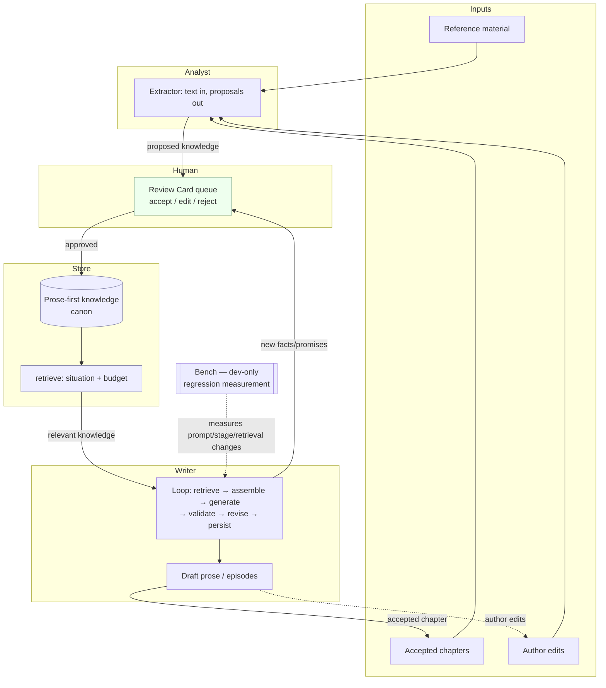

# RFC-001: Core Architecture

- **Status:** Draft
- **Date:** 2026-07-09
- **Author:** Chief Software Architect
- **Project:** AI Native Creative Workspace (`ai-creative-workspace` / "gorofan") — "나만의 로판AI + 하트픽션"
- **Conforms to:** ADR-001 … ADR-020 (the project's architectural constitution)
- **Supersedes:** nothing (first RFC)
- **RFC layer:** Highest — the system-level reference all later RFCs build on

> **Reading order.** This RFC is the single highest-level technical document for the AI Author OS. It defines *what the system is*, *how its parts relate*, and *the rules every later RFC must obey*. It deliberately contains **no** implementation detail — no schemas, APIs, prompt contents, algorithms, entry fields, or pipeline stages. Wherever a detail belongs to a component, this document says **"Defined in RFC-00X"** and stops there.
>
> **Source of truth.** The ADR set (`docs/architecture/adr/`) is authoritative. The two reviews (`docs/design-review-ai-author-os.md`, `docs/architecture-final-minimal.md`) supply rationale only. Where anything here appears to conflict with an ADR, **the ADR wins** and this RFC is in error.

---

## 1. Purpose

### 1.1 Why this architecture exists

The AI Author OS exists to produce **Korean web-novel-class creative quality** — 로판(로맨스 판타지) and Heart-Fiction-grade long-form fiction — from a system that a **single person can own and maintain for years**. It unifies two capabilities that most tools keep separate:

- **AI character chat** (로판AI): conversing with richly-characterized figures.
- **AI long-form novel writing** (하트픽션): drafting serialized fiction (회차) that stays coherent across hundreds of chapters.

Both draw on **one shared body of creative knowledge** — characters, worlds, style, and the accumulating facts of an ongoing story — rather than two disconnected knowledge bases.

### 1.2 What problems it solves

The architecture is a direct answer to the failure modes that make naive LLM writing tools plateau:

1. **The quality ceiling of single-pass generation.** A model asked to "continue the chapter" once has a hard quality limit no prompt can lift. The system replaces the line with **loops** — draft, validate, revise (ADR-005).
2. **Long-fiction incoherence.** By chapter 40, characters know things they shouldn't, promises go unpaid, and facts contradict. The system maintains a **living, timestamped knowledge base** and checks drafts against it (ADR-004).
3. **The maintenance debt of "an engine per feature."** Building a module and a table for every capability (plot library, dialogue library, relationship planner, …) produces a debt bomb one person cannot carry. The system collapses these into **three verbs and one data model** (ADR-001, ADR-002, ADR-003).
4. **Invisible prompt regression.** When creative behavior lives in text that changes weekly, an "improvement" can silently break quality. The system makes that behavior **measurable** (ADR-012).
5. **Vendor lock-in and cost.** The system stays **provider-neutral**, **zero-infra-cost beyond LLM fees**, and **offline-capable** (ADR-016, ADR-019).

### 1.3 Who it is designed for

- **Primary:** a single owner-author (or a very small team) running the system **self-hosted**, **local-first**, **mobile-first**, at **zero infrastructure cost beyond LLM usage** — who is simultaneously the *user*, the *maintainer*, and the *final judge of quality*.
- **Not** designed for: multi-tenant SaaS scale, large teams, or third-party plugin developers. Those remain *latent* and optional (`user_id` carried everywhere, an auth toggle) but are **not built and not assumed** (ADR-017, ADR-019). The tie-breaker throughout is **simplicity for one maintainer** over generality for hypothetical scale.

---

## 2. Architectural Principles

These are the principles the ADRs officially establish. Each is load-bearing; later sections and later RFCs derive from them.

### 2.1 Personal-first / Local-first

The tested default is a single owner, self-hosted, offline-capable, mobile-first, zero-cost-beyond-LLM. Multi-user and cloud are latent seams, never the assumed operating mode (ADR-001, ADR-017, ADR-019).

### 2.2 Simplicity over cleverness

When two designs deliver equal quality, the one with **fewer moving parts wins**. "Completeness is a liability at implementation time": the full map of quality mechanisms is valuable, but the built system deliberately visits **only what compounds** (ADR-001).

### 2.3 Three verbs: Store / Analyst / Writer (+ Bench)

The entire creative system is **three verbs — store, extract, write — plus one honesty mechanism, bench.** Everything that used to be named an "engine" dissolves into an entry *type*, a prompt *stage*, or a *check*. This is the primary structural decision (ADR-002).

### 2.4 Prompt-first evolution (the governing rule)

The single most important rule of the whole set:

> **Code that is written once — the loop runner, the entry store, the retrieval function, edit-diff capture — is code. Everything that will be tuned weekly — what to extract, how to plan, how to critique, how to style — is a versioned prompt file or a typed entry.**

Two years of product evolution should be **commits to `prompts/` and new entry `type` strings**, not new services and migrations (ADR-001, ADR-013, ADR-015).

### 2.5 Prose-first knowledge

All creative knowledge is stored as **prompt-ready prose** with provenance, not normalized into columns, ontologies, or graphs. The only heavy consumer of knowledge is prompt assembly, and models read well-written prose better than schemas. Structured data exists **only where a deterministic check needs it** (ADR-003). This is consciously acknowledged as the architecture's riskiest bet, with a sanctioned escape valve (§8, ADR-003 §6).

### 2.6 Review before Canon

No AI-proposed change reaches the source of truth except through **human review**. The model **reads canon freely but writes to canon only through a review gate.** This gate is *architectural, not optional chrome* — it is the only write path from Analyst/Writer proposals into stored canon (ADR-002, ADR-004, ADR-011).

### 2.7 Human remains in control

The user is the **final judge of quality**. The system proposes; the human disposes. There are no automated quality gates that block the user's own creative output, and no opaque machine "learning" that changes behavior behind the user's back — learning is transparent, curated, and reversible (ADR-010, ADR-012, ADR-011).

### 2.8 Quality lives in loops, not in a line

Effort concentrates on the closed loops — reference→knowledge, draft→validate→revise, accepted-chapter→living-bible, edit→capture — because quality **compounds in loops** and hits a ceiling in a feed-forward pipeline. Plumbing is disposable; the loops are the point (ADR-001, ADR-004, ADR-005).

---

## 3. System Overview

The system is a **single-process, layered modular monolith**. On top of a reusable **substrate**, it is organized as three creative services — **Store**, **Analyst**, **Writer** — and one dev-only harness, the **Bench**. There are no microservices, no message bus, no agent-framework backbone, no serverless functions (ADR-001, ADR-002).

At the highest level:

- The **Substrate** is the machinery that is *not* creative logic: provider adapters, the prompt-assembly engine, authentication, the chat engine, the chapter editor, and in-process background jobs. It is kept as-is and reused (ADR-009, ADR-016, ADR-019). The creative architecture sits *on* the substrate; this RFC's four responsibilities below are the creative layer.

The four responsibilities:

### 3.1 Store — the single source of knowledge

The Store is **one prose-first knowledge model plus one retrieval function**. It *is* the Story Bible, it *is* the character/world/style knowledge, and it *is* all of the story's accumulating ledgers — not as separate stores, but as one uniformly-typed body of knowledge. It answers exactly one question for the rest of the system: *"given this situation and this budget, what knowledge is relevant right now?"*

- **Owns:** all persisted creative knowledge and its retrieval.
- **Does not:** extract knowledge, generate prose, or judge quality.
- *Data model defined in RFC-002. Retrieval defined in RFC-003.*

### 3.2 Analyst — text in, knowledge out

The Analyst is **one extractor** with a single shape: *text in → proposed knowledge out.* The same service serves three inputs — uploaded reference material, accepted chapters, and accumulated edit history — differing only in what text goes in and what scope the result is filed under. Each kind of extraction ("facet") is a prompt file, not a distinct engine.

- **Owns:** turning text into candidate knowledge entries.
- **Does not:** decide what becomes canon (that is human review), store its own long-lived state, or write prose for the reader.
- *Analyst behavior and facets defined in RFC-008. Learning-capture remains a future topic RFC.*

### 3.3 Writer — one loop over declarative stages

The Writer is **one loop runner** executing a declarative list of stages: retrieve relevant knowledge → assemble a prompt → generate → validate against ground truth → revise where needed → persist. Planning, drafting, checking, episode assembly, and the style pass are all **stages**, each backed by a prompt file — not separate engines. The atomic unit it operates on is the **scene**; the delivery unit it composes is the **episode (회차)** (ADR-005, ADR-020).

- **Owns:** producing draft prose and running the draft→validate→revise loop.
- **Does not:** write to canon silently, own knowledge, or decide product-wide policy — it reads the Store and emits proposals like everyone else.
- *Pipeline, stages, and scene/episode units defined in RFC-004.*

### 3.4 Bench — the honesty mechanism

The Bench is a **dev-only evaluation harness**: a fixed set of golden scenarios scored by the same checks the Writer already runs, used to A/B any change to a prompt, stage, or retrieval before it ships. Because the architecture deliberately puts creative behavior in constantly-changing prompt files, the Bench is what makes that centrism *survivable* — it converts "did this prompt edit help or hurt?" from a vibe into a measurement.

- **Owns:** offline, out-of-band regression measurement of creative changes.
- **Does not:** run in production, score live user generations, block user output, or expose any UI.
- *Bench design defined in RFC-010.*

### 3.5 How they relate (in one breath)

The **Analyst** reads text and proposes knowledge; a **human** approves it into the **Store**; the **Writer** retrieves from the Store to draft and validate; accepted output feeds the Analyst again; the **Bench** watches over every prompt change so quality compounds instead of oscillating. Knowledge flows in only through review; prose flows out through a loop.

---

## 4. Architectural Boundaries

This section is the contract. Each component's ownership is exclusive, and its explicit non-ownership is as binding as its ownership. Ambiguity here is what re-creates the engine sprawl the architecture exists to prevent.

### 4.1 Store

| | |
|---|---|
| **Owns** | The one knowledge model; all persisted creative knowledge; the single retrieval function; the `type` vocabulary as a governed, closed set; the `proposed` / `canon` / `rejected` state of every piece of knowledge. |
| **Explicitly does NOT own** | Extraction (Analyst); generation (Writer); quality judgment (Bench); the decision to promote `proposed`→`canon` (human review). It exposes **no monolithic "Store" facade class** — it is a data model plus a small retrieval function plus typed access, not a God object (ADR-002). |

### 4.2 Analyst

| | |
|---|---|
| **Owns** | The single extraction operation (text → proposed entries) across all three inputs; the facet prompt files that define *what to look for*; provenance tagging of what it produces. |
| **Explicitly does NOT own** | The Store's persistence; canon decisions (it emits `proposed`, never `canon`); any private, long-lived state of its own — it is a **stateless transformer over explicit inputs**. It must not drift into a second subsystem with its own indexes or caches (ADR-002, ADR-008). |

### 4.3 Writer

| | |
|---|---|
| **Owns** | The loop runner; the declarative stage list; draft generation; the bounded validate→revise loop; composition of scenes into episodes. |
| **Explicitly does NOT own** | Knowledge storage (it reads the Store, it does not own it); canon writes (its ingestion step emits *proposals*, never inline canon mutations); transactional persistence policy (that stays in the service layer, post-loop); the *content* of its craft — planning heuristics, critique criteria, and style live in **prompt files**, not in the runner's code (ADR-005, ADR-011). |

### 4.4 Bench

| | |
|---|---|
| **Owns** | The golden scenario set; the offline scoring runs; the A/B diff report used to accept or reject a change. |
| **Explicitly does NOT own** | Any production code path; any user-facing surface; any authority to block or gate the user's own output. It **imports** the real code paths so it tests what ships, but it runs strictly out-of-band (ADR-012). |

### 4.5 The substrate (boundary note)

The substrate (provider adapters, prompt-assembly engine, auth, chat engine, chapter editor, jobs) is **shared infrastructure** the three services use. It owns *mechanism*; it owns **no creative policy**. The mapping between the three-verb vocabulary and the substrate's own names (e.g. the prompt-assembly engine) must remain explicit and is maintained in the component RFCs, not blurred (ADR-002). *Provider adapter, persistence, and auth remain future topic RFCs; no number is reserved until each file exists.*

---

## 5. System Lifecycle

The system's value is produced by a cycle, not a one-shot pass. At the highest level the lifecycle is:

```
Reference  →  Analysis  →  Storage  →  Writing  →  Validation  →  Review  →  Canon  →  Learning Capture
     ↑                                                                          │
     └──────────────────────────── the cycle feeds itself ─────────────────────┘
```

Stage by stage, high-level only:

1. **Reference** — the author supplies source material (uploaded references, or an accepted chapter, or their own edits). This is the raw text the system learns from.
2. **Analysis** — the Analyst extracts candidate knowledge from that text (§3.2). It proposes; it does not decide.
3. **Storage** — approved knowledge lives in the Store as prose-first, provenanced, typed entries (§3.1). This is the single body of truth both chat and novel-writing draw on.
4. **Writing** — the Writer retrieves the relevant slice of stored knowledge and drafts prose, scene by scene (§3.3).
5. **Validation** — each draft is checked against ground truth (the stored facts and the character's established voice) and revised where it fails. This is the loop that breaks the single-pass ceiling.
6. **Review** — anything the system wants to add to canon — newly extracted facts, promises, relationships — surfaces to the human as a proposal. Nothing crosses into canon unreviewed (§2.6).
7. **Canon** — approved proposals become canonical knowledge in the Store, immediately available to future retrieval and future drafts.
8. **Learning Capture** — the author's edits and acceptances are **captured** as they happen, so the system can later distill the author's preferences. Capture is day-one and irreversible-if-missed; the *learning* is a later, transparent, human-reviewed pass (§2.7, ADR-010).

The four closed loops embedded in this lifecycle — **analysis**, **drafting/validation**, **continuity** (accepted chapter → living bible → next draft), and **learning-capture** — are where quality compounds. *Implemented topic ownership follows the current document map in `docs/architecture/README.md`; unimplemented topics remain unnumbered.*

---

## 6. Data Flow Overview

The following diagram shows how information moves between the four responsibilities and the human. It is intentionally free of implementation detail — no fields, no calls, no tables.



**What the diagram asserts:** every arrow *into* canon (the Store) passes through the human review node; knowledge flows *out* of the Store only as retrieval into the Writer; the Bench touches only the change process, never the live data path.

---

## 7. Extension Philosophy

The architecture is designed so that **years of evolution are commits to `prompts/` and new entry `type` strings — not new services and not schema migrations** (ADR-015). Three examples of how the system grows *without changing its core*:

### 7.1 New knowledge kinds → a new entry `type`

A new "library" or ledger the author wants (a new kind of world knowledge, a new craft signal, a new relationship dimension) is a **new `type` string** in the closed, governed vocabulary — **never a new table and never a new service.** The Store, the retrieval function, the review queue, and the one editor absorb it automatically. *If a per-library table ever appears in a migration, the architecture has failed* (ADR-003, ADR-015). *The `type` vocabulary and its governance are defined in RFC-002.*

### 7.2 New craft → a new prompt stage or facet

A new planning heuristic, a new critique, a new style behavior, or a new thing to extract from references is a **new prompt file** — a Writer stage or an Analyst facet — added to a declarative list. The loop runner and the extractor are written once and do not change; the new behavior is a file the Bench can measure before it ships (ADR-005, ADR-008, ADR-013). *Writer orchestration is defined in RFC-004; Analyst facet philosophy is defined in RFC-008.*

### 7.3 New analytical depth → a new Analyst facet

Richer understanding of references or of the author's own preferences is another **facet prompt** over the same extractor, producing the same shape of proposals into the same review queue. No new pipeline, no new store (ADR-008, ADR-010).

### 7.4 Deferred seams, added only on a real trigger

A small number of boundaries *will* eventually be crossed (a different provider, a distributed job queue, remote storage, embedding-based retrieval). Each is a **named, sanctioned seam** whose second implementation is **deferred until a concrete or Bench-measured trigger fires** — not built speculatively (ADR-015, ADR-016, ADR-018). *The seam catalog and their triggers are defined in the relevant component RFCs.*

The net effect: the **evolution surface is the two cheapest things in software to change — prompt files and typed data** — and the core (loop runner, entry store, retrieval, capture) stays still.

---

## 8. Architectural Constraints

These are hard rules. A later RFC or implementation that violates one is non-conforming and must be corrected, not accommodated.

1. **Prompts live in the repository.** All prompt *bodies* are versioned files. There is no database-stored prompt template and no per-user prompt-body override. User customization is limited to **structured inputs** injected into prompts, never editable prompt bodies (ADR-013).
2. **Review before Canon.** No AI-proposed change reaches canon by any path other than human review. The Writer and Analyst emit *proposals*; only human approval writes canon (ADR-002, ADR-004, ADR-011).
3. **Creative behavior belongs in prompts (and typed data), not in code.** Anything tuned weekly — what to extract, how to plan, how to critique, how to style — is a prompt file or a `type`, not a code branch or a table (ADR-001).
4. **Runtime services remain minimal.** Single process, single logical set of three services plus a dev harness. No microservices, no message bus, no agent-framework backbone, no serverless (ADR-001, ADR-002).
5. **Avoid creating new engines.** A new capability is an entry `type`, a prompt stage, or a check — **not** a new named engine, module, service, or per-capability table. "Engine" is not the organizing noun (ADR-002, ADR-015).
6. **One knowledge model, prose-first, with a governed closed `type` vocabulary.** No `misc` type; no parallel per-domain stores; no ontology or graph as a second source of truth. Structured data appears only where a deterministic check consumes it (ADR-003).
7. **Read canon freely, write canon only through review.** The Store exposes retrieval to all; mutation of canon has exactly one gated path (ADR-002).
8. **Learning is transparent and captured from day one.** No opaque ML training, no online preference model. Edit history is captured immediately; distillation is a later, reviewable Analyst pass producing ordinary reviewable knowledge (ADR-010).
9. **Every change to volatile creative behavior is Bench-measurable.** Because behavior lives in changeable files, the regression harness is a required part of the workflow, not optional (ADR-012).
10. **The one sanctioned structural escape valve** is *promote-a-type-to-a-table*, used **only** when a deterministic check strains prose-first storage — the single legitimate place a new table is added later (ADR-003 §6).

---

## 9. Out of Scope

This RFC deliberately does **not** define the following. Each belongs to a later RFC, and any detail attempted here would be premature and non-authoritative:

- **The knowledge data model** — the entry shape, its fields, the `type` vocabulary, scoping, provenance, status transitions. *Defined in RFC-002.*
- **Retrieval mechanics** — ranking, budgeting, keyword-vs-embedding strategy, summary levels. *Defined in RFC-003.*
- **The Living Story Bible internals** — the specific ledgers, the knowledge matrix, the promise ledger, the contradiction gate, the continuity loop. *Defined in RFC-005.*
- **Analyst internals** — the facet catalog, extraction behavior, provenance and confidence handling, the three input paths in detail. *Defined in RFC-008.*
- **The Writer pipeline** — the concrete stage list, the scene card, the two ground-truth checks, revision behavior, episode assembly, streaming. *Defined in RFC-004.*
- **Prompt architecture** — block/budget assembly, provider-neutral prompt structure, the file layout of `prompts/`. *Defined in RFC-009 and its future implementation contract.*
- **Review Card UX** — the interaction, batching, editing, reversal, and surfacing model. *Defined in RFC-011.*
- **Learning capture & distillation** — what is captured, when, and how preferences are later distilled. *Reserved as a future topic RFC; no number is assigned.*
- **The Bench** — the golden set, the metrics, the diff report, the runner. *Defined in RFC-010.*
- **The relationship model** — relationships-as-entries, the planning stage, the relationship check. *Defined in RFC-006.*
- **Character DNA organization** — the exemplars-first, five-layer prompt organization. *Defined in RFC-007; World DNA details remain a future topic contract.*
- **Provider adapters, persistence & DB-swap, and authentication** — future substrate topic RFCs; no number is assigned until a file exists.
- **UI / information architecture** — a future topic RFC; no number is assigned until a file exists.

Also explicitly out of scope here: **database schema, APIs, prompt contents, entry field lists, Writer stage definitions, and algorithms.** Those are, by rule, never defined in this system-level document.

---

## 10. Dependencies

RFC-001 is the root of the RFC series. Every later RFC **depends on** this document and must conform to its principles (§2), boundaries (§4), and constraints (§8). The current series and its dependence on RFC-001 is:

| RFC | Topic | Grounding ADR(s) | Depends on RFC-001 for |
|---|---|---|---|
| **RFC-002** | Entry Model Contract | ADR-003, ADR-017 | Prose-first model, scope/type/status, migration boundary |
| **RFC-003** | Store-wide Retrieval Contract | ADR-018, ADR-009 | One keyword-first retrieval seam and Context Assembly handoff |
| **RFC-004** | Writer | ADR-005, ADR-020 | Loop-not-line; stages-as-data; no-new-engines |
| **RFC-005** | Story Bible | ADR-004 | Work-scoped canon and continuity loop |
| **RFC-006** | Relationship | ADR-006 | Entries + stage + check, not an engine |
| **RFC-007** | Character DNA | ADR-007 | Prose-first, exemplars-first identity organization |
| **RFC-008** | Analyst | ADR-008, ADR-010 | Stateless extractor; proposals-not-canon; facets-as-prompts |
| **RFC-009** | Prompt System | ADR-009, ADR-013 | Prompts-in-repository and standardized composition |
| **RFC-010** | Bench | ADR-012 | Dev-only evaluation and regression measurement |
| **RFC-011** | Human Review & Review Card | ADR-011, ADR-014 | The single human-gated write path |
| **RFC-012** | Character Chat | ADR-014, ADR-018 | First-class chat over shared knowledge, separate generation path |
| **Unnumbered future topics** | Learning Capture, Provider Adapter, Persistence, Auth, UI, World DNA details | Relevant ADRs | Assign a number only when the RFC file is created |

> This table is the current series and must match the files on disk and the document map in `docs/architecture/README.md`. Unwritten topics do not reserve numbers. Every successor still depends on RFC-001's principles, boundaries, and constraints; where a successor conflicts, RFC-001 and the ADR set govern.

---

## Appendix A — Traceability to ADRs

| RFC-001 Section | Primary ADRs |
|---|---|
| §1 Purpose | ADR-001 |
| §2 Principles | ADR-001, ADR-002, ADR-003, ADR-004, ADR-005, ADR-010, ADR-011, ADR-012, ADR-013, ADR-015 |
| §3 System Overview | ADR-001, ADR-002, ADR-009 |
| §4 Boundaries | ADR-002, ADR-003, ADR-005, ADR-008, ADR-011, ADR-012 |
| §5 Lifecycle | ADR-004, ADR-005, ADR-008, ADR-010, ADR-020 |
| §6 Data Flow | ADR-002, ADR-004, ADR-011 |
| §7 Extension Philosophy | ADR-003, ADR-008, ADR-015, ADR-016, ADR-018 |
| §8 Constraints | ADR-001, ADR-002, ADR-003, ADR-004, ADR-010, ADR-011, ADR-012, ADR-013 |
| §9 Out of Scope | ADR-INDEX (RFC boundary conventions) |
| §10 Dependencies | Full ADR set |

*End of RFC-001.*
